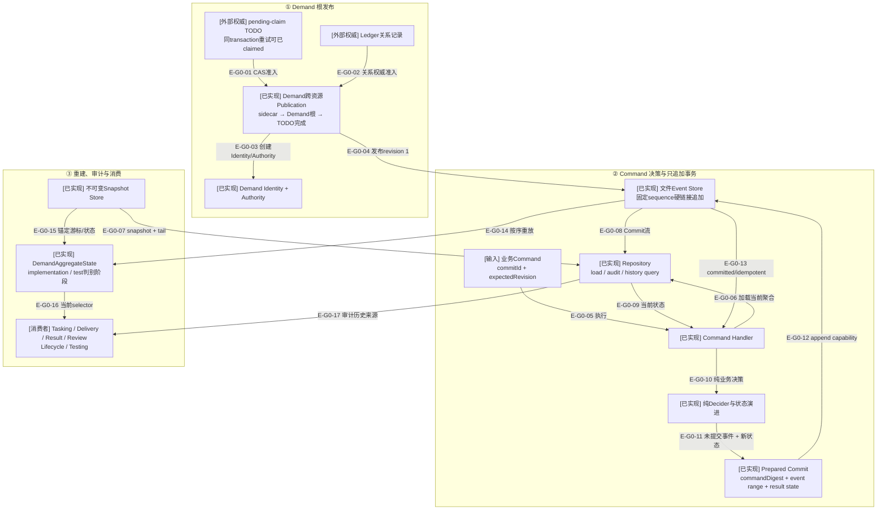

# Governance：Demand事件权威与聚合

> 本文绑定提交`d17602e`中的Demand Event Sourcing。33个生产模块、24份Demand Schema/生成合同
> 及相关测试均已提交；图不能替代Schema检查或完整重放测试。

## 当前结论

Demand业务事实由不可变Commit/Event流拥有；`DemandAggregateState`是按顺序归约事件得到的当前选择器，
不是第二份权威。正常Repository读取优先尝试不可变快照并重放tail；快照无效时从Commit 1完整重放，
但不会在读取过程中修复或创建快照。`audit`始终从Commit 1验证摘要链、事件转换和每一步结果状态。

业务命令先在内存中完成准入、纯决策和状态演进，再签发完整Prepared Commit；文件Event Store只接受
该能力，在固定sequence槽位用候选硬链接提交，并以`commitId + commandDigest + expectedRevision`支持
幂等重试和冲突拒绝。

## 核验快照

| 项目 | 读取值 |
| --- | --- |
| 分支/提交 | `main`；`d17602ed9931a1898f713c740752c54b94bd8086` |
| Demand生产源码 | 33 个模块：event-sourcing 21、publication 7、model 3、根级 2 |
| 当前全仓架构门 | 710个模块、4967条依赖、0违规；902项TypeScript测试通过 |
| 测试 | 15 个 `*.test.ts` |
| Demand合同 | 24个JSON Schema、24个生成TypeScript合同 |
| 提交状态 | Demand源码、Schema、生成合同与测试已进入`d17602e` |
| 来源指纹 | `37ba9fd4c166827ab2da0d969297c0ff0eae2e9a39498bf0ef89084b12e1ab89` |

## G0：Demand事件权威全景

### 本图术语说明

| 图中术语 | 解释 |
| --- | --- |
| Demand Identity | 不可变Demand身份、创建来源与初始修订事实 |
| Demand Authority | Identity摘要、角色、测试模式、Ledger引用与位置关系的强制权威 |
| Command | 请求某一业务转换的严格输入；本身不是“已发生”事实 |
| Decider | 只读取当前state和command、返回未提交事件的纯函数，不执行I/O |
| Prepared Commit | 已在内存中完成事件应用、摘要链和预期源前缀验证的追加能力 |
| Commit | 一次原子追加的不可变记录，可包含一个或多个连续事件 |
| `commandDigest` | 由Event Sourcing层自己计算的命令幂等摘要，调用方不能自行声明 |
| Snapshot | 锚定指定Commit、state digest和版本兼容摘要的不可变加速记录 |
| tail | Snapshot锚点之后仍需重放的Commit序列 |
| selector | 从完整历史确定性重建的当前状态视图，不拥有独立修改接口 |

## G0边级证据

| 边编号 | 代码证据 | 核验结论 |
| --- | --- | --- |
| `E-G0-01`–`E-G0-04` | Publication Service/Stage/TODO与revision 1 Command | Publication先发布Demand根和初始Event，再把精确TODO CAS为claimed |
| `E-G0-05`–`E-G0-13` | Command Handler、Repository、Decider、Prepared Commit与File Store | 纯决策先于append；固定sequence槽位提供并发/幂等收敛 |
| `E-G0-14`–`E-G0-17` | Aggregate/Repository/Snapshot与历史查询 | 当前状态和消费者读模型均由不可变Commit流重建，Snapshot只加速 |

## 事件与聚合覆盖

当前事件联合覆盖14个家族：Demand发布/取消/完成、Target Task规划、Test Card创建、Target/Test
Delivery准备、宿主效果claim/observe/rearm、TargetResult记录、Controller review决定/恢复，以及产品缺陷
remediation授权。

`DemandAggregateState`跟踪：

- Demand生命周期：`active / cancelled / completed`；
- Target Task阶段：planned、delivery prepared、host effect、result reported、accepted/rework/redesign/blocked；
- `currentTestCard`当前槽位、各Test Target自己的Card tuple、Test Delivery authorization/attempt lineage、
  Dispatch Packet来源与宿主效果状态；历史Test Target只允许保留`test-product-defect`代际；
- workType Result、Implementation Review generation和Test Review阶段；
- Test Review的`test-accepted / another-attempt / product-defect / blocked`类型已进入共享Decision Event；
  another-attempt进入rerun，test-accepted进入Completion，blocked进入共享Resume，product-defect进入
  Remediation Authorization、原Implementation Target返工和`pendingTestRetest`新代际。

每个状态转换都由对应事件归约函数拥有；跨实体ID、摘要、generation和前序阶段不匹配时失败关闭。

## 状态权威边界

| 事实 | 权威 | 派生/加速 | 失败时行为 |
| --- | --- | --- | --- |
| 已发生业务事实 | Commit/Event文件 | Aggregate、历史查询结果 | 任一摘要/序列/转换不一致则stream invalid |
| 当前Demand状态 | 从Commit 1或Snapshot+tail重放 | `DemandAggregateState` | 不能直接写state文件修改事实 |
| 快照 | 不可变Snapshot文件 | 正常load加速 | 无效快照被跳过；不在读取中自动修复 |
| 命令幂等 | Commit中的commitId/commandDigest/expectedRevision | Command Handler结果 | 同ID不同命令为idempotency conflict |
| 发布进度 | Workspace同级publication transaction sidecar | Demand根和TODO状态 | 只允许前向恢复，不删除已发布Demand倒退 |

## 当前边界

- Demand聚合只由14个Event家族演进，公共调用方不能直接写Event或state；
- Command Handler、Repository、Root Authority/Inventory、Snapshot与File Store拥有加载、追加与恢复；
- Delivery/Result/Review/Lifecycle/Testing owner只提交自己的严格Command；
- Demand Publication Service存在，但尚未注册为公共MCP入口。

## 验证证据

| 证据 | 当前结果 | 能证明什么 |
| --- | --- | --- |
| 当前全仓architecture | 710模块、4967依赖、0违规 | 当前扫描无循环、未解析依赖或架构违规 |
| 当前TypeScript/Schema门 | 902 pass；99 Schema/207 refs | Aggregate与生成合同一致 |
| Demand测试清单 | 15 个正式测试 | 覆盖聚合、decider、command、commit、store、repository、snapshot、upcast和publication |
| Demand Schema/生成合同 | 24/24 | 当前事件、Authority、Commit、Snapshot与Aggregate有生成来源 |
| 来源指纹 | 当前路径集合 | 本文绑定提交`d17602e`的Demand内容 |

## 下钻入口

- [Demand事件溯源关键文件依赖](./file-dependencies.md)
- [Command、Append、Load与Publication恢复流程](./runtime-call-flow.md)
- [返回Configuration/Workspace](../03-configuration-workspace/README.md)
