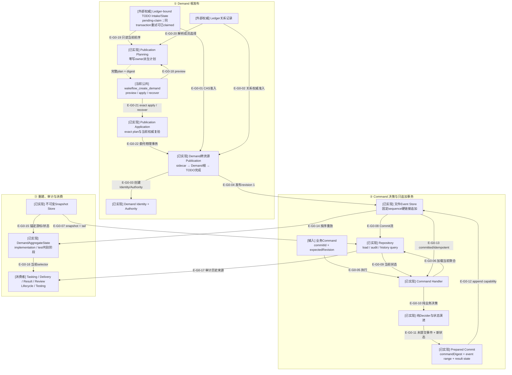

# Governance：Demand事件权威与聚合

> 本文以统一技术Review提交`08334ab`为当前核实点，`cfc61f4`保留为公共pre-Demand链的前一检查点。当前有
> 38个Demand生产模块、21个Evidence生产模块、25份Demand领域Schema/生成合同、2份Evidence领域合同及4份Publication公共合同。

## 当前结论

Demand业务事实由不可变Commit/Event流拥有；`DemandAggregateState`是按顺序归约事件得到的当前选择器，
不是第二份权威。正常Repository读取优先尝试不可变快照并重放tail；快照无效时从Commit 1完整重放，
但不会在读取过程中修复或创建快照。`audit`始终从Commit 1验证摘要链、事件转换和每一步结果状态。

业务命令先在内存中完成准入、纯决策和状态演进，再签发完整Prepared Commit；文件Event Store只接受
该能力，在固定sequence槽位用候选硬链接提交，并以`commitId + commandDigest + expectedRevision`支持
幂等重试和冲突拒绝。

`wakeflow_create_demand`把首次发布分成三层：Planning只读Config、TODO与Ledger并派生完整transaction；
Application复验plan digest和当前权威后调用既有物理Publication Service；Public Coordinator只拥有根作用域、
模式路由、结果脱敏与Schema闭合。失败结果通过`unchanged / recoverable / current / unknown`说明当前最强可证状态，
不会把未知副作用解释成安全重试。

当前A2-F1在typed TODO identity之上重写不可变Intake：Program、来源/Controller窗口、Readiness、测试决定与完整
Ledger member refs在创建时冻结；State revision 1从Readiness派生，Board只投影这些新事实。它仍不创建TODO公共入口，
随后A2-F2a–F2e加入activate/withdraw State、终态读模型、五操作Transaction、Storage Recovery与唯一Collection Service入口；整体复核又以Intake Readiness关闭精确State revision可达性。A3-A6现已补齐Ledger producer、TODO Inspection/Intake Public与Demand Authority单源；Auto Claim consumer仍后续。

第15个事件家族`evidence.managed-evidence-recorded.v1`保存完整Manifest，Aggregate只投影
`evidenceId + manifestDigest + payloadArtifactDigest`。提交内还包含无phase Publication Transaction、strict absent-only
Transaction Store、file/tree Payload与Manifest-last Stage Materializer、幂等Final Record Publisher、record-set Inventory、三类
Demand Root phase、事务期/健康Root Authority闭包、内部Application/Recovery与Transaction Settlement，以及按需Record Reader/Reading
Service。内部写入已固定`journal → complete stage → Event → final → journal retire`；读取区分`deferred / member / complete`；
`wakeflow_record_evidence`公开确认计划与metadata-only Apply/Recover回执。

## 核验快照

| 项目 | 读取值 |
| --- | --- |
| 分支/提交 | `main`；`HEAD=08334ab` |
| Demand生产源码 | 38 个模块：event-sourcing 21、publication 12、model 3、根级 2 |
| 当前全仓架构门 | 823个模块、5817条依赖、10个显式生产根、0违规 |
| 测试 | 当前完整TypeScript门1023项全通过；Demand input反向依赖18文件/80项独立通过 |
| Demand合同 | 25个领域Schema/生成合同 + Evidence/Demand Publication合同；Ledger与TODO另增8个entrypoint合同；全仓114 Schema/215 refs |
| 提交状态 | 生产TypeScript与测试已提交；仅本次Architecture Atlas同步待提交 |
| 来源指纹 | `f4d9f29af5dcbee79ea289315d39e6f6b29fbaa2830aa9759862244f9a4a9409` |

## G0：Demand事件权威全景

### 本图术语说明

| 图中术语 | 解释 |
| --- | --- |
| Demand Identity | 不可变Demand身份、创建来源与初始修订事实 |
| Demand Authority | Identity摘要、角色、测试模式、Ledger引用与位置关系的强制权威 |
| Command | 请求某一业务转换的严格输入；本身不是“已发生”事实 |
| Decider | 只读取当前state和command、返回未提交事件的纯函数，不执行I/O |
| Prepared Commit | 已在内存中完成事件应用、摘要链和预期源前缀验证的追加能力 |
| Commit | 一次原子追加的不可变记录，可包含一个或多个连续事件 |
| `commandDigest` | 由Event Sourcing层自己计算的命令幂等摘要，调用方不能自行声明 |
| Publication plan | Planning从当前Config、TODO、Ledger、Identity分配与时间派生的完整自包含transaction；调用方不能补写内部字段 |
| Publication authority | 一次发布失败后对exact transaction效果的最强证明：`unchanged / recoverable / current / unknown` |
| Snapshot | 锚定指定Commit、state digest和版本兼容摘要的不可变加速记录 |
| tail | Snapshot锚点之后仍需重放的Commit序列 |
| selector | 从完整历史确定性重建的当前状态视图，不拥有独立修改接口 |

## G0边级证据

| 边编号 | 代码证据 | 核验结论 |
| --- | --- | --- |
| `E-G0-01`–`E-G0-04` | Publication Service/Stage/TODO与revision 1 Command | Publication先发布Demand根和初始Event，再把精确TODO CAS为claimed |
| `E-G0-05`–`E-G0-13` | Command Handler、Repository、Decider、Prepared Commit与File Store | 纯决策先于append；固定sequence槽位提供并发/幂等收敛 |
| `E-G0-14`–`E-G0-17` | Aggregate/Repository/Snapshot与历史查询 | 当前状态和消费者读模型均由不可变Commit流重建，Snapshot只加速 |
| `E-G0-18`–`E-G0-22` | Public Coordinator、Planning/Application与物理Publication Service | preview零写；apply复验精确计划；recover只凭sidecar证据；公共层不复制物理状态机 |

## 事件与聚合覆盖

当前事件联合覆盖15个家族：Demand发布/取消/完成、Managed Evidence记录、Target Task规划、Test Card创建、Target/Test
Delivery准备、宿主效果claim/observe/rearm、TargetResult记录、Controller review决定/恢复，以及产品缺陷
remediation授权。

`DemandAggregateState`跟踪：

- Demand生命周期：`active / cancelled / completed`；
- Target Task阶段：planned、delivery prepared、host effect、result reported、accepted/rework/redesign/blocked；
- `currentTestCard`当前槽位、各Test Target自己的Card tuple、Test Delivery authorization/attempt lineage、
  Dispatch Packet来源与宿主效果状态；历史Test Target只允许保留`test-product-defect`代际；
- workType Result、Implementation Review generation和Test Review阶段；
- `managedEvidence`只在首个Evidence Event后出现，并仅保存Evidence ID与Manifest/payload双摘要；
- Test Review的`test-accepted / another-attempt / product-defect / blocked`类型已进入共享Decision Event；
  another-attempt进入rerun，test-accepted进入Completion，blocked进入共享Resume，product-defect进入
  Remediation Authorization、原Implementation Target返工和`pendingTestRetest`新代际。

每个状态转换都由对应事件归约函数拥有；跨实体ID、摘要、generation和前序阶段不匹配时失败关闭。

## 状态权威边界

| 事实 | 权威 | 派生/加速 | 失败时行为 |
| --- | --- | --- | --- |
| 已发生业务事实 | Commit/Event文件 | Aggregate、历史查询结果 | 任一摘要/序列/转换不一致则stream invalid |
| 当前Demand状态 | 从Commit 1或Snapshot+tail重放 | `DemandAggregateState` | 不能直接写state文件修改事实 |
| 快照 | 不可变Snapshot文件 | 正常load加速 | 无效快照被跳过；不在读取中自动修复 |
| 命令幂等 | Commit中的commitId/commandDigest/expectedRevision | Command Handler结果 | 同ID不同命令为idempotency conflict |
| 发布进度 | Workspace同级publication transaction sidecar | Demand根和TODO状态 | 只允许前向恢复，不删除已发布Demand倒退 |
| Managed Evidence内容 | Manifest关闭的final顶层 + 对应Manifest Event | Aggregate最小selector；Reader按需签发deferred/member/complete证明 | final/Event缺失、Authority漂移或所请求内容摘要不一致时失败关闭 |
| Managed Evidence发布进度 | Application + Transaction Settlement + Store/Stage/Final + 事务期Authority | strict journal；Manifest-last；Event乐观追加；幂等final；Event前stale退休；journal-last | 任一Commit/selector/物理状态关系不成立则保留journal并失败关闭 |
| Managed Evidence内容读取 | Record Reader + Reading Service + healthy Authority | Manifest=`deferred`；单文件=`member`；整树=`complete`；只读使用Snapshot + tail | 未声明member、容量、摘要、mode、节点或Authority漂移均失败关闭 |

## 当前边界

- Demand聚合只由15个Event家族演进，公共调用方不能直接写Event或state；
- Command Handler、Repository、Root Authority/Inventory、Snapshot与File Store拥有加载、追加与恢复；
- Delivery/Result/Review/Lifecycle/Testing owner只提交自己的严格Command；
- Demand Publication已通过`wakeflow_create_demand`公开；公共成功结果只返回稳定回执，完整Aggregate、Authority内容与机器路径保持内部。
- Managed Evidence内部Command/Event/Reducer、可恢复Publication、Root Authority、按需Reader及metadata-only Public均已存在；Reader bytes不公开。
- TODO Intake保存完整Ledger refs，A5 Public Planning从Ledger派生；Demand Publication已删除独立selectors并只重验该Intake refs。
- `parked`已有activate/withdraw State、终态读模型、可恢复Storage与Public Intake/Inspection；Auto Claim仍无scheduler consumer。
- A4 list/item Query、Schema、Coordinator与MCP均已闭合；page token绑定collection/filter/offset且不授权mutation。
- A3已关闭共享内部纵切、双family wire/parser/Coordinator，并把Requirement/Confirmation同时注册到双宿主MCP；它是可发现的Ledger Public producer，但不创建TODO或Demand。

## 验证证据

| 证据 | 当前结果 | 能证明什么 |
| --- | --- | --- |
| 当前全仓architecture | 823模块、5817依赖、10个显式生产根、0违规 | 当前扫描无循环、未解析依赖或架构违规 |
| 当前Schema门 | 114 Schema/215 refs | Ledger/TODO/Demand wire自包含；生成输出一致 |
| Publication聚焦测试 | 25项领域/公共/MCP测试通过 | 覆盖输入、Planning、Application、物理事务、回执、真实Route与恢复authority |
| A2-F1直接闭包 | TODO 52项 + Demand Publication/Tasking 31项 | Intake/State/Transaction/Board、真实Ledger-first fixture与相邻consumer |
| A2-F2a状态骨干 | State 11项；Intake/Transaction/Projection相邻回归共29项 | withdrawn载荷、activate/withdraw纯转换、状态互斥与clock读取顺序 |
| A2-F2b终态读模型 | 完整TODO 56项 | 五状态活动分类、终态保留Authority/digest且不进入活动Board |
| A2-F2c Transaction | 完整TODO 57项 | 五操作Schema、exact digest信封、目标状态矩阵与确定文档 |
| A2-F2d Storage | 完整TODO 60项 | journal前source→target、真实atomic replace、Board失败后的exact-target Recovery |
| A2-F2e Service | 完整TODO 62项 | closed input、collection/item CAS、clock/error映射、正常mutation与两类Service Recovery |
| A2整体复核 | TODO 63项 + 直接consumer 31项 | ready/parked精确revision可达矩阵、旧字段清零与明确后续consumer |
| A3-S7b Public Coordinator | Ledger 14文件57项 | 双executor、根隐私、真实三模式路由、效果权威与metadata-only receipt |
| A3-S8 MCP注册 | Ledger/MCP/Catalog 62项 | 两个required executor、21工具Schema/annotations矩阵、Codex Requirement与Claude Confirmation真实调用 |
| A4-S1 TODO Inspection Query | 新增4项 | 纯list/item、五类filter、同snapshot分页、item脱敏与稳定token错误；未接Authority I/O或Public |
| A4/A5/A6核实 | TODO79项；矩阵48项；专项7项 | Inspection/Intake双宿主公开、Demand Authority单源及Ledger→TODO→Demand→Route真实MCP |
| Managed Evidence Public纵切 | 当前相关47项分层通过；日常门11项 | 四类Coordinator结果、错误authority、独立catalog、真实MCP和候选stdio入口 |
| 最近完整TypeScript门 | 1023 pass / 0 fail / 0 cancelled / 0 skip | 覆盖提交`08334ab`的入口解耦与测试清理 |
| 来源指纹 | 当前路径集合 | 本文绑定提交`08334ab`的统一技术Review内容 |

## 下钻入口

- [Demand事件溯源关键文件依赖](./file-dependencies.md)
- [Command、Append、Load与Publication恢复流程](./runtime-call-flow.md)
- [返回Configuration/Workspace](../03-configuration-workspace/README.md)
