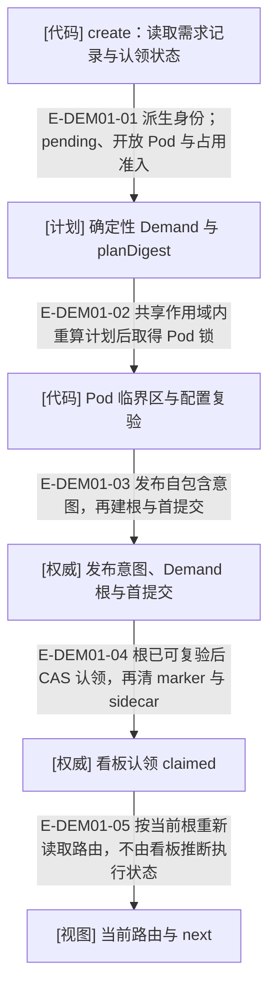

# Demand：发布事实、运行事实与派生读取

> 2026-10-03 当前工作树语义复核；含未提交实现。HEAD 只定位已提交基线，来源指纹覆盖本页实际引用的文件。图谱不拥有业务状态。本页的测试锚点表示已核对的覆盖入口，运行结果见本轮总台账。

需求包记录冻结原始要求；Demand 身份固定程序、需求来源与 Pod，authority 固定需求成员引用和 testingDecision。事件提交拥有执行事实，看板拥有认领关系。首次发布必须同时收敛这两个资源。公共追加与创建/生命周期 apply、recover 在打开业务上下文前取得工作区共享作用域；后续事件追加仍使用自己的 Demand 追加锁，不借用首次发布事务锁。

```mermaid
flowchart TB
  accTitle: 首次创建的权威边界
  accDescr: 首次创建的权威边界；每条关系由当前实现的调用或条件支持，错误停止与恢复保持显式。
  A["[代码] create：读取需求记录与认领状态"]
  B["[计划] 确定性 Demand 与 planDigest"]
  C["[代码] Pod 临界区与配置复验"]
  D["[权威] 发布意图、Demand 根与首提交"]
  F["[权威] 看板认领 claimed"]
  H["[视图] 当前路由与 next"]
  A -->|"E-DEM01-01 派生身份；pending、开放 Pod 与占用准入"| B
  B -->|"E-DEM01-02 共享作用域内重算计划后取得 Pod 锁"| C
  C -->|"E-DEM01-03 发布自包含意图，再建根与首提交"| D
  D -->|"E-DEM01-04 根已可复验后 CAS 认领，再清 marker 与 sidecar"| F
  F -->|"E-DEM01-05 按当前根重新读取路由，不由看板推断执行状态"| H
```

### 本图术语说明

| 术语 | 本图含义 |
| --- | --- |
| [代码] | 确定性服务、守卫或纯决定；失败会拒绝转换。 |
| [权威] | 持久事实；只能由指定写入者改变。 |
| [视图] | 由权威派生的可重建数据，不授权写入。 |
| sidecar | 活动根之外的发布意图；崩溃后仍持有 Pod 占用。 |
| CAS | 比较观察到的资源状态；并发变更时拒绝覆盖。 |

### 本图边级证据

| 编号 | 代码证据 | 测试证据 | 关系与边界 |
| --- | --- | --- | --- |
| E-DEM01-01 | `src/capabilities/demand/service.ts#planCreate` | 间接覆盖：`tests/capabilities/demand/pod-concurrency.test.ts#executeDemandCreationRequest`（经公共切片入口执行此内部关系） | 派生身份；pending、开放 Pod 与占用准入 |
| E-DEM01-02 | `src/capabilities/demand/service.ts#applyCreate` | 间接覆盖：`tests/capabilities/demand/pod-concurrency.test.ts#executeDemandCreationRequest`（经公共切片入口执行此内部关系） | 共享作用域内重算计划后取得 Pod 锁 |
| E-DEM01-03 | `src/governance/demand/publication/demand-event-sourcing-publication-service.ts#publishDemandFromPackage` | 间接覆盖：`tests/governance/demand/demand-event-sourcing-publication-service.test.ts#publishDemandFromPackage`（经公共切片入口执行此内部关系） | 发布自包含意图，再建根与首提交 |
| E-DEM01-04 | `src/governance/demand/publication/demand-event-sourcing-publication-service.ts#applyPublication` | 间接覆盖：`tests/governance/demand/demand-event-sourcing-publication-service.test.ts#publishDemandFromPackage`（经公共切片入口执行此内部关系） | 根已可复验后 CAS 认领，再清 marker 与 sidecar |
| E-DEM01-05 | `src/capabilities/demand/context.ts#nextAfterMutation` | 间接覆盖：`tests/capabilities/demand/service.test.ts#executeDemandContinuationRequest`（经公共切片入口执行此内部关系） | 按当前根重新读取路由，不由看板推断执行状态 |

## 状态所有权与失败含义

| 对象 | 写入者 / 消费者 | 不承担的责任 |
| --- | --- | --- |
| Demand identity / authority | 发布服务构建并复验；上下文读取 Ledger 成员 | 不以当前 Config 重写历史权威 |
| 事件提交 | 命令处理器与文件事件存储；仓储按顺序重放 | checkpoint 失败不能撤销已提交事实 |
| 看板认领 | publication / lifecycle 执行 CAS | claimed 不证明某次宿主投递落地 |
| snapshot / index / next | 追加后的刷新与读取派生 | 不创建第二套业务状态 |
| 发布意图与生命周期日志 | 创建、终态、续接 owner | 进程锁释放不等于业务事务完成 |

新增未提交范围：创建/恢复与终态/续接接入 Pod 临界区；活动守卫把发布意图和生命周期日志纳入占用；验收覆盖为只读派生门。不存在“仅靠 claimed 看板就能证明 Pod 空闲”的保证。活动根读坏时守卫保守阻塞；中止则上抛。

工作区共享作用域与 Pod 锁解决不同竞争：前者使普通写入及其派生视图收尾与工作区独占维护互斥；后者保护同 Pod 创建、终态和续接的短临界区。共享作用域不串行所有 Demand，事件修订、看板 CAS 与精确资源锁仍须各自验证。preview 和只读评审不取得该写入作用域。

## 继续阅读

[本专题总览](./README.md) · [文件导入](./file-dependencies.md) · [实际调用](./runtime-call-flow.md) · [逐文件审阅记录](../../plans/review-2026-10-03/demand-delivery.md) · [图谱入口](../README.md)
