# Governance：Demand事件溯源关键文件依赖

> 本图选取Demand 38个生产模块中的28个状态、命令、存储、快照、Publication物理事务和公共边界骨干文件，
> 并加入相邻Managed Evidence Manifest。Event Sourcing基线与Publication Public已提交；Evidence Event增量在工作树中。

## F4：Demand事件溯源关键文件依赖

```mermaid
flowchart LR
  accTitle: Wakeflow Demand事件溯源关键文件导入关系
  accDescr: Decider、Command Handler、Commit、Repository、Snapshot与Upcaster保持既有Event Sourcing方向。Publication Planning导入公共输入与transaction并零写派生计划；Application导入transaction和物理Service；Public Coordinator组合Planning、Application与公共Contract。物理Service仍独占sidecar、stage、storage和TODO模块并创建revision 1根目录。

  subgraph ROOTS["Demand模型"]
    IDENTITY["[源码][F-DMD-01]\ndemand-identity.ts"]
    AUTHORITY["[源码][F-DMD-02]\ndemand-authority.ts"]
    STATE["[已实现][F-DMD-03]\ndemand-aggregate-state.ts"]
    EVENT["[已实现][F-DMD-04]\ndemand-event-sourcing-event.ts"]
    EVIDENCE_MANIFEST["[进行中][F-EVD-01]\nmanaged-evidence-manifest.ts"]
  end

  subgraph SHARED_ENTRY["命令决策与Commit"]
    DECIDER["[已实现][F-ES-01]\ndemand-event-sourcing-decider.ts"]
    HANDLER["[已实现][F-ES-02]\ndemand-event-sourcing-command-handler.ts"]
    AGGREGATE["[源码][F-ES-03]\ndemand-event-sourcing-aggregate.ts"]
    COMMIT["[已实现][F-ES-04]\ndemand-event-stream-commit.ts"]
    STORED["[源码][F-ES-05]\ndemand-event-sourcing-stored-event.ts"]
  end

  subgraph DOMAIN["Repository与文件存储"]
    REPOSITORY["[已实现][F-ES-06]\ndemand-event-sourcing-repository.ts"]
    STORE["[已实现][F-ES-07]\ndemand-file-event-store.ts"]
    SNAPSTORE["[源码][F-ES-08]\ndemand-file-event-snapshot-store.ts"]
    ROOT_AUTH["[已实现][F-ES-09]\ndemand-event-sourcing-root-authority.ts"]
    INVENTORY["[已实现][F-ES-10]\ndemand-event-sourcing-root-inventory.ts"]
  end

  subgraph HOST_ENTRY["Snapshot与版本演进"]
    SNAPSHOT["[已实现][F-ES-11]\ndemand-event-sourcing-snapshot.ts"]
    UPCAST["[源码][F-ES-12]\ndemand-event-sourcing-upcaster.ts"]
    CODEC["[已实现][F-ES-13]\ndemand-event-sourcing-event-version-codec.ts"]
    PERSISTED["[源码][F-ES-14]\ndemand-event-sourcing-persisted-event-envelope.ts"]
  end

  subgraph HOST_IMPL["跨资源Publication"]
    PUB_INPUT["[源码][F-PUB-06]\ndemand-event-sourcing-publication-input.ts"]
    PUB_PLAN["[源码][F-PUB-07]\ndemand-event-sourcing-publication-planning-service.ts"]
    PUB_APP["[源码][F-PUB-08]\ndemand-event-sourcing-publication-application-service.ts"]
    PUB_SERVICE["[源码][F-PUB-01]\ndemand-event-sourcing-publication-service.ts"]
    PUB_TX["[源码][F-PUB-02]\ndemand-event-sourcing-publication-transaction.ts"]
    PUB_STAGE["[源码][F-PUB-03]\ndemand-event-sourcing-publication-stage.ts"]
    PUB_STORAGE["[源码][F-PUB-04]\ndemand-event-sourcing-publication-storage.ts"]
    PUB_TODO["[源码][F-PUB-05]\ndemand-event-sourcing-publication-todo.ts"]
    PUB_CONTRACT["[源码][F-PUB-09]\ndemand-publication-public-contract.ts"]
    PUB_COORD["[源码][F-PUB-10]\ndemand-publication-public-coordinator.ts"]
  end

  WIRE["[生成][F-GEN-04]\nDemand 25个Schema/生成合同"]
  REQUEST_WIRE["[生成][F-GEN-05]\nwakeflow-demand-publication-request.generated.ts"]
  RESULT_WIRE["[生成][F-GEN-06]\nwakeflow-demand-publication-result.generated.ts"]

  AUTHORITY -->|"E-F4-01 Identity关系"| IDENTITY
  STATE -->|"E-F4-02 Aggregate State Schema"| WIRE
  EVENT -->|"E-F4-03 事件数据Schema"| WIRE
  DECIDER -->|"E-F4-04 纯状态转换"| STATE
  DECIDER -->|"E-F4-05 权威/事件准入"| AUTHORITY
  DECIDER -->|"E-F4-06 创建未提交事件"| EVENT
  STATE -->|"E-F4-47 解析Manifest并投影selector"| EVIDENCE_MANIFEST
  EVENT -->|"E-F4-48 解析完整Manifest事件数据"| EVIDENCE_MANIFEST
  DECIDER -->|"E-F4-49 准入Evidence Command"| EVIDENCE_MANIFEST
  HANDLER -->|"E-F4-07 决策"| DECIDER
  HANDLER -->|"E-F4-08 准备Commit"| COMMIT
  HANDLER -->|"E-F4-09 加载/追加"| REPOSITORY

  COMMIT -->|"E-F4-10 应用状态"| DECIDER
  COMMIT -->|"E-F4-11 Aggregate游标"| AGGREGATE
  COMMIT -->|"E-F4-12 未提交事件"| EVENT
  COMMIT -->|"E-F4-13 持久事件"| STORED
  COMMIT -->|"E-F4-14 版本演进"| UPCAST
  COMMIT -->|"E-F4-15 Commit Schema"| WIRE

  REPOSITORY -->|"E-F4-16 应用Commit"| COMMIT
  REPOSITORY -->|"E-F4-17 事件存储"| STORE
  REPOSITORY -->|"E-F4-18 Snapshot存储"| SNAPSTORE
  REPOSITORY -->|"E-F4-19 恢复Snapshot"| SNAPSHOT
  REPOSITORY -->|"E-F4-20 upcast历史事件"| UPCAST
  STORE -->|"E-F4-21 Commit文档"| COMMIT
  SNAPSTORE -->|"E-F4-22 Snapshot文档"| SNAPSHOT
  UPCAST -->|"E-F4-23 版本codec"| CODEC
  UPCAST -->|"E-F4-24 稳定事件封装"| PERSISTED
  ROOT_AUTH -->|"E-F4-25 完整根清单"| INVENTORY
  ROOT_AUTH -->|"E-F4-26 聚合重建"| REPOSITORY
  ROOT_AUTH -->|"E-F4-27 Identity/Authority闭合"| AUTHORITY
  ROOT_AUTH -->|"E-F4-28 revision 1验证"| STORE

  PUB_SERVICE -->|"E-F4-29 自包含恢复计划"| PUB_TX
  PUB_SERVICE -->|"E-F4-30 暂存根与最终加载"| PUB_STAGE
  PUB_SERVICE -->|"E-F4-31 sidecar/lock存储"| PUB_STORAGE
  PUB_SERVICE -->|"E-F4-32 TODO claim/complete"| PUB_TODO
  PUB_STAGE -->|"E-F4-33 发布revision 1命令"| HANDLER
  PUB_STAGE -->|"E-F4-34 构造Repository"| REPOSITORY
  PUB_STAGE -->|"E-F4-35 最终根权威加载"| ROOT_AUTH
  PUB_STAGE -->|"E-F4-36 初始化Event/Snapshot Store"| STORE
  PUB_TX -->|"E-F4-37 Publication Schema"| WIRE
  PUB_PLAN -->|"E-F4-38 解析author-owned输入"| PUB_INPUT
  PUB_PLAN -->|"E-F4-39 创建完整计划"| PUB_TX
  PUB_APP -->|"E-F4-40 复验完整计划"| PUB_TX
  PUB_APP -->|"E-F4-41 委托物理事务"| PUB_SERVICE
  PUB_COORD -->|"E-F4-42 preview"| PUB_PLAN
  PUB_COORD -->|"E-F4-43 apply/recover"| PUB_APP
  PUB_COORD -->|"E-F4-44 解析公共请求"| PUB_CONTRACT
  PUB_CONTRACT -->|"E-F4-45 Request Schema"| REQUEST_WIRE
  PUB_COORD -->|"E-F4-46 Result Schema"| RESULT_WIRE
```

### 本图术语说明

| 图中术语 | 解释 |
| --- | --- |
| 未提交Event | 已由纯Decider确认发生、但尚无commitSequence/streamRevision的领域事实 |
| Stored Event | 绑定事件ID、修订位置、schemaVersion、数据和摘要的持久事件信封 |
| Persisted Event Envelope | 只解析跨版本稳定的位置、类型、原始数据和结果摘要，不提前解释事件家族语义 |
| Aggregate cursor | demandId、commitSequence、streamRevision、lastCommitDigest与当前state的组合 |
| Root Inventory | Demand根允许资源集合及节点策略的排他稳定清单；未知资源使根不健康 |
| Root Authority | Inventory、Identity、Authority、Ledger引用、revision 1和Aggregate的闭合事实 |
| upcast | 从历史schemaVersion逐步转换到当前归约器Event，不修改原Commit文件 |
| Publication sidecar | Demand根同级的immutable发布意图，支持跨TODO/目录发布前向恢复 |
| revision 1 | `publication.demand-published`初始Commit，只允许创建聚合初态 |

## 文件与符号映射

| 文件编号 | 文件/符号 | 状态 | 职责 |
| --- | --- | --- | --- |
| `F-DMD-01` | `model/demand-identity.ts` | 已实现 | Demand不可变身份与确定文档/摘要 |
| `F-DMD-02` | `model/demand-authority.ts#parse/create/admitDemandAuthority` | 已实现 | Identity、角色、测试模式、Ledger引用和位置关系闭合 |
| `F-DMD-03` | `model/demand-aggregate-state.ts` | 已实现 | 15个Event家族对应的纯状态转换和当前selector |
| `F-DMD-04` | `event-sourcing/demand-event-sourcing-event.ts#parseDemandUncommittedEvent` | 已实现 | 未提交事件严格联合，不含持久位置字段 |
| `F-ES-01` | `demand-event-sourcing-decider.ts#decide/evolve*` | 已实现 | Command准入、幂等摘要、纯事件决策与状态演进 |
| `F-ES-02` | `demand-event-sourcing-command-handler.ts#execute*Command` | 已实现 | 加载→决策→准备→按预期追加及重试冲突处理 |
| `F-ES-03` | `demand-event-sourcing-aggregate.ts#parse*Aggregate` | 已实现 | 聚合游标和state事实的防御性复验 |
| `F-ES-04` | `demand-event-stream-commit.ts#prepare/apply*Commit` | 已实现 | Commit计划、摘要链、事件范围与结果state绑定 |
| `F-ES-05` | `demand-event-sourcing-stored-event.ts` | 已实现 | 持久事件信封、表示和摘要 |
| `F-ES-06` | `demand-event-sourcing-repository.ts#DemandEventSourcingRepository` | 已实现 | snapshot-tail load、full audit、历史查询、append与snapshot发布 |
| `F-ES-07` | `demand-file-event-store.ts#DemandFileEventStore` | 已实现 | 固定sequence文件追加、候选恢复、读取和并发冲突 |
| `F-ES-08` | `demand-file-event-snapshot-store.ts#DemandFileEventSnapshotStore` | 已实现 | 不可变Snapshot读取、发布和有效/无效观察 |
| `F-ES-09` | `demand-event-sourcing-root-authority.ts#load*RootAuthority` | 已实现 | 健康根、Ledger引用、revision 1和Aggregate闭合 |
| `F-ES-10` | `demand-event-sourcing-root-inventory.ts#inspect*RootInventory` | 已实现 | Demand根排他资源清单与节点策略 |
| `F-ES-11` | `demand-event-sourcing-snapshot.ts#create/restore*Snapshot` | 已实现 | 带版本不可变Snapshot和锚定Commit恢复 |
| `F-ES-12/13` | `demand-event-sourcing-{upcaster,event-version-codec}.ts` | 已实现 | 事件schemaVersion codec与相邻版本演进 |
| `F-ES-14` | `demand-event-sourcing-persisted-event-envelope.ts` | 已实现 | 跨事件版本稳定的持久化信封准入与摘要 |
| `F-EVD-01` | `evidence/managed-evidence-manifest.ts#parseManagedEvidenceManifest` | 进行中 | Event保存的完整Evidence内容/provenance事实；为final record预留payload容量，不执行资源发布 |
| `F-PUB-01` | `publication-service.ts#publishDemandFromTodo/recoverDemandPublication` | 已实现 | TODO/Ledger准入、sidecar、锁和跨资源前向恢复 |
| `F-PUB-02` | `publication-transaction.ts#create*Transaction` | 已实现 | 不含可变阶段的自包含发布恢复计划 |
| `F-PUB-03` | `publication-stage.ts#materialize/publishDemandStage` | 已实现 | 暂存Demand根、revision 1、整体重命名和最终加载 |
| `F-PUB-04/05` | `publication-{storage,todo}.ts` | 已实现 | sidecar/锁资源与TODO claim/complete关系 |
| `F-GEN-04` | `contracts/{schemas,generated}/governance/demand/*` | 进行中 | 25个事件/状态/Commit/Snapshot/Authority合同，含Managed Evidence Recorded v1 |
| `F-PUB-06` | `demand-event-sourcing-publication-input.ts` | 已实现 | 只接收作者语义、TODO ID、位置与Ledger成员选择的关闭输入 |
| `F-PUB-07` | `demand-event-sourcing-publication-planning-service.ts` | 已实现 | 零写读取Config/TODO/Ledger并派生完整transaction与digest |
| `F-PUB-08` | `demand-event-sourcing-publication-application-service.ts` | 已实现 | exact plan/current authority复验、物理apply/recover委托与输出闭合 |
| `F-PUB-09/10` | `demand-publication-public-{contract,coordinator}.ts` | 已实现 | 公共Schema重解析、根隐私、模式路由、稳定回执与错误authority |
| `F-GEN-05/06` | `contracts/{schemas,generated}/entrypoints/wakeflow-demand-publication-*` | 已实现 | `wakeflow_create_demand`自包含Request/Result wire合同 |

## 原始依赖快照

| 范围 | 生产模块 | 当前全仓受检模块 | 当前全仓依赖 | 违规 |
| --- | ---: | ---: | ---: | ---: |
| Demand Event Sourcing + Publication | 38 + 1个相邻Evidence Manifest | 740 | 5182 | 0 |

本图仍只选择Demand骨干；全量依赖数使用当前全仓SWC architecture gate，局部边以本图静态imports为准。

## 边级证据

| 边编号 | 范围 | 代码/测试证据 |
| --- | --- | --- |
| `E-F4-01`–`E-F4-15` | 模型、Decider、Handler与Commit | 直接imports；aggregate/decider/handler/commit测试 |
| `E-F4-16`–`E-F4-28` | Repository、Store、Snapshot、Upcast与Root Authority | 直接imports；repository/store/snapshot/upcast/inventory测试 |
| `E-F4-29`–`E-F4-37` | 跨资源Publication | service/stage/storage/todo直接imports；publication service/transaction测试 |
| `E-F4-38`–`E-F4-46` | Publication公共边界 | Input/Planning/Application/Contract/Coordinator直接imports；25项聚焦与真实MCP Route测试 |
| `E-F4-47`–`E-F4-49` | Managed Evidence Event边界 | Aggregate/Event/Decider直接导入Manifest；4项Event测试及真实Commit重放 |

## 停止边界

- 文件存在不等于调用方可绕过Command/Repository；公共写入必须经过真实owner。
- Repository的历史查询不是独立持久投影；它每次审计完整不可变流。
- Snapshot只加速正常load，不能替代Commit摘要链或audit。
- 公共调用方不能绕过Decider/Prepared Commit直接向文件Store写任意事件。
- Managed Evidence Command/Event/selector尚无资源Application调用方；图中的静态依赖不证明payload或Manifest文件已经发布。
