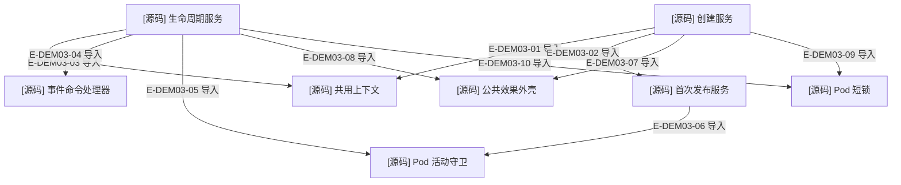

# Demand：发布、生命周期与事件内核的静态边界

> 2026-10-03 当前工作树语义复核；含未提交实现。HEAD 只定位已提交基线，来源指纹覆盖本页实际引用的文件。图谱不拥有业务状态。本页仅声明静态导入，由 AST 核验；不把导入存在作为运行分支已覆盖的证明。

```mermaid
flowchart TB
  accTitle: Demand 的精选直接导入
  accDescr: 图中连线仅表示当前 TypeScript 直接导入，不表示调用顺序或持久状态；完整路径与符号在表中定位。
  S["[源码] 创建服务"]
  L["[源码] 生命周期服务"]
  C["[源码] 共用上下文"]
  P["[源码] 首次发布服务"]
  A["[源码] Pod 活动守卫"]
  H["[源码] 事件命令处理器"]
  W["[源码] 公共效果外壳"]
  K["[源码] Pod 短锁"]
  S -->|"E-DEM03-01 导入"| C
  S -->|"E-DEM03-02 导入"| P
  L -->|"E-DEM03-03 导入"| C
  L -->|"E-DEM03-04 导入"| H
  L -->|"E-DEM03-05 导入"| A
  P -->|"E-DEM03-06 导入"| A
  S -->|"E-DEM03-07 导入"| W
  L -->|"E-DEM03-08 导入"| W
  S -->|"E-DEM03-09 导入"| K
  L -->|"E-DEM03-10 导入"| K
```

### 本图术语说明

| 术语 | 本图含义 |
| --- | --- |
| [代码] | 确定性服务、守卫或纯决定；失败会拒绝转换。 |
| [权威] | 持久事实；只能由指定写入者改变。 |
| [视图] | 由权威派生的可重建数据，不授权写入。 |

### 本图边级证据

| 编号 | 代码证据 | 测试证据 | 关系与边界 |
| --- | --- | --- | --- |
| E-DEM03-01 | `src/capabilities/demand/service.ts` | 未覆盖：此边仅声明静态 import，由 AST 核验；运行分支覆盖见相邻调用页。 | 导入 |
| E-DEM03-02 | `src/capabilities/demand/service.ts` | 未覆盖：此边仅声明静态 import，由 AST 核验；运行分支覆盖见相邻调用页。 | 导入 |
| E-DEM03-03 | `src/capabilities/demand/lifecycle.ts` | 未覆盖：此边仅声明静态 import，由 AST 核验；运行分支覆盖见相邻调用页。 | 导入 |
| E-DEM03-04 | `src/capabilities/demand/lifecycle.ts` | 未覆盖：此边仅声明静态 import，由 AST 核验；运行分支覆盖见相邻调用页。 | 导入 |
| E-DEM03-05 | `src/capabilities/demand/lifecycle.ts` | 未覆盖：此边仅声明静态 import，由 AST 核验；运行分支覆盖见相邻调用页。 | 导入 |
| E-DEM03-06 | `src/governance/demand/publication/demand-event-sourcing-publication-service.ts` | 未覆盖：此边仅声明静态 import，由 AST 核验；运行分支覆盖见相邻调用页。 | 导入 |
| E-DEM03-07 | `src/capabilities/demand/service.ts` | 未覆盖：此边仅声明静态 import，由 AST 核验。 | 导入 |
| E-DEM03-08 | `src/capabilities/demand/lifecycle.ts` | 未覆盖：此边仅声明静态 import，由 AST 核验。 | 导入 |
| E-DEM03-09 | `src/capabilities/demand/service.ts` | 未覆盖：此边仅声明静态 import，由 AST 核验。 | 导入 |
| E-DEM03-10 | `src/capabilities/demand/lifecycle.ts` | 未覆盖：此边仅声明静态 import，由 AST 核验。 | 导入 |

| 节点 | 完整路径 | 主要符号 |
| --- | --- | --- |
| S | `src/capabilities/demand/service.ts` | `executeDemandCreationRequest` |
| L | `src/capabilities/demand/lifecycle.ts` | `executeDemandCompletionRequest` |
| C | `src/capabilities/demand/context.ts` | `openSliceContext` |
| P | `src/governance/demand/publication/demand-event-sourcing-publication-service.ts` | `publishDemandFromPackage` |
| A | `src/governance/demand/publication/demand-active-guard.ts` | `assertNoActiveDemand` |
| H | `src/governance/demand/event-sourcing/demand-event-sourcing-command-handler.ts` | `executeDemandEventSourcingCommand` |
| W | `src/kernel/publication-transaction.ts` | `runPublicationTransaction` |
| K | `src/kernel/pod-mutation-lock.ts` | `withPodMutation` |

这是人工核对的精选直接导入，非完整闭包。Foundation 原子写入、Ledger、事件编解码器与生成合同折叠；运行调用见相邻页。

## 继续阅读

[本专题总览](./README.md) · [文件导入](./file-dependencies.md) · [实际调用](./runtime-call-flow.md) · [逐文件审阅记录](../../plans/review-2026-10-03/demand-delivery.md) · [图谱入口](../README.md)
