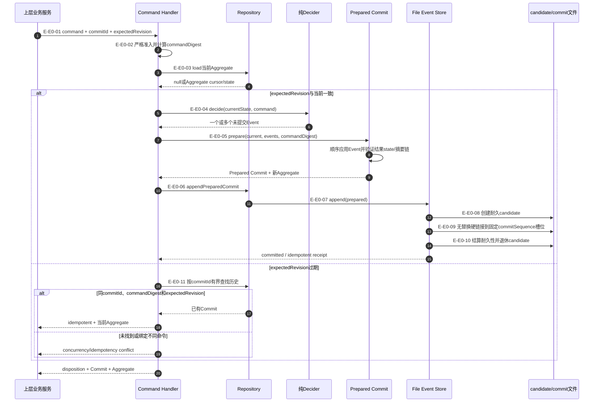
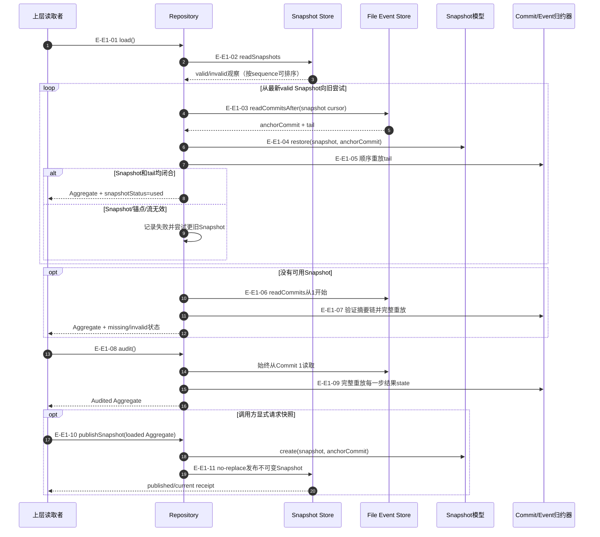
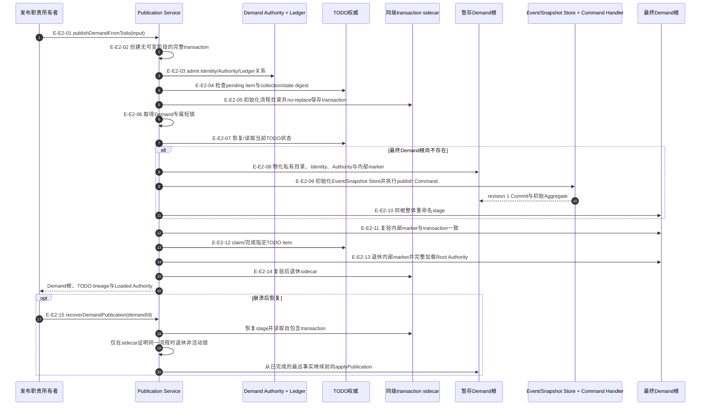

# Governance：Demand Command、Append、Load与Publication流程

## E0：业务Command决策与幂等追加

### 本图术语说明

| 图中术语 | 解释 |
| --- | --- |
| `expectedRevision` | 调用方基于其读取视图期望的当前逻辑事件修订号 |
| `commitId` | 一次业务命令追加的稳定幂等身份；同ID不能绑定不同命令 |
| Prepared Commit | 已完成纯事件应用、游标推进、摘要链和源前缀预期的追加能力 |
| fixed sequence槽位 | `commitSequence`对应的不替换文件名；并发方只能有一个Commit占据 |
| candidate | 进程/线程/token归属的耐久候选文件，用硬链接竞争Commit槽位 |
| idempotent | 同一Commit已存在且完整相同；不重新执行业务转换或写第二条事件 |

### E0边级证据

| 边编号 | 代码位置 | 测试重点 |
| --- | --- | --- |
| `E-E0-01`–`E-E0-03` | `demand-event-sourcing-command-handler.ts` | 输入、revision、commitId、取消和load错误 |
| `E-E0-04`、`E-E0-05` | Decider、Aggregate State、Commit | 阶段守卫、事件联合、multi-event、结果state和摘要 |
| `E-E0-06`–`E-E0-10` | Repository、File Event Store | Prepared capability、candidate、并发槽位、耐久性与残留恢复 |
| `E-E0-11` | Handler/Repository `findCommitById` | 只在过期预期时扫描、同ID同命令重试和冲突 |

## E1：Snapshot-tail加载、完整审计与快照发布

### 本图术语说明

| 图中术语 | 解释 |
| --- | --- |
| Snapshot观察 | `valid`或`invalid`的文件读取结果；invalid不会在load中删除或覆盖 |
| anchorCommit | Snapshot声明的最后Commit，恢复时必须与摘要、sequence和revision完全一致 |
| Snapshot-tail | 从Snapshot恢复Aggregate游标后只重放锚点之后的Commit |
| `audit` | 明确从Commit 1验证整个摘要链、版本演进和每一步state的读取模式 |
| `snapshotStatus` | `used / missing / invalid`，解释正常load采用的路径，不是业务状态 |
| no-replace Snapshot | 由commitSequence命名的不可变文件；同一锚点只能有完全相同内容 |

### E1边级证据

| 边编号 | 代码位置 | 测试重点 |
| --- | --- | --- |
| `E-E1-01`–`E-E1-07` | `DemandEventSourcingRepository.load` | 多Snapshot顺序、无效fallback、tail cursor、空流和完整重放 |
| `E-E1-08`、`E-E1-09` | `Repository.audit`、`applyDemandEventStreamCommit` | 从1开始、摘要链、upcast和每步结果state |
| `E-E1-10`、`E-E1-11` | Snapshot模型/Store、Repository.publishSnapshot | anchor闭合、版本兼容摘要、不可变发布和并发幂等 |

## E2：从TODO发布Demand根及前向恢复

### 本图术语说明

| 图中术语 | 解释 |
| --- | --- |
| Publication transaction | Identity、Authority、TODO预期、revision 1 IDs与所有派生路径的自包含不可变计划 |
| 同级sidecar | 位于Demand最终根之外的流程意图；根尚未发布时仍可找到恢复依据 |
| 内部marker | 暂存/最终Demand根内的transaction副本，用来证明发布根与sidecar相同 |
| stage根 | 与最终根同一文件系统的完整私有候选目录，可整体重命名发布 |
| 前向恢复 | 根据sidecar、stage/final根和TODO当前事实继续，不删除已发布根倒退 |
| TODO lineage | 发布完成后TODO claim/完成产生的可验证来源关系 |

### E2边级证据

| 边编号 | 代码位置 | 测试重点 |
| --- | --- | --- |
| `E-E2-01`–`E-E2-07` | Publication service/transaction/storage/todo | Authority先于副作用、CAS、sidecar、锁和幂等重入 |
| `E-E2-08`–`E-E2-10` | `publication-stage.ts` | 私有节点策略、revision 1、整体rename和stage/final冲突 |
| `E-E2-11`–`E-E2-14` | `applyPublication` | marker、TODO claim、完整Root Authority加载和sidecar退休顺序 |
| `E-E2-15` | `recoverDemandPublication` | demandId查找、sidecar完整性、非活动锁与每个崩溃点前向恢复 |

## 停止边界

- 当前文件Event Store只在单进程内按canonical Demand root串行append；跨进程竞争靠固定槽位硬链接与冲突检测。
- Repository load不写Snapshot；Snapshot发布必须由显式上层策略触发。
- Publication流程锁只保护首次Demand根跨资源发布；普通Event append不取得该流程锁。
- 事件、聚合和消费者联合已进入`d17602e`；后续变化必须重新运行重放、Schema与指纹门。
