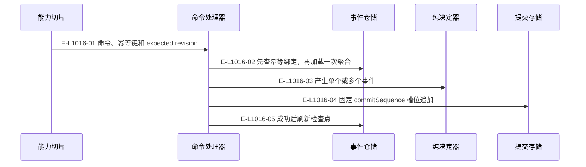
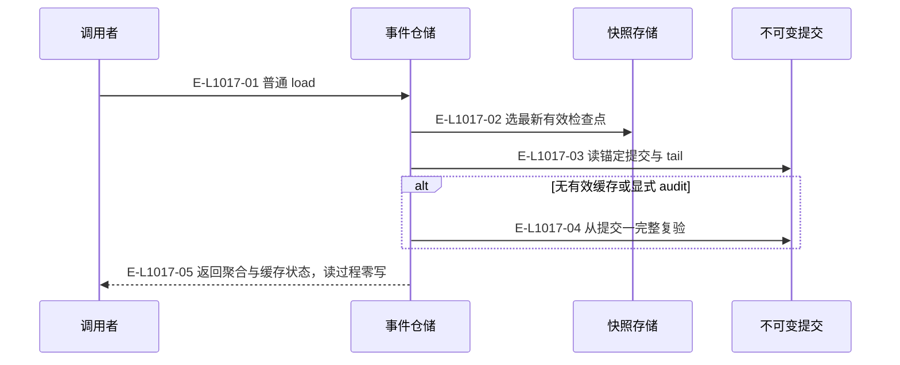
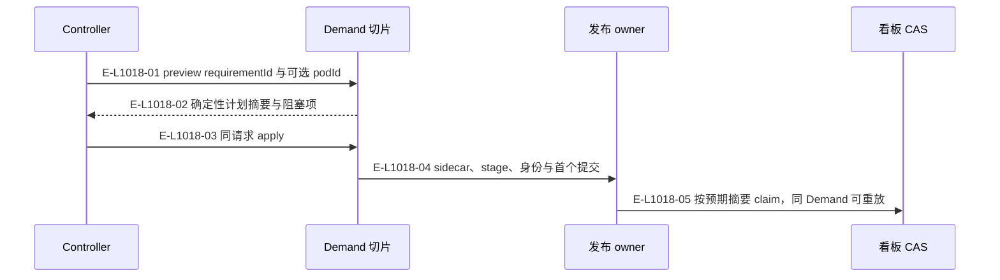

# Demand：命令、检查点与首次发布

事件流保留持久化事实，内核及切片提供追加型和效果型调用形状。

> 核验基线：`7ba1f38`；核验时实现代码均已提交，本轮图谱更新另列。开发阶段为 L1 九片已落地，observation 尚未开始。本文说明实现事实，未宣称双宿主真实会话已经验证。

## 追加命令的幂等与 CAS

### 本图术语说明

| 术语 | 本图含义 |
| --- | --- |
| CAS | 比较已观察的摘要/修订后提交；来源已改变则拒绝。 |
| commit | 一次不可变事件提交批；文件槽位以预期修订防止并发覆盖。 |
| snapshot | 可重建的事件聚合检查点；损坏时回退重放。 |

### 节点与实现定位

| 节点 | 文件 / 符号 | 责任 |
| --- | --- | --- |
| slice | `src/capabilities/tasking/service.ts` | 能力切片 |
| handler | `src/governance/demand/event-sourcing/demand-event-sourcing-command-handler.ts#executeDemandEventSourcingCommand` | 命令处理器 |
| repo | `src/governance/demand/event-sourcing/demand-event-sourcing-repository.ts` | 事件仓储 |
| decider | `src/governance/demand/event-sourcing/demand-event-sourcing-decider.ts` | 纯决定器 |
| store | `src/governance/demand/event-sourcing/demand-file-event-store.ts` | 提交存储 |

### 本图边级证据

| 编号 | 代码定位 | 测试 / 核验 | 关系依据 |
| --- | --- | --- | --- |
| E-L1016-01 | `src/capabilities/tasking/service.ts#execute` | `tests/capabilities/tasking/service.test.ts` | 命令、幂等键和 expected revision |
| E-L1016-02 | `src/governance/demand/event-sourcing/demand-event-sourcing-command-handler.ts#executeDemandEventSourcingCommand` | `tests/governance/demand/demand-event-sourcing-command-handler.test.ts` | 先查幂等绑定，再加载一次聚合 |
| E-L1016-03 | `src/governance/demand/event-sourcing/demand-event-sourcing-decider.ts#decideDemandEventSourcingCommand` | `tests/governance/demand/demand-event-sourcing-command-handler.test.ts` | 产生单个或多个事件 |
| E-L1016-04 | `src/governance/demand/event-sourcing/demand-event-sourcing-command-handler.ts#executeDemandEventSourcingCommand` | `tests/governance/demand/demand-event-sourcing-command-handler.test.ts` | 固定 commitSequence 槽位追加 |
| E-L1016-05 | `src/governance/demand/event-sourcing/demand-event-sourcing-repository.ts#DemandEventSourcingRepository.refreshCheckpoints` | `tests/governance/demand/demand-event-sourcing-command-handler.test.ts` | 成功后刷新检查点 |

## 快照加尾部和完整审计

### 本图术语说明

| 术语 | 本图含义 |
| --- | --- |
| snapshot | 可重建的事件聚合检查点；损坏时回退重放。 |
| commit | 一次不可变事件提交批；文件槽位以预期修订防止并发覆盖。 |

### 节点与实现定位

| 节点 | 文件 / 符号 | 责任 |
| --- | --- | --- |
| reader | Agent / 用户 / 外部效果或条件视图 | 调用者 |
| repo | `src/governance/demand/event-sourcing/demand-event-sourcing-repository.ts` | 事件仓储 |
| snapshot | `src/governance/demand/event-sourcing/demand-file-event-snapshot-store.ts` | 快照存储 |
| store | `src/governance/demand/event-sourcing/demand-file-event-store.ts` | 不可变提交 |

### 本图边级证据

| 编号 | 代码定位 | 测试 / 核验 | 关系依据 |
| --- | --- | --- | --- |
| E-L1017-01 | `src/governance/demand/event-sourcing/demand-event-sourcing-repository.ts#DemandEventSourcingRepository.load` | `tests/governance/demand/demand-event-sourcing-command-handler.test.ts` | 普通 load |
| E-L1017-02 | `src/governance/demand/event-sourcing/demand-event-sourcing-repository.ts#DemandEventSourcingRepository.load` | `tests/governance/demand/demand-event-sourcing-command-handler.test.ts` | 选最新有效检查点 |
| E-L1017-03 | `src/governance/demand/event-sourcing/demand-event-sourcing-repository.ts#DemandEventSourcingRepository.load` | `tests/governance/demand/demand-event-sourcing-command-handler.test.ts` | 读锚定提交与 tail |
| E-L1017-04 | `src/governance/demand/event-sourcing/demand-event-sourcing-repository.ts#DemandEventSourcingRepository.audit` | `tests/governance/demand/demand-event-sourcing-command-handler.test.ts` | 从提交一完整复验 |
| E-L1017-05 | `src/governance/demand/event-sourcing/demand-event-sourcing-repository.ts#DemandEventSourcingRepository.load` | `tests/governance/demand/demand-event-sourcing-command-handler.test.ts` | 返回聚合与缓存状态，读过程零写 |

## 根先发布后认领需求包

### 本图术语说明

| 术语 | 本图含义 |
| --- | --- |
| Demand | 一个需求的不可变身份和事件流；当前执行环境由 podId 指定。 |
| Pod | 完整窗口组与每仓执行位置；main 是 primary Pod。 |
| CAS | 比较已观察的摘要/修订后提交；来源已改变则拒绝。 |

### 节点与实现定位

| 节点 | 文件 / 符号 | 责任 |
| --- | --- | --- |
| agent | Agent / 用户 / 外部效果或条件视图 | Controller |
| slice | `src/capabilities/demand/service.ts` | Demand 切片 |
| publication | `src/governance/demand/publication/demand-event-sourcing-publication-service.ts` | 发布 owner |
| board | `src/kernel/requirement-board.ts` | 看板 CAS |

### 本图边级证据

| 编号 | 代码定位 | 测试 / 核验 | 关系依据 |
| --- | --- | --- | --- |
| E-L1018-01 | `src/capabilities/demand/service.ts#executeDemandCreationRequest` | `tests/capabilities/demand/service.test.ts` | preview requirementId 与可选 podId |
| E-L1018-02 | `src/capabilities/demand/service.ts#planCreate` | `tests/capabilities/demand/service.test.ts` | 确定性计划摘要与阻塞项 |
| E-L1018-03 | `src/capabilities/demand/service.ts#executeDemandCreationRequest` | `tests/capabilities/demand/service.test.ts` | 同请求 apply |
| E-L1018-04 | `src/governance/demand/publication/demand-event-sourcing-publication-service.ts#publishDemandFromPackage` | `tests/capabilities/demand/service.test.ts` | sidecar、stage、身份与首个提交 |
| E-L1018-05 | `src/governance/demand/publication/demand-event-sourcing-publication-package.ts#claimPackageForDemandPublication` | `tests/capabilities/demand/service.test.ts` | 按预期摘要 claim，同 Demand 可重放 |

## 守卫、恢复与验证范围

只画当前已有的恢复 owner。跨资源失败必须由原 sidecar 或日志前向结算；看板不是事件流的替代物。

涉及的测试与核验入口：

- `tests/capabilities/demand/service.test.ts`。
- `tests/capabilities/tasking/service.test.ts`。
- `tests/governance/demand/demand-event-sourcing-command-handler.test.ts`。

## 下钻与相关视图

- [本专题总览](./README.md)
- [图谱总索引](../README.md)
- [核验与剩余范围](../01-diagram-review-ledger.md)
