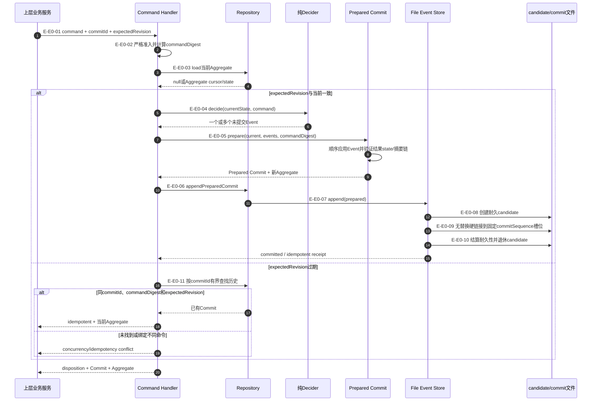
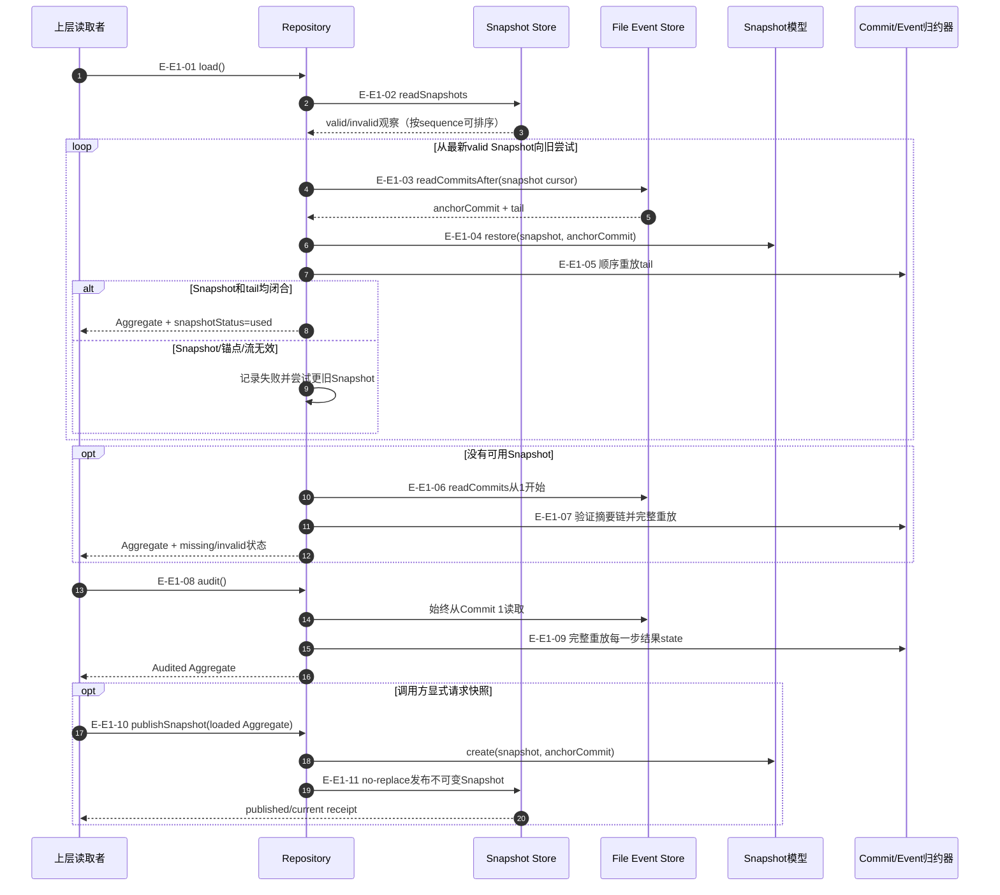
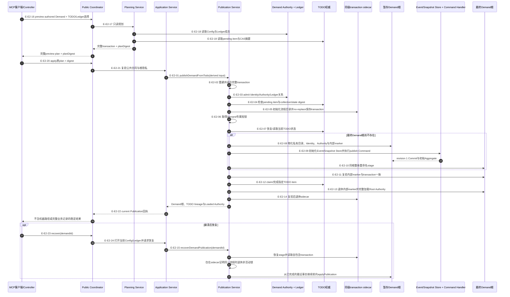
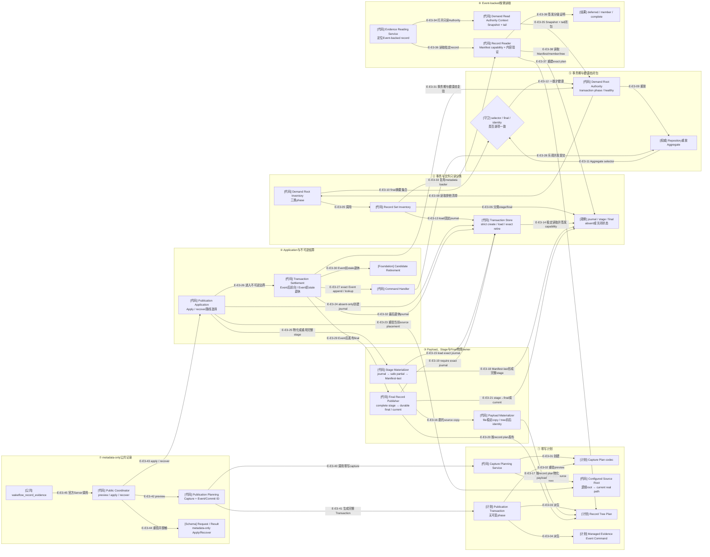

# Governance：Demand Command、Append、Load与Publication流程

## E0：业务Command决策与幂等追加

### 本图术语说明

| 图中术语 | 解释 |
| --- | --- |
| `expectedRevision` | 调用方基于其读取视图期望的当前逻辑事件修订号 |
| `commitId` | 一次业务命令追加的稳定幂等身份；同ID不能绑定不同命令 |
| Prepared Commit | 已完成纯事件应用、游标推进、摘要链和源前缀预期的追加能力 |
| fixed sequence槽位 | `commitSequence`对应的不替换文件名；并发方只能有一个Commit占据 |
| candidate | 进程/线程/token归属的耐久候选文件，用硬链接竞争Commit槽位 |
| idempotent | 同一Commit已存在且完整相同；不重新执行业务转换或写第二条事件 |

### E0边级证据

| 边编号 | 代码位置 | 测试重点 |
| --- | --- | --- |
| `E-E0-01`–`E-E0-03` | `demand-event-sourcing-command-handler.ts` | 输入、revision、commitId、取消和load错误 |
| `E-E0-04`、`E-E0-05` | Decider、Aggregate State、Commit | 阶段守卫、事件联合、multi-event、结果state和摘要 |
| `E-E0-06`–`E-E0-10` | Repository、File Event Store | Prepared capability、candidate、并发槽位、耐久性与残留恢复 |
| `E-E0-11` | Handler/Repository `findCommitById` | 只在过期预期时扫描、同ID同命令重试和冲突 |

## E1：Snapshot-tail加载、完整审计与快照发布

### 本图术语说明

| 图中术语 | 解释 |
| --- | --- |
| Snapshot观察 | `valid`或`invalid`的文件读取结果；invalid不会在load中删除或覆盖 |
| anchorCommit | Snapshot声明的最后Commit，恢复时必须与摘要、sequence和revision完全一致 |
| Snapshot-tail | 从Snapshot恢复Aggregate游标后只重放锚点之后的Commit |
| `audit` | 明确从Commit 1验证整个摘要链、版本演进和每一步state的读取模式 |
| `snapshotStatus` | `used / missing / invalid`，解释正常load采用的路径，不是业务状态 |
| no-replace Snapshot | 由commitSequence命名的不可变文件；同一锚点只能有完全相同内容 |

### E1边级证据

| 边编号 | 代码位置 | 测试重点 |
| --- | --- | --- |
| `E-E1-01`–`E-E1-07` | `DemandEventSourcingRepository.load` | 多Snapshot顺序、无效fallback、tail cursor、空流和完整重放 |
| `E-E1-08`、`E-E1-09` | `Repository.audit`、`applyDemandEventStreamCommit` | 从1开始、摘要链、upcast和每步结果state |
| `E-E1-10`、`E-E1-11` | Snapshot模型/Store、Repository.publishSnapshot | anchor闭合、版本兼容摘要、不可变发布和并发幂等 |

## E2：公共preview、精确应用与Demand根前向恢复

### 本图术语说明

| 图中术语 | 解释 |
| --- | --- |
| Publication transaction | Identity、Authority、TODO预期、revision 1 IDs与所有派生路径的自包含不可变计划 |
| authored Demand | 调用方拥有的title、goal、completion definition、执行位置、typed TODO选择与Ledger成员选择；不含系统派生Demand身份、时间、摘要或CAS；Ledger选择暂未由Intake引用唯一派生 |
| exact apply | 必须提交preview返回的完整plan及其digest；Application重新解析并复验当前Config/Ledger与输出闭合 |
| 同级sidecar | 位于Demand最终根之外的流程意图；根尚未发布时仍可找到恢复依据 |
| 内部marker | 暂存/最终Demand根内的transaction副本，用来证明发布根与sidecar相同 |
| stage根 | 与最终根同一文件系统的完整私有候选目录，可整体重命名发布 |
| 前向恢复 | 根据sidecar、stage/final根和TODO当前事实继续，不删除已发布根倒退 |
| TODO lineage | 发布完成后TODO claim/完成产生的可验证来源关系 |
| Publication authority | 失败时公开的最强可证效果：`unchanged / recoverable / current / unknown`；只有`recoverable`指示显式recover |

### E2边级证据

| 边编号 | 代码位置 | 测试重点 |
| --- | --- | --- |
| `E-E2-01`–`E-E2-07` | Publication service/transaction/storage/todo | Authority先于副作用、CAS、sidecar、锁和幂等重入 |
| `E-E2-08`–`E-E2-10` | `publication-stage.ts` | 私有节点策略、revision 1、整体rename和stage/final冲突 |
| `E-E2-11`–`E-E2-14` | `applyPublication` | marker、TODO claim、完整Root Authority加载和sidecar退休顺序 |
| `E-E2-15` | `recoverDemandPublication` | demandId查找、sidecar完整性、非活动锁与每个崩溃点前向恢复 |
| `E-E2-16`–`E-E2-21` | Public Contract/Coordinator、Input与Planning/Application Services | preview只有author-owned输入且零写；apply只接受exact plan/digest并复验当前权威 |
| `E-E2-22` | Application/Public Coordinator输出闭合 | Canonical JSON语义比较、commit digest与稳定脱敏回执 |
| `E-E2-23`、`E-E2-24` | Public recover与Application Service | recover只接受Demand ID，缺失或冲突sidecar失败关闭 |

## E3：Managed Evidence内部Application与恢复闭包

### 本图术语说明

| 图中术语 | 解释 |
| --- | --- |
| Capture Plan codec | 只解析Config摘要、Event Stream预期、Manifest及plan digest的纯合同；不依赖Planning I/O Service |
| 无可变phase | Transaction不保存`prepared/executing/committed`字段；恢复阶段从journal、stage/final与Event Store事实观察 |
| 三类phase | `healthy`、`demand-publication`、`managed-evidence-publication`三个明确Root Inventory上下文 |
| Record Set Inventory | healthy路径关闭final Manifest与顶层、将历史payload复验标记为deferred；事务路径对当前stage/final执行完整record-plan分类 |
| Transaction Store | 固定0600单槽的strict create/load/exact retire owner；现存exact journal也不被普通create接管，retire只接受Store签发能力 |
| Payload Materializer | file来源执行stable streaming copy；tree来源在复制前后计算完整Loaded Artifact identity并保留executable mode |
| Stage Materializer | 只在exact journal下创建/补齐stage；完整payload可脱离变化source恢复，Manifest必须最后出现 |
| Final Record Publisher | 只把完整stage同根rename为不存在final；final已存在时只接受stage absent且整树exact，journal保持不变 |
| Configured Source Root | 把Manifest中的repository/support逻辑根闭合到当前Config entity、present placement与real path；不读取source内容 |
| Transaction Settlement | Application下的不可逆边界owner；Event提交后只能发布final并退休journal，Event缺失且基线过期时才可退休safe candidate |
| transaction phase | journal存在时的专用Root Authority模式；允许目标stage/final与Event selector处于被事务顺序明确解释的中间组合 |
| Read Authority Context | 只读消费使用普通Root Authority的Snapshot + tail路径；mutation上下文继续从Commit 1完整audit |
| deferred / member / complete | 分别表示只验证Manifest顶层、一个完整payload文件、整棵record tree；三者不能互相冒充 |
| Manifest capability | Record Reader进程内签发的WeakSet能力；structured clone不能取得成员或整树读取权限 |
| metadata-only receipt | Apply/Recover只返回typed ID、摘要与Event/Commit/Aggregate游标；不返回Manifest、source ref或payload bytes |
| Aggregate selector | Event重放得到的`evidenceId + manifestDigest + payloadArtifactDigest`最小当前状态 |
| 健康闭包 | 物理final的Manifest摘要集合与Event selector、Program/Demand/Authority身份全部一致；具体payload内容在Evidence读取时复验 |

### E3边级证据

| 边编号 | 代码位置 | 测试重点 |
| --- | --- | --- |
| `E-E3-01` | `managed-evidence-capture-planning-service.ts` → `managed-evidence-capture-plan.ts` | 既有file/tree preview保持零写且digest不变 |
| `E-E3-02`–`E-E3-04` | `managed-evidence-publication-transaction.ts` | capture/record/command三摘要轴分别替换均拒绝；deterministic document重读 |
| `E-E3-05` | `demand-event-sourcing-root-inventory.ts` → `managed-evidence-record-set-inventory.ts` | healthy、demand-publication与managed-evidence-publication严格分流 |
| `E-E3-06` | Record Set Inventory、Transaction codec与Foundation candidate inspection | journal-only、partial/complete stage、当前final payload漂移，以及healthy历史payload复验deferred |
| `E-E3-08`–`E-E3-12` | `demand-event-sourcing-root-authority.ts`、Root Inventory与Repository | 完整final但无Event及foreign Program Manifest均拒绝；真实Command Handler追加后audit加载通过 |
| `E-E3-13`、`E-E3-14` | Record Set Inventory与Transaction Store | Inventory复用Store load；Application/Settlement分别消费strict create/load/exact retire |
| `E-E3-15`–`E-E3-18` | Payload/Stage Materializer、Transaction Store、Record Plan与Foundation transfer/candidate | 5项测试覆盖file/tree、executable、safe partial、Manifest-last、journal缺失与source漂移 |
| `E-E3-19`–`E-E3-21` | Final Record Publisher、Store、Record Plan与Foundation directory publication | 3项测试覆盖真实rename、current、journal保留、缺失/不完整/双根及final漂移；Publisher不读取Event |
| `E-E3-22`、`E-E3-23` | Capture Planning/Application → Configured Source Root | Planning旧行为回归通过；Application重验当前Config placement后才读取source |
| `E-E3-24`–`E-E3-29` | Application、Settlement、Store、Stage、Command Handler与Publisher | 正常真实Apply严格执行journal→stage→Event→final并最终恢复healthy Root |
| `E-E3-30`–`E-E3-32` | Settlement、Candidate Retirement、Root Authority与Store | Event前CAS过期退休partial；Event前/后完整stage脱离source恢复；journal已退休重试返回healthy |
| `E-E3-33`–`E-E3-36` | Record Set Inventory、Reading Service、Read Context与Record Reader | Inventory删除重复Manifest loader；Reader先取得Event-backed healthy Authority |
| `E-E3-37`–`E-E3-39` | Record Reader、Record Plan与final tree | 容量、未知member、capability clone、opaque tree、无关/目标成员漂移及完整tree验证 |
| `E-E3-40`–`E-E3-45` | Publication Planning、Public Coordinator、Schema与MCP工具 | 四类恢复结果、Demand/plan绑定、recoverable错误、23工具双宿主与候选stdio测试 |

## 停止边界

- 当前文件Event Store只在单进程内按canonical Demand root串行append；跨进程竞争靠固定槽位硬链接与冲突检测。
- Repository load不写Snapshot；Snapshot发布必须由显式上层策略触发。
- Publication流程锁只保护首次Demand根跨资源发布；普通Event append不取得该流程锁。
- `evidence.record-managed-evidence`已经沿E3形成内部写入/读取闭包，并由`wakeflow_record_evidence`公开metadata-only记录。
- Manifest v1没有chunk/Merkle identity，不能把byte range描述为独立可验证Evidence内容。
- 公共入口分组没有改变Transaction、Event、恢复或Reader证明语义；当前完整门1023项全通过，Demand input反向依赖18文件/80项独立通过。
- A2已关闭TODO内部手动生命周期与Intake/State可达性；A4/A5已公开Inspection/Intake，A6已删除Demand独立Authority selectors。Auto Claim consumer仍缺失。
