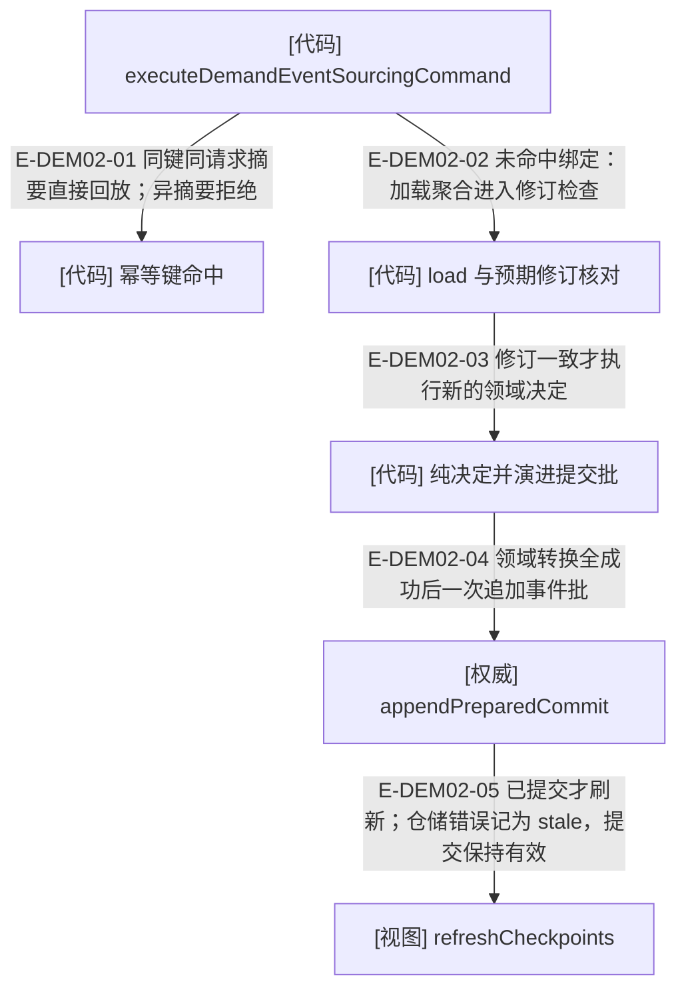
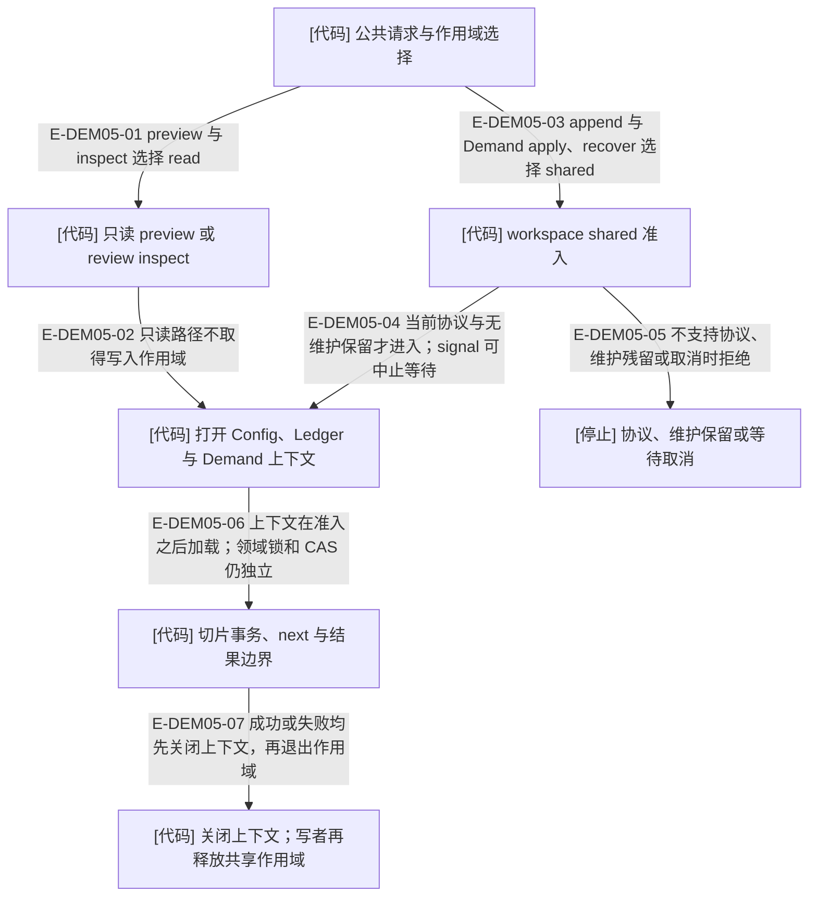

# Demand：追加提交与首次发布的两条管线

> 2026-10-03 当前工作树语义复核；含未提交实现。HEAD 只定位已提交基线，来源指纹覆盖本页实际引用的文件。图谱不拥有业务状态。本页的测试锚点表示已核对的覆盖入口，运行结果见本轮总台账。

```mermaid
flowchart TB
  accTitle: 追加命令的幂等与提交点
  accDescr: 追加命令的幂等与提交点；每条关系由当前实现的调用或条件支持，错误停止与恢复保持显式。
  A["[代码] executeDemandEventSourcingCommand"]
  B["[代码] 幂等键命中"]
  C["[代码] load 与预期修订核对"]
  D["[代码] 纯决定并演进提交批"]
  F["[权威] appendPreparedCommit"]
  H["[视图] refreshCheckpoints"]
  A -->|"E-DEM02-01 同键同请求摘要直接回放；异摘要拒绝"| B
  A -->|"E-DEM02-02 未命中绑定：加载聚合进入修订检查"| C
  C -->|"E-DEM02-03 修订一致才执行新的领域决定"| D
  D -->|"E-DEM02-04 领域转换全成功后一次追加事件批"| F
  F -->|"E-DEM02-05 已提交才刷新；仓储错误记为 stale，提交保持有效"| H
```

### 本图术语说明

| 术语 | 本图含义 |
| --- | --- |
| [代码] | 确定性服务、守卫或纯决定；失败会拒绝转换。 |
| [权威] | 持久事实；只能由指定写入者改变。 |
| [视图] | 由权威派生的可重建数据，不授权写入。 |
| commitId | 一次批提交的确定身份；与客户端 idempotency key 是不同层次。 |
| streamRevision | 事件修订号；一个提交批可含多个连续事件。 |

### 本图边级证据

| 编号 | 代码证据 | 测试证据 | 关系与边界 |
| --- | --- | --- | --- |
| E-DEM02-01 | `src/governance/demand/event-sourcing/demand-event-sourcing-command-handler.ts#executeDemandEventSourcingCommand` | 间接覆盖：`tests/governance/demand/demand-event-sourcing-command-handler.test.ts#executeDemandEventSourcingCommand`（经公共切片入口执行此内部关系） | 同键同请求摘要直接回放；异摘要拒绝 |
| E-DEM02-02 | `src/governance/demand/event-sourcing/demand-event-sourcing-command-handler.ts#loadAggregateForCommand` | 间接覆盖：`tests/governance/demand/demand-event-sourcing-command-handler.test.ts#executeDemandEventSourcingCommand`（经公共切片入口执行此内部关系） | 未命中绑定：加载聚合进入修订检查 |
| E-DEM02-03 | `src/governance/demand/event-sourcing/demand-event-sourcing-command-handler.ts#executeDemandEventSourcingCommand` | 间接覆盖：`tests/governance/demand/demand-event-sourcing-command-handler.test.ts#executeDemandEventSourcingCommand`（经公共切片入口执行此内部关系） | 修订一致才执行新的领域决定 |
| E-DEM02-04 | `src/governance/demand/event-sourcing/demand-event-sourcing-command-handler.ts#executeDemandEventSourcingCommand` | 间接覆盖：`tests/governance/demand/demand-event-sourcing-command-handler.test.ts#executeDemandEventSourcingCommand`（经公共切片入口执行此内部关系） | 领域转换全成功后一次追加事件批 |
| E-DEM02-05 | `src/governance/demand/event-sourcing/demand-event-sourcing-command-handler.ts#executeDemandEventSourcingCommand` | 间接覆盖：`tests/governance/demand/demand-event-sourcing-command-handler.test.ts#executeDemandEventSourcingCommand`（经公共切片入口执行此内部关系） | 已提交才刷新；仓储错误记为 stale，提交保持有效 |

幂等键命中时仍加载当前聚合，但直接返回旧提交，不再执行领域决定。预期修订过期时，只有同 commitId、命令摘要及原 expectedStreamRevision 都相符才重放；找不到或不匹配分别拒绝并发或幂等冲突。

## 首次发布的中断收敛

`src/governance/demand/publication/demand-event-sourcing-publication-service.ts#applyPublication` 顺序为：检查 pending 或同 Demand 已认领 → 构建 stage → 发布 final 根 → 复验根内 marker → CAS claim → 删除 marker → 加载根与认领闭包 → 删除 sidecar。final 与 stage 同时存在拒绝为 conflict。根存在但无 marker 且包未认领也拒绝，不把陌生根当作已发布。

`src/governance/demand/publication/demand-event-sourcing-publication-service.ts#recoverDemandPublication` 只根据同级意图恢复；先恢复意图文件的临时阶段，复验意图后才可退休已死拥有者的锁，取锁后再读意图并向前应用。意图不存在返回 not-found；它不是任意残留清理器。

错误的 publicationAuthority 为 unchanged、recoverable、current 或 unknown；读失败不可猜成功。纯事件命令对短暂 stream 读取冲突最多重读三次，不放宽校验、不无限重试。

## 公共切片进入写入前的工作区边界

```mermaid
flowchart TB
  accTitle: 共享工作区作用域覆盖上下文与收尾
  accDescr: 只读预览直接打开上下文；任务、投递、结果和生命周期写入先进入共享作用域，再加载配置并执行领域事务，结果边界和上下文关闭后才释放。维护保留或不支持协议时停止写入。
  R["[代码] 公共请求与作用域选择"]
  O["[代码] 只读 preview 或 review inspect"]
  S["[代码] workspace shared 准入"]
  C["[代码] 打开 Config、Ledger 与 Demand 上下文"]
  D["[代码] 切片事务、next 与结果边界"]
  F["[代码] 关闭上下文；写者再释放共享作用域"]
  X["[停止] 协议、维护保留或等待取消"]
  R -->|"E-DEM05-01 preview 与 inspect 选择 read"| O
  O -->|"E-DEM05-02 只读路径不取得写入作用域"| C
  R -->|"E-DEM05-03 append 与 Demand apply、recover 选择 shared"| S
  S -->|"E-DEM05-04 当前协议与无维护保留才进入；signal 可中止等待"| C
  S -->|"E-DEM05-05 不支持协议、维护残留或取消时拒绝"| X
  C -->|"E-DEM05-06 上下文在准入之后加载；领域锁和 CAS 仍独立"| D
  D -->|"E-DEM05-07 成功或失败均先关闭上下文，再退出作用域"| F
```

### 本图术语说明

| 术语 | 本图含义 |
| --- | --- |
| shared | 普通写者共享租约，可与其他共享写者并存；与独占维护冲突。 |
| read | 此处是不进入写入作用域的只读路径，不表示获得读写锁中的共享租约。 |
| 维护保留 | 活跃维护门或未结算维护事务；进程结束不自动解除耐久保留。 |
| signal | 请求取消信号传入准入等待；不等于撤销已经提交的事件。 |
| CAS | 比较并交换；共享作用域不替代每个资源的并发条件。 |

### 本图边级证据

| 编号 | 代码证据 | 测试证据 | 关系与边界 |
| --- | --- | --- | --- |
| E-DEM05-01 | `src/kernel/publication-transaction.ts#runPublicationTransaction`、`src/capabilities/result-review/service.ts#executeTargetResultReviewInspectionRequest` | `tests/kernel/publication-transaction.test.ts#runPublicationTransaction`、间接覆盖：`tests/capabilities/result-review/service.test.ts#inspectFixtureReview`（各自入口的只读行为） | preview/read 不持有写入租约。 |
| E-DEM05-02 | `src/kernel/command-shell.ts#runCommandShell` | `tests/kernel/command-shell.test.ts#runCommandShell` | read 直接执行 open/body/close，仍检查公开结果。 |
| E-DEM05-03 | `src/kernel/append-command.ts#runAppendCommand`、`src/capabilities/demand/lifecycle.ts#executeTerminal` | `tests/kernel/append-command.test.ts#runAppendCommand`、`tests/kernel/publication-transaction.test.ts#runPublicationTransaction` | 追加固定 shared，Demand 效果声明 mutationScope=shared。 |
| E-DEM05-04 | `src/kernel/workspace-operation-scope.ts#withWorkspaceOperationScope` | `tests/kernel/workspace-operation-scope.test.ts#withWorkspaceOperationScope`；间接覆盖：`tests/capabilities/workspace/operation-scope.test.ts#refreshActiveProjection`（在途投影使维护等待） | 开上下文之前进入；嵌套只能借用相同根且不可提升。 |
| E-DEM05-05 | `src/kernel/workspace-operation-scope.ts#prepareScope`、`src/kernel/workspace-operation-scope.ts#assertNoMaintenanceReservation` | `tests/capabilities/workspace/operation-scope.test.ts#withWorkspaceOperationScope` | 非当前协议或未结算维护拒绝；取消准入等待的逐切片组合未全部单测。 |
| E-DEM05-06 | `src/kernel/command-shell.ts#runCommandShell` | `tests/kernel/command-shell.test.ts#runCommandShell` | open、body、结果脱敏及上限均在 execute 内。 |
| E-DEM05-07 | `src/kernel/command-shell.ts#runCommandShell`、`src/kernel/workspace-operation-scope.ts#withWorkspaceOperationScope` | `tests/kernel/command-shell.test.ts#runCommandShell`、`tests/kernel/workspace-operation-scope.test.ts#withWorkspaceOperationScope` | execute 内上下文关闭不覆盖已有 body 错误；租约随后按自身 owner 结算，失败可另行覆盖。逃逸回调不能继续借用。 |

该图只覆盖普通写入与只读分支；维护 owner 自行管理入口门，私有权限收窄不在此共享/独占模型中。已提交之后仍可能因下游 I/O 或取消需要幂等重放或日志恢复，不能把作用域称为跨资源回滚事务。

当前租约取得即登记到外层，短 latch 结算失败后仍尝试释放已取得许可；未知同名替换者不被删除。清理错误可能覆盖原错误，这与 shell 的上下文关闭首错规则不同，见[许可交接与失败结算](../02-foundation/admission-races-and-recovery.md)。

## 继续阅读

[本专题总览](./README.md) · [文件导入](./file-dependencies.md) · [实际调用](./runtime-call-flow.md) · [逐文件审阅记录](../../plans/review-2026-10-03/demand-delivery.md) · [图谱入口](../README.md)
