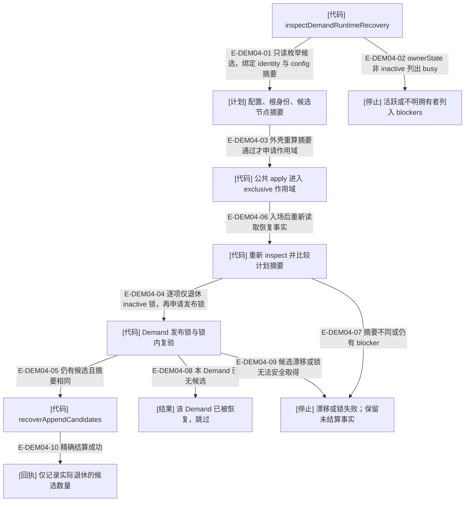

# Demand：候选提交恢复与 Pod 持久占用

> 2026-10-03 当前工作树语义复核；含未提交实现。HEAD 只定位已提交基线，来源指纹覆盖本页实际引用的文件。图谱不拥有业务状态。本页的测试锚点表示已核对的覆盖入口，运行结果见本轮总台账。

### 本图术语说明

| 术语 | 本图含义 |
| --- | --- |
| [代码] | 确定性服务、守卫或纯决定；失败会拒绝转换。 |
| [权威] | 持久事实；只能由指定写入者改变。 |
| [视图] | 由权威派生的可重建数据，不授权写入。 |
| 候选 | 追加过程中尚未退休的 staging 资源；不等于新领域命令。 |
| inactive | 拥有者明确不活动；unknown 不可按死亡处理。 |
| exclusive | 工作区写者准入许可；不是只读工具的全局快照锁，也不是维护 intent/journal 的权威。 |
| 双重摘要检查 | 外壳计划比对与进入独占后再次 inspect 分属两个调用边界，后者防止等待期间计划已变。 |

### 本图边级证据

| 编号 | 代码证据 | 测试证据 | 关系与边界 |
| --- | --- | --- | --- |
| E-DEM04-01 | `src/governance/demand/demand-runtime-recovery.ts#inspectDemandRuntimeRecovery` | 间接覆盖：`tests/capabilities/workspace/demand-runtime-recovery.test.ts#executeCodexWakeflowMaintenance`（经公共切片入口执行此内部关系） | 只读枚举候选，绑定 identity 与 config 摘要 |
| E-DEM04-02 | `src/governance/demand/demand-runtime-recovery.ts#inspectDemandRuntimeRecovery` | 间接覆盖：`tests/capabilities/workspace/demand-runtime-recovery.test.ts#executeCodexWakeflowMaintenance`（经公共切片入口执行此内部关系） | ownerState 非 inactive 列出 busy |
| E-DEM04-03 | `src/kernel/publication-transaction.ts#runPhase` / `src/capabilities/workspace/maintain-workspace.ts#executeWakeflowMaintenancePublicRequest` | 间接覆盖：`tests/capabilities/workspace/demand-runtime-recovery.test.ts#executeCodexWakeflowMaintenance` 的真实崩溃恢复调用；未单独暂停外壳计划与作用域之间。 | ready 与请求摘要相同才进入 runtime-recovery apply 分支。 |
| E-DEM04-04 | `src/governance/demand/demand-runtime-recovery.ts#applyDemandRuntimeRecovery` | 间接覆盖：`tests/capabilities/workspace/demand-runtime-recovery.test.ts#executeCodexWakeflowMaintenance`，杀死真实 MCP 后公开 reconcile。 | 只有 inactive 锁走显式退休；active/unknown 不偷取，后续申请受有界等待约束。 |
| E-DEM04-05 | `src/governance/demand/demand-runtime-recovery.ts#applyDemandRuntimeRecovery` | 间接覆盖：`tests/capabilities/workspace/demand-runtime-recovery.test.ts#executeCodexWakeflowMaintenance`，candidate/linked 两断点及大身份半写候选。 | 锁内再次 inspect，observed.digest 必须等于已绑定的 demand.digest。 |
| E-DEM04-06 | `src/capabilities/workspace/maintain-workspace.ts#executeWakeflowMaintenancePublicRequest` / `src/governance/demand/demand-runtime-recovery.ts#applyDemandRuntimeRecovery` | 间接覆盖：同上 `tests/capabilities/workspace/demand-runtime-recovery.test.ts#executeCodexWakeflowMaintenance`；精确调用先后按源码核验。 | withWorkspaceOperationScope 的回调内才调用 applyDemandRuntimeRecovery。 |
| E-DEM04-07 | `src/governance/demand/demand-runtime-recovery.ts#applyDemandRuntimeRecovery` | 未覆盖：现有公开恢复回归没有注入进入独占前后的候选摘要变化；按明确比较分支核验。 | 拒绝 stale plan，不自动重算并应用新集合。 |
| E-DEM04-08 | `src/governance/demand/demand-runtime-recovery.ts#applyDemandRuntimeRecovery` | 未覆盖：现有 candidate/linked 崩溃用例没有在锁内复验前让另一恢复者完成。 | observed 缺失只跳过当前 Demand，不伪造退休回执。 |
| E-DEM04-09 | `src/governance/demand/demand-runtime-recovery.ts#applyDemandRuntimeRecovery` / `src/foundation/filesystem/rooted-exclusive-file-lock.ts#withRootedExclusiveFileLock` | 间接覆盖：`tests/foundation/filesystem/rooted-exclusive-file-lock.test.ts#withRootedExclusiveFileLock` 证明已有锁获取超时不删除；未覆盖此恢复器锁内候选漂移组合。 | 失败不回滚此前已退休候选，也不删除不明锁。 |
| E-DEM04-10 | `src/governance/demand/demand-runtime-recovery.ts#applyDemandRuntimeRecovery` | 间接覆盖：`tests/capabilities/workspace/demand-runtime-recovery.test.ts#executeCodexWakeflowMaintenance`，候选清空、commit 原字节保留，原请求可 committed/idempotent 继续。 | 收集每个完成 Demand 的 retiredCount；中途抛错不返回部分成功结果。 |

维护恢复不解释或改写旧事件，不新增领域命令，不强制接管活动写者。已链接提交保留原字节，候选落盘而未链接时原请求重试可 committed；已链接后崩溃则原键重放 idempotent。真正的子进程崩溃测试覆盖 candidate / linked 两个断点，未知候选条目必须保留。

这里的公共入口是 `reconcile preview → apply`，其执行结果没有 maintenance operationId；`mode: recover` 加原 operationId 走的是静态维护事务恢复，不能与此候选清理混画。逐 Demand 清理不是跨全部 Demand 的原子事务：前项已经退休后若后项失败，前项保持已结算，下次应从当前事实重新预览。

Pod 占用来自三类事实：未结算发布意图、未结算生命周期日志、看板 claimed 对应的非终态 Demand。`assertNoActiveDemand` 先查前两类，再查活动聚合；无法归属的生命周期残留保守阻塞。它与 Pod 锁配合，使进程死亡不会释放尚未收尾的业务占用。

本轮复核中，创建/终态/续接 apply、recover 的共享工作区作用域包围这些短 Pod 锁，防止普通写入跨越独占配置切换。旧生命周期 journal 仍向前恢复；等待用户决定时取消现在由归约器清除活动等待，完整升级事件保持在归档历史中，见[终态修复](../07-review-rework-completion/state-and-recovery.md)。

## 继续阅读

[本专题总览](./README.md) · [文件导入](./file-dependencies.md) · [实际调用](./runtime-call-flow.md) · [逐文件审阅记录](../../plans/review-2026-10-03/demand-delivery.md) · [图谱入口](../README.md)
