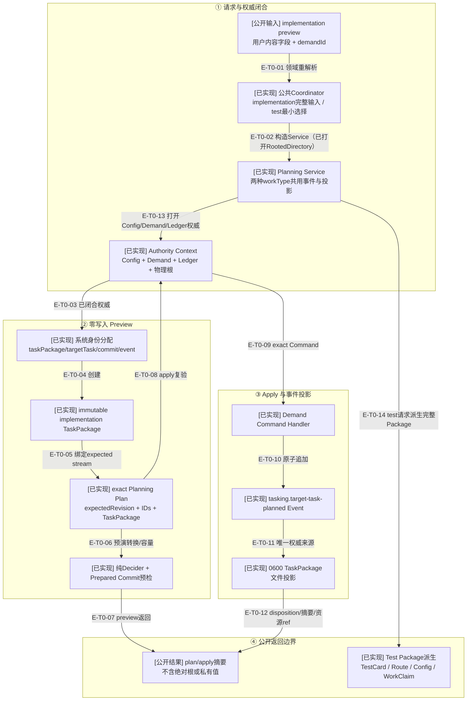

# Tasking纵切：Demand到不可变TaskPackage

> 这是图集首个L2垂直切片：当前可达生产路径从公共implementation或test preview请求开始，经过
> Config/Demand/Ledger权威准入，创建不可变TaskPackage与exact plan，再通过Demand Command追加
> 规划事件，最后从事件权威幂等物化文件投影。
>
> TaskPackage的`implementation | test`判别联合、Authority/Input/Service及相关测试均已进入`d17602e`。

## 当前结论

Target Task Planning把“用户可编辑内容”和“系统分配身份/权威”分开。implementation preview可以接受objective、
confirmed context、boundaries和acceptance anchors，但`taskPackageId`、`targetTaskId`、`commitId`、
`eventId`、Config/Demand摘要、创建时间和完整Ledger引用由Planning owner决定。

公共test分支不接收自由编写的测试目标：它必须从唯一TestCard Event恢复
`strategyAuthority`、`environmentAuthority`、`productSourcePolicy: read-only`和预留`targetTaskId`，
再确定性派生Test TaskPackage。公共Coordinator及wire Schema只接受最小`taskPackage={workType:"test"}`，
禁止调用方重写assignment、objective、Authority、boundaries或completion expectations。

apply不信任旧preview：它验证plan digest，按commitId检查已有Commit；若事件尚不存在，则重新打开
Config/Demand/Ledger权威并复验TaskPackage拓扑与Config时效性，再执行严格Demand Command。事件权威
一旦current，即使文件投影失败也不能回滚事件；重试只需从唯一规划事件恢复投影。

## 核验快照

| 项目 | 读取值 |
| --- | --- |
| 生产源码 | 9 个Tasking模块 |
| 全仓Architecture | 710个模块、4967条依赖、0违规 |
| 测试 | 6个正式测试、2个fixture；公共Coordinator覆盖implementation/test两种请求 |
| 合同 | 1个TaskPackage Schema、1个生成合同 |
| 提交状态 | TaskPackage、Planning Authority/Input/Service及测试已提交 |
| 来源指纹 | `0eae581be2a350ceb3e1f4fe0c4db9b0d3659514142e39f8f05eb5c6f8780dbc` |

## T0：Target Task Planning垂直切片

### 本图术语说明

| 图中术语 | 解释 |
| --- | --- |
| 用户内容字段 | implementation调用方可描述的objective、context、assignment、boundaries、completion和acceptance信息 |
| Authority Context | 已打开Workspace/Demand/Ledger根、Config snapshot、Demand Root Authority和关系引用的组合 |
| 系统身份分配 | Planning owner通过UUID工厂创建的TaskPackage、TargetTask、Commit和Event身份 |
| immutable TaskPackage | 公共路径可创建`implementation`合同，或从当前TestCard确定派生`test`合同 |
| exact plan | 绑定demandId、expectedRevision、commitId、eventId和完整TaskPackage的preview产物 |
| 预检 | 在零写入preview中运行同一纯Decider和Prepared Commit容量检查，不签发append capability |
| 事件权威 | `tasking.target-task-planned`持久Event；TaskPackage文件只是可重建投影 |
| disposition | `committed`或`idempotent`，说明事件追加是本次完成还是同计划重试收敛 |

## T0边级证据

| 边编号 | 真实代码关系 | 证据 |
| --- | --- | --- |
| `E-T0-01`、`E-T0-02` | 公共合同重解析后构造`TargetTaskPlanningService` | `target-task-planning-public-{contract,coordinator}.ts`及公共入口测试 |
| `E-T0-13`、`E-T0-03` | Service打开并复验Config、Demand、Ledger权威 | `target-task-planning-authority.ts`与Service authority负例 |
| `E-T0-04`–`E-T0-07` | 分配ID、创建implementation TaskPackage、预演Decider/Commit并返回preview | Input、TaskPackage、Plan、Decider与Service preview测试 |
| `E-T0-08`–`E-T0-12` | apply重验后追加唯一Event并物化投影 | Service apply、Demand Handler与Projection Store测试 |
| `E-T0-14` | 公共test请求只选择workType，Service从TestCard/Route/Config/WorkClaim派生完整Package | 公共Schema、Coordinator与真实preview/apply/retry纵切 |

## 权威与字段所有权

| 字段/事实 | 所有者 | preview/apply规则 |
| --- | --- | --- |
| objective、context、boundaries、acceptance | Controller authored输入 | preview重解析并冻结；不能控制系统身份/权威摘要 |
| TaskPackage/TargetTask/Commit/Event IDs | Planning owner | preview分配并写入exact plan；apply不得重新分配 |
| Config/Demand/Authority摘要 | 当前Authority Context | preview签发；apply在事件不存在时重新打开并复验 |
| expected stream revision | 当前Demand Aggregate | plan绑定；事件流变化时Command冲突或同Commit幂等 |
| TaskPackage事实 | Demand Event | implementation与test都只能从唯一规划Event创建/复验文件projection |
| projection路径/文档摘要 | Projection Store | 由TaskPackage身份和确定文档派生，不反向修改Event |

## 实现与测试任务

| 分支 | 当前生产入口 | Service实现 | 结论 |
| --- | --- | --- | --- |
| `implementation` | 公共MCP Coordinator与判别式wire Schema | preview/apply、事件与投影均闭合 | Controller提供完整包内容 |
| `test` | 同一公共MCP工具的最小`workType:test`请求 | TestCard/route/WorkClaim准入、TaskPackage派生及事件闭合 | owner派生，调用方不能重新author |

## 重试与失败边界

- preview绝不写事件或投影；plan容量在返回前通过真实Prepared Commit渲染上限预检。
- apply先按commitId查找；同ID绑定不同command或expectedRevision时拒绝。
- 事件不存在时，apply重新打开完整Authority Context并检查Config仍current。
- Event追加成功后`eventAuthority=current`；投影失败返回可恢复错误，不能删除Commit回滚。
- Projection Store先审计唯一`target-task-planned`事件；事件缺失时没有写入副作用。
- 已有投影只有与事件TaskPackage确定文档完全相同才返回`current`，否则冲突。

## 验证证据

| 证据 | 当前结果 | 说明 |
| --- | --- | --- |
| 全仓architecture | 710模块、4967依赖、0违规 | 当前纵切所在静态依赖边界 |
| TaskPackage测试 | 解析、创建、文档、摘要与implementation/test联合 | 合同和字段关系负例 |
| Planning Service测试 | preview/apply/idempotency/Config变化/测试路由/投影恢复 | 纵切主链证据 |
| Projection Store测试 | 事件来源、0600、缺失/冲突/幂等 | Event权威与文件投影边界 |

## 下钻入口

- [Tasking关键文件依赖](./file-dependencies.md)
- [preview/apply/retry调用时序](./runtime-call-flow.md)
- [返回Demand事件权威](../04-governance-event-sourcing/README.md)
