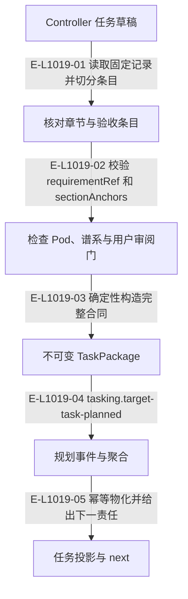

# 任务规划：需求锚点、谱系与测试合同

公共规划已改为一次追加。实现任务的锚点逐条指向需求包验收标准；测试任务直接携带 testContract，独立 TestCard 家族已经移除。

> 核验基线：`1480271`（L1 observation 第十片已落地，20 个公共工具、18 个一次性场景）。工作树另有并行未提交改动（宿主 hook 通道等），本图不描绘；来源指纹按当前工作树计算。本文说明实现事实，未宣称双宿主真实会话已经验证。

## 一次追加生成任务合同

### 本图术语说明

| 术语 | 本图含义 |
| --- | --- |
| TaskPackage | 目标任务的不可变合同，内容来自已发布需求包。 |
| testContract | 测试任务包内冻结的步骤、环境、技能、预算与停止条件。 |
| CAS | 比较已观察的摘要/修订后提交；来源已改变则拒绝。 |
| next | 根据当前事实派生的下一责任与建议工具。 |

### 节点与实现定位

| 节点 | 文件 / 符号 | 责任 |
| --- | --- | --- |
| request | `src/capabilities/tasking/service.ts` | Controller 任务草稿 |
| anchors | `src/capabilities/tasking/decide.ts` | 核对章节与验收条目 |
| lineage | `src/capabilities/tasking/decide.ts` | 检查 Pod、谱系与用户审阅门 |
| package | `src/governance/tasking/task-package.ts` | 不可变 TaskPackage |
| event | `src/governance/demand/model/demand-aggregate-state.ts` | 规划事件与聚合 |
| view | `src/governance/tasking/task-package-projection-store.ts` | 任务投影与 next |

### 本图边级证据

| 编号 | 代码定位 | 测试 / 核验 | 关系依据 |
| --- | --- | --- | --- |
| E-L1019-01 | `src/capabilities/tasking/service.ts#buildImplementationPackage` | `tests/capabilities/tasking/service.test.ts` | 读取固定记录并切分条目 |
| E-L1019-02 | `src/capabilities/tasking/decide.ts#deriveAnchorReferenceBlockers` | `tests/capabilities/tasking/service.test.ts` | 校验 requirementRef 和 sectionAnchors |
| E-L1019-03 | `src/capabilities/tasking/service.ts#buildPackage` | `tests/capabilities/tasking/service.test.ts` | 确定性构造完整合同 |
| E-L1019-04 | `src/capabilities/tasking/service.ts#execute` | `tests/capabilities/tasking/service.test.ts` | tasking.target-task-planned |
| E-L1019-05 | `src/capabilities/tasking/service.ts#materialize` | `tests/capabilities/tasking/service.test.ts` | 幂等物化并给出下一责任 |

## 守卫、恢复与验证范围

同一仓库的开放谱系须 replacement；只有接受的前序可 continuation。新 replacement 创建时旧目标成为 superseded。taskPlanReview:user 要求请求带确认时间；不是只保存一个未消费的元数据字段。

涉及的测试与核验入口：

- `tests/capabilities/tasking/service.test.ts`。

## 下钻与相关视图

- [文件直接导入](./file-dependencies.md)
- [运行调用与恢复](./runtime-call-flow.md)
- [图谱总索引](../README.md)
- [核验与剩余范围](../01-diagram-review-ledger.md)
