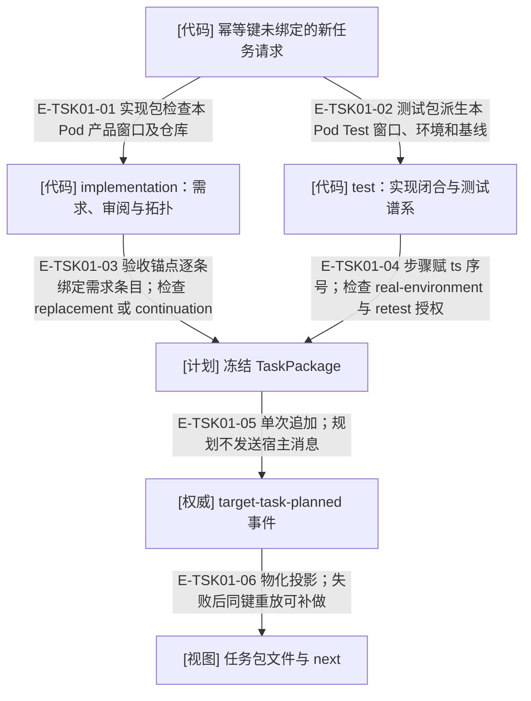

# 任务规划：冻结合同之前的准入分支

> 2026-10-03 当前工作树语义复核；含未提交实现。HEAD 只定位已提交基线，来源指纹覆盖本页实际引用的文件。图谱不拥有业务状态。本页的测试锚点表示已核对的覆盖入口，运行结果见本轮总台账。

```mermaid
flowchart TB
  accTitle: 实现任务和测试任务分别冻结什么
  accDescr: 实现任务和测试任务分别冻结什么；每条关系由当前实现的调用或条件支持，错误停止与恢复保持显式。
  A["[代码] 幂等键未绑定的新任务请求"]
  B["[代码] implementation：需求、审阅与拓扑"]
  C["[代码] test：实现闭合与测试谱系"]
  D["[计划] 冻结 TaskPackage"]
  F["[权威] target-task-planned 事件"]
  H["[视图] 任务包文件与 next"]
  A -->|"E-TSK01-01 实现包检查本 Pod 产品窗口及仓库"| B
  A -->|"E-TSK01-02 测试包派生本 Pod Test 窗口、环境和基线"| C
  B -->|"E-TSK01-03 验收锚点逐条绑定需求条目；检查 replacement 或 continuation"| D
  C -->|"E-TSK01-04 步骤赋 ts 序号；检查 real-environment 与 retest 授权"| D
  D -->|"E-TSK01-05 单次追加；规划不发送宿主消息"| F
  F -->|"E-TSK01-06 物化投影；失败后同键重放可补做"| H
```

### 本图术语说明

| 术语 | 本图含义 |
| --- | --- |
| [代码] | 确定性服务、守卫或纯决定；失败会拒绝转换。 |
| [权威] | 持久事实；只能由指定写入者改变。 |
| [视图] | 由权威派生的可重建数据，不授权写入。 |
| TaskPackage | 冻结的目标合同，是事件内容；磁盘任务包只是可重建投影。 |
| lineage | 实现替代/续接、测试 retest 的显式来源关系。 |

### 本图边级证据

| 编号 | 代码证据 | 测试证据 | 关系与边界 |
| --- | --- | --- | --- |
| E-TSK01-01 | `src/capabilities/tasking/service.ts#buildImplementationPackage` | 间接覆盖：`tests/capabilities/tasking/service.test.ts#planFixtureTargetTask`（经公共切片入口执行此内部关系） | 实现包检查本 Pod 产品窗口及仓库 |
| E-TSK01-02 | `src/capabilities/tasking/service.ts#buildTestPackage` | 间接覆盖：`tests/capabilities/tasking/service.test.ts#planFixtureTestTask`（经公共切片入口执行此内部关系） | 测试包派生本 Pod Test 窗口、环境和基线 |
| E-TSK01-03 | `src/capabilities/tasking/service.ts#buildImplementationPackage` | 间接覆盖：`tests/capabilities/tasking/service.test.ts#planFixtureTargetTask`（经公共切片入口执行此内部关系） | 验收锚点逐条绑定需求条目；检查 replacement 或 continuation |
| E-TSK01-04 | `src/capabilities/tasking/service.ts#buildTestPackage` | 间接覆盖：`tests/capabilities/tasking/service.test.ts#planFixtureTestTask`（经公共切片入口执行此内部关系） | 步骤赋 ts 序号；检查 real-environment 与 retest 授权 |
| E-TSK01-05 | `src/capabilities/tasking/service.ts#execute` | 间接覆盖：`tests/capabilities/tasking/service.test.ts#planFixtureTargetTask`（经公共切片入口执行此内部关系） | 单次追加；规划不发送宿主消息 |
| E-TSK01-06 | `src/capabilities/tasking/service.ts#materialize` | 间接覆盖：`tests/capabilities/tasking/service.test.ts#TaskPackageProjectionStore`（经公共切片入口执行此内部关系） | 物化投影；失败后同键重放可补做 |

## 准入规则决定读图方式

| 分支 | 真实条件 | 失败或下一步 |
| --- | --- | --- |
| 实现 | 非 research；Demand active；当前测试代际尚未开始 | 测试已开始则禁止另开实现包；修复走已授权目标 |
| 拓扑 | 指派窗口 role=product、repository 相同、pod 相同 | unknown / role / repository / pod mismatch 明确拒绝 |
| 验收引用 | recordDigest、acceptance-criteria、itemId 均命中冻结需求 | 不允许发明条目；完成覆盖另由 verify 汇总 |
| 用户审阅 | taskPlanReview=user 必须携带 confirmedAt | controller 模式多给确认时间也拒绝；代码记录声明，不验证真人身份 |
| 同仓实现 | 未接受且未 superseded 的头必须 replacement | in-flight 不可替代；仅有 accepted 则 continuation 指向已接受目标 |
| 测试 | real-environment、active、无 awaitingDecision、至少一个现存实现目标且全部 accepted | 当前代际至多一个未终结 test；product-defect 后须消费 pendingTestRetest |

测试步骤的 GWT 由 Controller 撰写；窗口、landing 成员、实现已接受结果/决定摘要、修复授权身份由 Wakeflow 派生。任务规划不替 Agent 安装环境或执行测试。

2026-10-03 增量没有改变任务合同或谱系规则；新增的共享工作区准入和取消传播位于调用外壳。混合失败的产品修复仍复用原实现包；修复接受后才以 retest 规划新测试包，其他失败不会随修复授权自动通过。

## 继续阅读

[本专题总览](./README.md) · [文件导入](./file-dependencies.md) · [实际调用](./runtime-call-flow.md) · [逐文件审阅记录](../../plans/review-2026-10-03/demand-delivery.md) · [图谱入口](../README.md)
