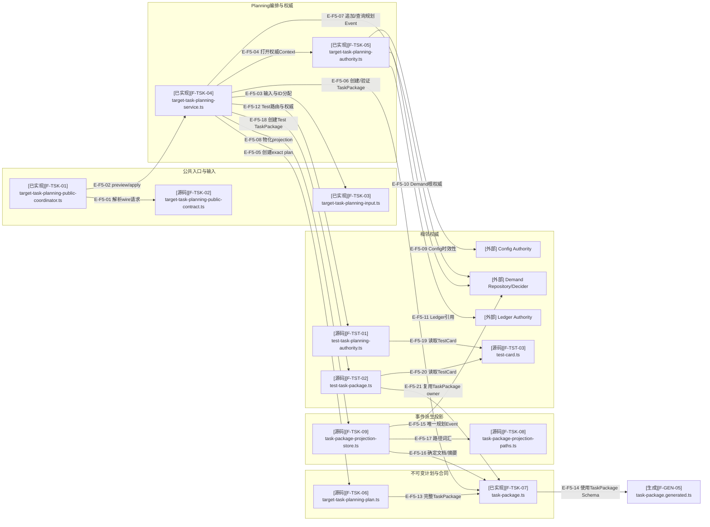

# Tasking纵切：关键文件导入依赖

## F5：Planning、TaskPackage与投影依赖

### 本图术语说明

| 图中术语 | 解释 |
| --- | --- |
| wire请求 | MCP输入Schema准入后的公共preview/apply结构；领域仍重新解析和冻结 |
| Authority Context | Config、Demand Root Authority、Ledger root和当前物理根的组合 |
| exact plan | 固定所有系统ID、expected revision和完整TaskPackage的不可变preview结果 |
| 相邻权威 | Tasking只读取并引用的Config/Demand/Ledger/TestCard事实，不复制为自身权威 |
| Event派生投影 | 从唯一`target-task-planned`事件重建的0600文件，便于目标窗口读取 |

## 文件与符号映射

| 文件编号 | 文件/符号 | 状态 | 职责 |
| --- | --- | --- | --- |
| `F-TSK-01` | `target-task-planning-public-coordinator.ts#execute*PublicRequest` | 已实现 | 打开根、调用Service并脱敏preview/apply结果 |
| `F-TSK-02` | `target-task-planning-public-contract.ts` | 已实现 | 公共工具名、Schema版本和请求领域重解析 |
| `F-TSK-03` | `target-task-planning-input.ts` | 已实现 | authored输入、options、取消和4类系统ID分配 |
| `F-TSK-04` | `target-task-planning-service.ts#TargetTaskPlanningService` | 已实现 | preview/apply唯一编排职责 |
| `F-TSK-05` | `target-task-planning-authority.ts` | 已实现 | 打开Config/Demand/Ledger权威并复验引用/拓扑/Config current |
| `F-TSK-06` | `target-task-planning-plan.ts` | 已实现 | exact plan解析、创建和Canonical digest |
| `F-TSK-07` | `task-package.ts` | 已实现 | `workType`判别联合、TestCard tuple、确定文档和摘要 |
| `F-TSK-08` | `task-package-projection-paths.ts` | 已实现 | TaskPackage ID与唯一投影路径/文件名互转 |
| `F-TSK-09` | `task-package-projection-store.ts#TaskPackageProjectionStore` | 已实现 | 从事件审计并幂等物化/读取0600投影 |
| `F-TST-01` | `testing/test-task-planning-authority.ts` | 已实现 | 从Review route、TestCard、Config Test窗口及产品WorkClaim闭合test准入 |
| `F-TST-02` | `testing/test-task-package.ts` | 已实现 | 从TestCard确定性派生`test` TaskPackage并复验投影关系 |
| `F-TST-03` | `testing/test-card.ts` | 已实现 | TestCard严格合同、确定文档和摘要；由相邻Testing纵切拥有 |
| `F-GEN-05` | `contracts/generated/governance/tasking/task-package.generated.ts` | 已实现 | TaskPackage Schema生成类型与运行时常量 |

## 原始依赖快照

| 生产模块 | 聚焦闭包模块 | 依赖 | 违规 |
| ---: | ---: | ---: | ---: |
| 9 | 823 | 5817 | 0 |

## 边级证据

| 边编号 | 范围 | 证据 |
| --- | --- | --- |
| `E-F5-01`–`E-F5-08` | Public/Service内部组合 | Tasking模块直接imports；Planning Service与Public Coordinator测试 |
| `E-F5-09`–`E-F5-12` | Config/Demand/Ledger与Test Planning权威 | Authority模块与Test Planning来源加载；Service负例 |
| `E-F5-13`、`E-F5-14` | Plan/TaskPackage/Schema | plan与TaskPackage测试、schema:check |
| `E-F5-15`–`E-F5-17` | Event到文件投影 | Projection Store审计事件、路径、确定文档与幂等测试 |
| `E-F5-18`–`E-F5-21` | Service内部Test分支 | Service、Test Planning Authority、Test TaskPackage和TestCard直接imports；当前仅测试/fixture调用该分支 |

## 停止边界

- 本图只展示Tasking骨干；Demand、Ledger、TestCard和Foundation闭包在相邻文档包下钻。
- TaskPackage/Event是权威事实；projection缺失不允许调用方伪造文件补齐。
- 公共Coordinator与wire Schema允许两种workType，但test只接受最小选择并由owner派生完整内容。
- Tasking相关源码、Schema和测试已进入`d17602e`。
- A2-F1只调整测试fixture的前置权威顺序；本图Tasking生产文件的直接import声明已逐条复核，没有新增TODO依赖边。
