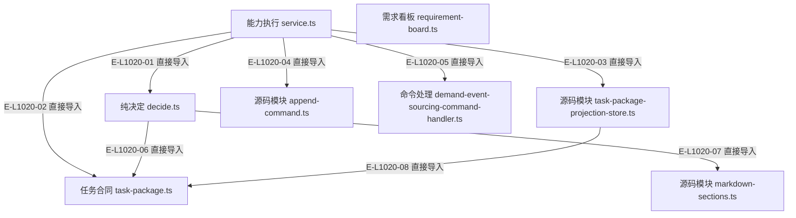

# 任务规划：文件直接导入

这是当前源码 AST 提取的审阅精选范围，只显示下表文件之间的真实直接导入。完整源码闭包可以继续沿导入下钻；此图不证明调用顺序。

> 核验基线：`7ba1f38`；核验时实现代码均已提交，本轮图谱更新另列。开发阶段为 L1 九片已落地，observation 尚未开始。本文说明实现事实，未宣称双宿主真实会话已经验证。

## 任务规划的精选直接导入

### 本图术语说明

| 术语 | 本图含义 |
| --- | --- |
| AST | 源码的语法树；直接导入自动提取，运行时调用顺序另行核实。 |

### 节点与实现定位

| 节点 | 文件 / 符号 | 责任 |
| --- | --- | --- |
| f1 | `src/capabilities/tasking/service.ts` | 能力执行 service.ts |
| f2 | `src/capabilities/tasking/decide.ts` | 纯决定 decide.ts |
| f3 | `src/governance/tasking/task-package.ts` | 任务合同 task-package.ts |
| f4 | `src/governance/tasking/task-package-projection-store.ts` | 源码模块 task-package-projection-store.ts |
| f5 | `src/kernel/append-command.ts` | 源码模块 append-command.ts |
| f6 | `src/governance/demand/event-sourcing/demand-event-sourcing-command-handler.ts` | 命令处理 demand-event-sourcing-command-handler.ts |
| f7 | `src/kernel/requirement-board.ts` | 需求看板 requirement-board.ts |
| f8 | `src/kernel/markdown-sections.ts` | 源码模块 markdown-sections.ts |

### 本图边级证据

| 编号 | 代码定位 | 测试 / 核验 | 关系依据 |
| --- | --- | --- | --- |
| E-L1020-01 | `src/capabilities/tasking/service.ts` | `tests/capabilities/tasking/service.test.ts` | 直接导入 |
| E-L1020-02 | `src/capabilities/tasking/service.ts` | `tests/capabilities/tasking/service.test.ts` | 直接导入 |
| E-L1020-03 | `src/capabilities/tasking/service.ts` | `tests/capabilities/tasking/service.test.ts` | 直接导入 |
| E-L1020-04 | `src/capabilities/tasking/service.ts` | `tests/capabilities/tasking/service.test.ts` | 直接导入 |
| E-L1020-05 | `src/capabilities/tasking/service.ts` | `tests/capabilities/tasking/service.test.ts` | 直接导入 |
| E-L1020-06 | `src/capabilities/tasking/decide.ts` | `tests/capabilities/tasking/service.test.ts` | 直接导入 |
| E-L1020-07 | `src/capabilities/tasking/decide.ts` | `tests/capabilities/tasking/service.test.ts` | 直接导入 |
| E-L1020-08 | `src/governance/tasking/task-package-projection-store.ts` | `tests/capabilities/tasking/service.test.ts` | 直接导入 |

## 守卫、恢复与验证范围

文件身份采用完整仓库相对路径；同名 service.ts、decide.ts 不靠文件名猜测。生成合同仍回指 Schema 权威。

涉及的测试与核验入口：

- `tests/capabilities/tasking/service.test.ts`。

## 下钻与相关视图

- [本专题总览](./README.md)
- [图谱总索引](../README.md)
- [核验与剩余范围](../01-diagram-review-ledger.md)
