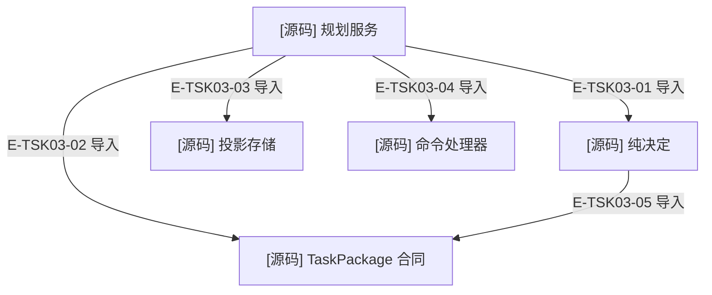

# 任务规划：直接导入与职责分离

> 2026-10-03 当前工作树语义复核；含未提交实现。HEAD 只定位已提交基线，来源指纹覆盖本页实际引用的文件。图谱不拥有业务状态。本页仅声明静态导入，由 AST 核验；不把导入存在作为运行分支已覆盖的证明。

```mermaid
flowchart TB
  accTitle: 规划切片的精选直接导入
  accDescr: 图中连线仅表示当前 TypeScript 直接导入，不表示调用顺序或持久状态；完整路径与符号在表中定位。
  S["[源码] 规划服务"]
  D["[源码] 纯决定"]
  P["[源码] TaskPackage 合同"]
  M["[源码] 投影存储"]
  H["[源码] 命令处理器"]
  S -->|"E-TSK03-01 导入"| D
  S -->|"E-TSK03-02 导入"| P
  S -->|"E-TSK03-03 导入"| M
  S -->|"E-TSK03-04 导入"| H
  D -->|"E-TSK03-05 导入"| P
```

### 本图术语说明

| 术语 | 本图含义 |
| --- | --- |
| [代码] | 确定性服务、守卫或纯决定；失败会拒绝转换。 |
| [权威] | 持久事实；只能由指定写入者改变。 |
| [视图] | 由权威派生的可重建数据，不授权写入。 |

### 本图边级证据

| 编号 | 代码证据 | 测试证据 | 关系与边界 |
| --- | --- | --- | --- |
| E-TSK03-01 | `src/capabilities/tasking/service.ts` | 未覆盖：此边仅声明静态 import，由 AST 核验；运行分支覆盖见相邻调用页。 | 导入 |
| E-TSK03-02 | `src/capabilities/tasking/service.ts` | 未覆盖：此边仅声明静态 import，由 AST 核验；运行分支覆盖见相邻调用页。 | 导入 |
| E-TSK03-03 | `src/capabilities/tasking/service.ts` | 未覆盖：此边仅声明静态 import，由 AST 核验；运行分支覆盖见相邻调用页。 | 导入 |
| E-TSK03-04 | `src/capabilities/tasking/service.ts` | 未覆盖：此边仅声明静态 import，由 AST 核验；运行分支覆盖见相邻调用页。 | 导入 |
| E-TSK03-05 | `src/capabilities/tasking/decide.ts` | 未覆盖：此边仅声明静态 import，由 AST 核验；运行分支覆盖见相邻调用页。 | 导入 |

| 节点 | 完整路径 | 主要符号 |
| --- | --- | --- |
| S | `src/capabilities/tasking/service.ts` | `executeTargetTaskPlanningPublicRequest` |
| D | `src/capabilities/tasking/decide.ts` | `deriveLineageExpectation` |
| P | `src/governance/tasking/task-package.ts` | `createTaskPackage` |
| M | `src/governance/tasking/task-package-projection-store.ts` | `TaskPackageProjectionStore` |
| H | `src/governance/demand/event-sourcing/demand-event-sourcing-command-handler.ts` | `executeDemandEventSourcingCommand` |

折叠：生成请求/结果合同、Ledger成员读取、纯摘要、ID与时间原语。本图只表示直接 import，不能推出所有符号都会在每个 workType 分支运行。

## 继续阅读

[本专题总览](./README.md) · [文件导入](./file-dependencies.md) · [实际调用](./runtime-call-flow.md) · [逐文件审阅记录](../../plans/review-2026-10-03/demand-delivery.md) · [图谱入口](../README.md)
