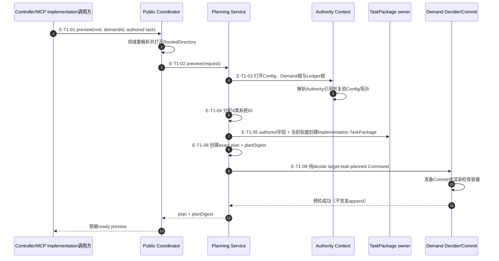
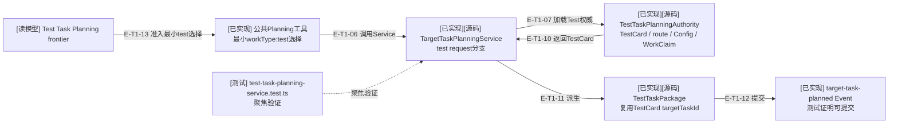
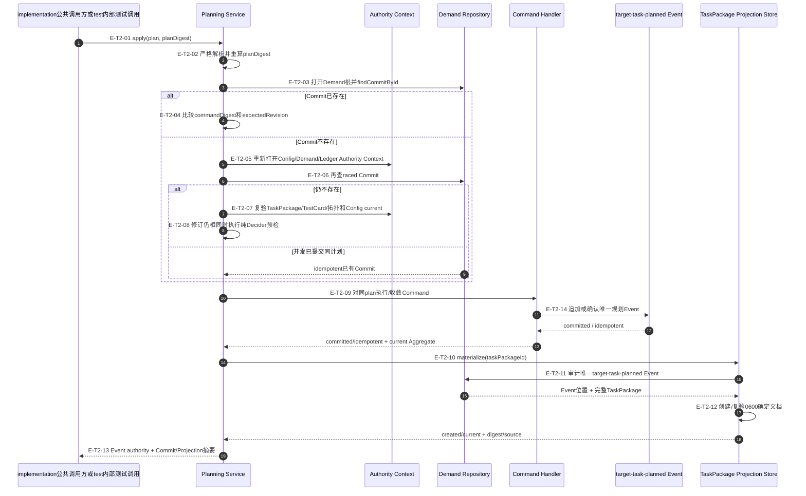

# Tasking纵切：preview、apply与投影恢复

## T1：零写入preview与exact plan

### 本图术语说明

| 图中术语 | 解释 |
| --- | --- |
| authored task | 不含协议头、系统ID、权威摘要和创建时间的Controller内容草稿 |
| 4类系统ID | `taskPackageId`、`targetTaskId`、`commitId`、`eventId` |
| Authority引用 | TaskPackage选中的Ledger authority member引用；由当前Demand Authority解析 |
| planDigest | exact plan的Canonical JSON SHA-256；apply拒绝任一字段变化 |
| 容量预检 | 渲染真实Prepared Commit并检查Event Store单Commit字节上限，仍保持零写入 |

### T1边级证据

| 边编号 | 代码位置 | 测试重点 |
| --- | --- | --- |
| `E-T1-01`、`E-T1-02` | Public Coordinator、Planning Input | wire后二次准入、私有根脱敏、取消和错误映射 |
| `E-T1-03` | Planning Authority | Config/Demand/Ledger根、Identity/Authority摘要、位置和引用 |
| `E-T1-04`、`E-T1-05` | Input/TaskPackage | implementation ID所有权、authored字段与权威字段分责 |
| `E-T1-08`、`E-T1-09` | Plan、Decider、Prepared Commit | plan确定性、阶段转换和容量上限 |

## T1B：公共test选择与owner派生边界

### 本图术语说明

| 图中术语 | 解释 |
| --- | --- |
| 最小test选择 | 公共请求只携带`taskPackage.workType=test`，不携带完整Package字段 |
| Test Planning Authority | 从Review route、TestCard Event、Config Test窗口及产品WorkClaim组合准入test请求 |
| Test TaskPackage | 从TestCard确定性派生的`workType:test`变体；不是调用方自由编写的测试目标 |
| owner派生 | Service从当前TestCard与Route恢复全部执行合同字段 |

### T1B边级证据

| 边编号 | 代码位置 | 结论 |
| --- | --- | --- |
| `E-T1-06` | Public Coordinator与`TargetTaskPlanningService` | 公共最小test请求进入同一Service |
| `E-T1-07`、`E-T1-10` | `target-task-planning-service.ts`、`test-task-planning-authority.ts` | Service加载TestCard、route、Config与Claim并返回闭合来源 |
| `E-T1-11`、`E-T1-12` | `test-task-package.ts`、Service | 派生Package并提交规划Event |
| `E-T1-13` | 公共request Schema、Public Coordinator与Service | 公共路径允许最小test选择并拒绝调用方重写派生内容 |

## T2：apply、幂等Event与Projection收敛

### 本图术语说明

| 图中术语 | 解释 |
| --- | --- |
| raced Commit | 第一次检查后、完整Authority Context打开期间由并发调用提交的同sequence事实 |
| `eventAuthority` | Service错误/结果对事件权威的判断：`unchanged / current / unknown` |
| exact Planning Command | 从plan唯一派生的`tasking.target-task-planned`命令；不读取新authored输入 |
| Event位置 | eventId、eventDigest与streamRevision；Projection只引用并审计，不复制Commit权威 |
| `created/current` | 投影本次创建，或已经与Event确定文档完全相同 |
| 收敛 | 重试不产生第二条Event或不同文件，只把缺失派生投影补齐到同一事实 |

### T2边级证据

| 边编号 | 代码位置 | 测试重点 |
| --- | --- | --- |
| `E-T2-01`–`E-T2-04` | `TargetTaskPlanningService.apply` | plan篡改、同commit不同command、已有Commit快速路径 |
| `E-T2-05`–`E-T2-08` | Planning Authority、纯Decider预检 | raced Commit、Config变化、TaskPackage/TestCard关系和revision冲突 |
| `E-T2-09`、`E-T2-14` | Command Handler/Event Store | 单次执行、committed/idempotent、eventAuthority current/unknown |
| `E-T2-10`–`E-T2-12` | TaskPackage Projection Store | 唯一Event、缺失时零写入、0600、确定文档和冲突 |
| `E-T2-13` | Service/Public Coordinator | 脱敏Commit/Projection摘要与资源ref |

## 停止边界

- preview返回的plan不是Event；只有apply经标准Command Handler追加后才形成权威事实。
- Projection失败不允许回滚已经current的Event；调用方根据eventAuthority决定恢复策略。
- 文件Projection是本地读取便利层，不是向目标窗口派发任务的宿主效果。
- T1B已由同一公共MCP Planning工具消费，并受Controller Route frontier约束。
- Tasking合同和Service已进入`d17602e`；后续变化必须刷新本文指纹。
