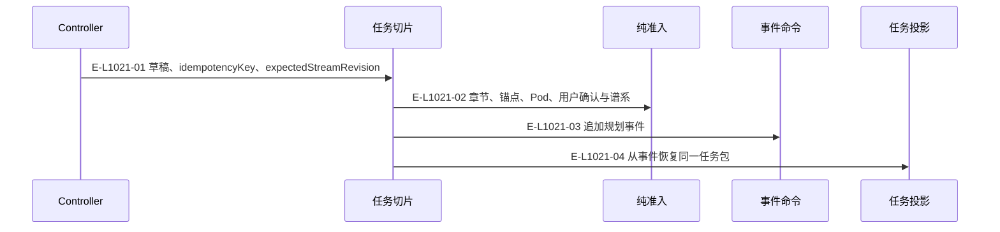
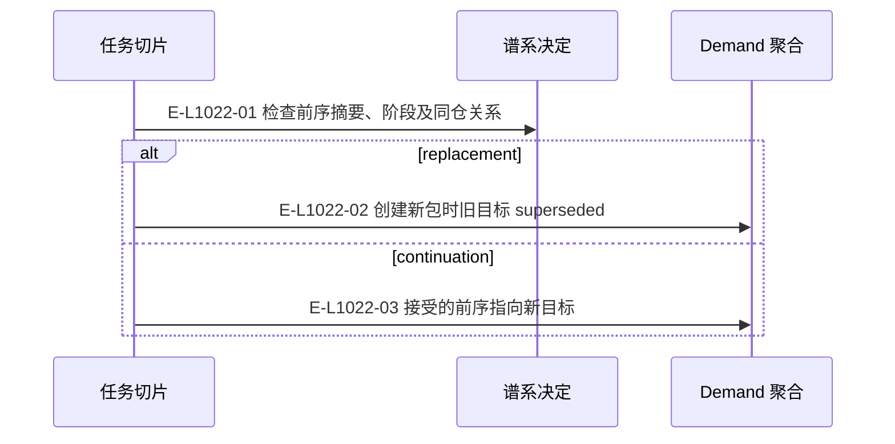
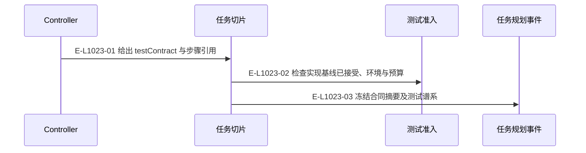

# 任务规划：追加、谱系与测试派生

实现和测试共用一个公开工具；两类草稿的准入和字段所有权分开。

> 核验基线：`7ba1f38`；核验时实现代码均已提交，本轮图谱更新另列。开发阶段为 L1 九片已落地，observation 尚未开始。本文说明实现事实，未宣称双宿主真实会话已经验证。

## 实现任务的一次追加

### 本图术语说明

| 术语 | 本图含义 |
| --- | --- |
| TaskPackage | 目标任务的不可变合同，内容来自已发布需求包。 |
| CAS | 比较已观察的摘要/修订后提交；来源已改变则拒绝。 |

### 节点与实现定位

| 节点 | 文件 / 符号 | 责任 |
| --- | --- | --- |
| controller | Agent / 用户 / 外部效果或条件视图 | Controller |
| slice | `src/capabilities/tasking/service.ts` | 任务切片 |
| decide | `src/capabilities/tasking/decide.ts` | 纯准入 |
| handler | `src/governance/demand/event-sourcing/demand-event-sourcing-command-handler.ts` | 事件命令 |
| view | `src/governance/tasking/task-package-projection-store.ts` | 任务投影 |

### 本图边级证据

| 编号 | 代码定位 | 测试 / 核验 | 关系依据 |
| --- | --- | --- | --- |
| E-L1021-01 | `src/capabilities/tasking/service.ts#executeTargetTaskPlanningPublicRequest` | `tests/capabilities/tasking/service.test.ts` | 草稿、idempotencyKey、expectedStreamRevision |
| E-L1021-02 | `src/capabilities/tasking/service.ts#buildImplementationPackage` | `tests/capabilities/tasking/service.test.ts` | 章节、锚点、Pod、用户确认与谱系 |
| E-L1021-03 | `src/capabilities/tasking/service.ts#execute` | `tests/capabilities/tasking/service.test.ts` | 追加规划事件 |
| E-L1021-04 | `src/capabilities/tasking/service.ts#materialize` | `tests/capabilities/tasking/service.test.ts` | 从事件恢复同一任务包 |

## 替换与继续的谱系约束

### 本图术语说明

| 术语 | 本图含义 |
| --- | --- |
| TaskPackage | 目标任务的不可变合同，内容来自已发布需求包。 |
| Demand | 一个需求的不可变身份和事件流；当前执行环境由 podId 指定。 |

### 节点与实现定位

| 节点 | 文件 / 符号 | 责任 |
| --- | --- | --- |
| slice | `src/capabilities/tasking/service.ts` | 任务切片 |
| decide | `src/capabilities/tasking/decide.ts` | 谱系决定 |
| aggregate | `src/governance/demand/model/demand-aggregate-state.ts` | Demand 聚合 |

### 本图边级证据

| 编号 | 代码定位 | 测试 / 核验 | 关系依据 |
| --- | --- | --- | --- |
| E-L1022-01 | `src/capabilities/tasking/decide.ts#deriveLineageBlockers` | `tests/capabilities/tasking/service.test.ts` | 检查前序摘要、阶段及同仓关系 |
| E-L1022-02 | `src/governance/demand/model/demand-aggregate-state.ts#planTargetTaskInDemandAggregateState` | `tests/capabilities/tasking/service.test.ts` | 创建新包时旧目标 superseded |
| E-L1022-03 | `src/governance/demand/model/demand-aggregate-state.ts#planTargetTaskInDemandAggregateState` | `tests/capabilities/tasking/service.test.ts` | 接受的前序指向新目标 |

## 测试任务的合同准入

### 本图术语说明

| 术语 | 本图含义 |
| --- | --- |
| testContract | 测试任务包内冻结的步骤、环境、技能、预算与停止条件。 |
| TaskPackage | 目标任务的不可变合同，内容来自已发布需求包。 |

### 节点与实现定位

| 节点 | 文件 / 符号 | 责任 |
| --- | --- | --- |
| controller | Agent / 用户 / 外部效果或条件视图 | Controller |
| slice | `src/capabilities/tasking/service.ts` | 任务切片 |
| decide | `src/capabilities/tasking/decide.ts` | 测试准入 |
| event | `src/governance/demand/model/demand-aggregate-state.ts` | 任务规划事件 |

### 本图边级证据

| 编号 | 代码定位 | 测试 / 核验 | 关系依据 |
| --- | --- | --- | --- |
| E-L1023-01 | `src/capabilities/tasking/service.ts#buildTestPackage` | `tests/capabilities/tasking/service.test.ts` | 给出 testContract 与步骤引用 |
| E-L1023-02 | `src/capabilities/tasking/decide.ts#deriveTestPlanningBlockers` | `tests/capabilities/tasking/service.test.ts` | 检查实现基线已接受、环境与预算 |
| E-L1023-03 | `src/governance/demand/model/demand-aggregate-state.ts#planTargetTaskInDemandAggregateState` | `tests/capabilities/tasking/service.test.ts` | 冻结合同摘要及测试谱系 |

## 守卫、恢复与验证范围

同键重放先于后置领域约束检查，避免因已存在任务而误拒重试。不同请求摘要不能复用同一幂等键。

涉及的测试与核验入口：

- `tests/capabilities/tasking/service.test.ts`。

## 下钻与相关视图

- [本专题总览](./README.md)
- [图谱总索引](../README.md)
- [核验与剩余范围](../01-diagram-review-ledger.md)
