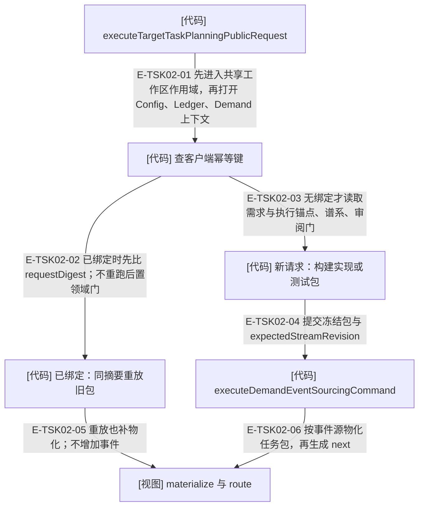

# 任务规划：先重放，再做领域准入

> 2026-10-03 当前工作树语义复核；含未提交实现。HEAD 只定位已提交基线，来源指纹覆盖本页实际引用的文件。图谱不拥有业务状态。本页的测试锚点表示已核对的覆盖入口，运行结果见本轮总台账。

```mermaid
flowchart TB
  accTitle: 规划请求的幂等优先调用
  accDescr: 规划请求的幂等优先调用；每条关系由当前实现的调用或条件支持，错误停止与恢复保持显式。
  A["[代码] executeTargetTaskPlanningPublicRequest"]
  B["[代码] 查客户端幂等键"]
  C["[代码] 已绑定：同摘要重放旧包"]
  D["[代码] 新请求：构建实现或测试包"]
  F["[代码] executeDemandEventSourcingCommand"]
  H["[视图] materialize 与 route"]
  A -->|"E-TSK02-01 先进入共享工作区作用域，再打开 Config、Ledger、Demand 上下文"| B
  B -->|"E-TSK02-02 已绑定时先比 requestDigest；不重跑后置领域门"| C
  B -->|"E-TSK02-03 无绑定才读取需求与执行锚点、谱系、审阅门"| D
  D -->|"E-TSK02-04 提交冻结包与 expectedStreamRevision"| F
  C -->|"E-TSK02-05 重放也补物化；不增加事件"| H
  F -->|"E-TSK02-06 按事件源物化任务包，再生成 next"| H
```

### 本图术语说明

| 术语 | 本图含义 |
| --- | --- |
| [代码] | 确定性服务、守卫或纯决定；失败会拒绝转换。 |
| [权威] | 持久事实；只能由指定写入者改变。 |
| [视图] | 由权威派生的可重建数据，不授权写入。 |
| requestDigest | 同键输入绑定摘要；同键异输入不会被当作重试。 |
| materialize | 根据权威规划事件重新生成文件；不创建新的任务状态。 |

### 本图边级证据

| 编号 | 代码证据 | 测试证据 | 关系与边界 |
| --- | --- | --- | --- |
| E-TSK02-01 | `src/capabilities/tasking/service.ts#executeTargetTaskPlanningPublicRequest` | 间接覆盖：`tests/capabilities/tasking/service.test.ts#planFixtureTargetTask`（经公共切片入口执行此内部关系） | 先进入共享工作区作用域，再打开 Config、Ledger、Demand 上下文 |
| E-TSK02-02 | `src/capabilities/tasking/service.ts#execute` | 间接覆盖：`tests/capabilities/tasking/service.test.ts#planFixtureTargetTask`（经公共切片入口执行此内部关系） | 已绑定时先比 requestDigest；不重跑后置领域门 |
| E-TSK02-03 | `src/capabilities/tasking/service.ts#buildPackage` | 间接覆盖：`tests/capabilities/tasking/service.test.ts#planFixtureTargetTask`（经公共切片入口执行此内部关系） | 无绑定才读取需求与执行锚点、谱系、审阅门 |
| E-TSK02-04 | `src/capabilities/tasking/service.ts#execute` | 间接覆盖：`tests/capabilities/tasking/service.test.ts#planFixtureTargetTask`（经公共切片入口执行此内部关系） | 提交冻结包与 expectedStreamRevision |
| E-TSK02-05 | `src/capabilities/tasking/service.ts#execute` | 间接覆盖：`tests/capabilities/tasking/service.test.ts#planFixtureTargetTask`（经公共切片入口执行此内部关系） | 重放也补物化；不增加事件 |
| E-TSK02-06 | `src/capabilities/tasking/service.ts#next` | 间接覆盖：`tests/capabilities/tasking/service.test.ts#planFixtureTestTask`（经公共切片入口执行此内部关系） | 按事件源物化任务包，再生成 next |

过期修订映射为 concurrency-conflict/stream-revision；同键异体为 idempotency-mismatch/request-digest；领域决定拒绝为 precondition-failed。投影失败报 io-failure/projection，已经提交的规划事件仍在；下一次同键回放恢复投影。

纯决定函数不读文件、不看时钟。任务 ID 从 demandId 与 idempotencyKey 派生，时间仅由构建包时注入。重试先查键的顺序至关重要：第一次规划后“同仓已有活动头”会变真，但不应阻止回放第一次结果。

`runAppendCommand` 固定使用 shared 工作区作用域，`executeTargetTaskPlanningPublicRequest` 将 signal 传给外壳；取消可以中止等待，准入之后才读取配置/权威。作用域包住事件追加、任务包投影、next 和上下文关闭；它不替代 Demand 事件修订检查。完整入口分支见[公共工作区边界](../04-governance-event-sourcing/runtime-call-flow.md)。

## 继续阅读

[本专题总览](./README.md) · [文件导入](./file-dependencies.md) · [实际调用](./runtime-call-flow.md) · [逐文件审阅记录](../../plans/review-2026-10-03/demand-delivery.md) · [图谱入口](../README.md)
