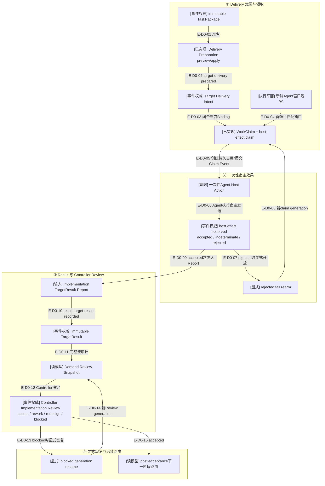

# 实现投递与Controller Review纵切

> Delivery、Result与Review共69个生产模块、11组Schema/生成合同和相关测试已进入`d17602e`。
> 公共MCP按Controller Route分别暴露Preparation、Claim/Outcome/Rearm、Result Import、Inspection、Decision
> 与Resume；它们不是一个绕过Event前置条件的单体orchestrator。

## 当前结论

Delivery不是“把prompt发给窗口”的单步操作。准备阶段从TaskPackage、当前Binding和可选返工上下文创建
不可变Target Delivery Intent并追加Event；claim阶段要求新鲜、闭合的Agent窗口观察，原子创建
WindowWorkClaim并提交host-effect-claimed Event，之后才签发一次性Agent Host Action。

宿主效果发生后必须记录accepted/indeterminate/rejected观察。只有accepted尾部可导入Agent Report并由
Wakeflow补齐不可变Implementation TargetResult；Controller Implementation Review再从完整事件流重建Snapshot并提交accept/rework/
redesign/blocked决定。blocked generation只能由显式resume恢复。

当前`src/entrypoints/`只组合Maintenance、implementation Target Task Planning和Window Binding；没有
Delivery、Result或Review executor。下图跨阶段箭头表达“前一事件是后一Service的准入前提”，不是一个已接线
orchestrator在进程内连续调用所有Service。

## 核验快照

| 项目 | 读取值 |
| --- | --- |
| 生产源码 | Delivery 22、Result 9、Review 15，共46模块 |
| 当前全仓架构门 | 823模块、5817依赖、10个显式生产根、0违规；最近完整门1023项 |
| 测试 | Delivery 17、Result 7、Review 19，共43个正式测试 |
| 合同 | Delivery 4、Result 3、Review 4，共11个Schema/生成合同 |
| 提交状态 | 本范围源码、合同和测试已提交 |
| 来源指纹 | `2aa76ec90d7e2b8ceb9212e45a53ea3f0f64f2916bbd610852a9862db2ff0ae0` |

## D0：实现投递、结果与审阅主链

### 本图术语说明

| 图中术语 | 解释 |
| --- | --- |
| Delivery Intent | 绑定TaskPackage、目标窗口、attempt/generation和可移植prompt核心的不可变发送准备事实 |
| WindowWorkClaim | 不自动过期的当前窗口工作占用权威；创建与释放都要求精确同一Claim |
| Agent Host Action | 只由首次提交的Claim Event回执生成的一次性瞬时宿主动作，不持久化为第二权威 |
| host effect observation | Agent对实际宿主发送结果的结构化观察；不由Wakeflow伪造成功 |
| `indeterminate` | 无法安全证明成功或失败；禁止自动重试造成重复宿主效果 |
| rearm | 仅针对精确rejected尾部显式开放新的效果generation |
| Implementation TargetResult | Implementation Report经当前TaskPackage、Intent、Claim和accepted effect补齐后的不可变事件事实 |
| Review Snapshot | Repository一次完整审计重建的零写结果审查视图 |
| Review generation | 同一TargetResult/snapshot digest对应的一轮决定；blocked resume开启后续轮次 |

## 权威与副作用边界

| 阶段 | 权威 | 派生/瞬时内容 |
| --- | --- | --- |
| 准备 | `target-delivery-prepared` Event中的Intent | portable prompt、rework context投影 |
| Claim | WindowWorkClaim文件 + `target-host-effect-claimed` Event | Agent Host Action |
| 宿主结果 | `target-host-effect-observed` Event | accepted/indeterminate/rejected selector |
| Result | `target-result-recorded` Event中的TargetResult | Result Report解析结果 |
| Review | decision/resume Events | Review Snapshot与post-acceptance route |

## D0边级证据

| 边编号 | 实际关系 | 证据边界 |
| --- | --- | --- |
| `E-D0-01`–`E-D0-05` | 独立Preparation/Claim Service以前序Event、Binding观察和Claim文件闭合下一步 | Delivery preparation/claim源码与聚焦测试；不是一个直接跨Service调用链 |
| `E-D0-06`–`E-D0-08` | Agent执行宿主效果，Outcome Event决定保留Claim或为rejected授权释放/rearm | Agent Host Action、Outcome/Rearm Service及Claim settlement测试 |
| `E-D0-09`–`E-D0-12` | accepted效果后由Result Import提交TargetResult，再由Review Snapshot完整审计 | Result Report/Import、Repository history与Review Snapshot测试 |
| `E-D0-13`–`E-D0-15` | Decision/Resume Event改变审阅代际，accepted后route只读选择下一阶段 | Review Decision/Resume/Route源码与测试 |

## 安全停止点

- Claim Event提交前不签发Agent Host Action。
- `indeterminate`不得自动rearm；只有精确`rejected`尾部可显式重开。
- Result导入要求accepted effect和同一action/claim/intent/TaskPackage来源。
- rejected outcome在observed Event current后释放Claim；accepted在TargetResult Event current后释放；
  indeterminate保留Claim并失败关闭。
- Review Snapshot来自完整事件流审计，不信任单独的Result文件或调用方摘要。
- Decision为blocked时，后续决定前必须提交精确resume Event。

## 验证证据

| 证据 | 当前结果 |
| --- | --- |
| 当前全仓dependency-cruiser | 823模块、5817依赖、10个显式生产根、0违规 |
| 正式测试 | Delivery/Result/Review领域测试均进入1023项完整门；MCP保留一条真实跨域链和23工具映射矩阵 |
| Schema/生成合同 | 11/11；当前全仓103份Schema生成检查通过 |
| 提交状态 | 本范围已提交于`d17602e` |

## 下钻入口

- [实现投递与审阅关键文件依赖](./file-dependencies.md)
- [准备、Claim、Outcome、Result和Review调用流](./runtime-call-flow.md)
- [返回Tasking纵切](../05-tasking-slice/README.md)
