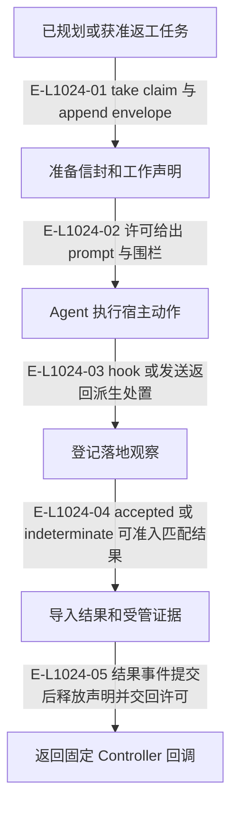

# 投递：信封、工作声明与回交观察

prepare_delivery 一次创建声明和信封并返回许可；实际发送由 Agent 执行。目标投递的 accepted、indeterminate、rejected-before-send 是证据派生的结果，不由回读超时直接判失败。

> 核验基线：`7ba1f38`；核验时实现代码均已提交，本轮图谱更新另列。开发阶段为 L1 九片已落地，observation 尚未开始。本文说明实现事实，未宣称双宿主真实会话已经验证。

## 当前投递与目标结果的接力

### 本图术语说明

| 术语 | 本图含义 |
| --- | --- |
| permit | 供 Agent 使用的投递内容与围栏；重放不是新一次发送授权。 |
| fence | claimId、claimDigest 与流修订构成的准入令牌。 |
| claim | 端点注意力及产品检出的工作声明，释放必须匹配当前令牌。 |
| 回调 | 结果导入返回的 wake-controller 传输内容；送达不等于接受结果。 |

### 节点与实现定位

| 节点 | 文件 / 符号 | 责任 |
| --- | --- | --- |
| task | `src/governance/tasking/task-package.ts` | 已规划或获准返工任务 |
| prepare | `src/capabilities/delivery/service.ts` | 准备信封和工作声明 |
| agent | Agent / 用户 / 外部效果或条件视图 | Agent 执行宿主动作 |
| outcome | `src/capabilities/delivery/decide.ts` | 登记落地观察 |
| result | `src/capabilities/result-review/service.ts` | 导入结果和受管证据 |
| callback | `src/governance/result/target-result-callback.ts` | 返回固定 Controller 回调 |

### 本图边级证据

| 编号 | 代码定位 | 测试 / 核验 | 关系依据 |
| --- | --- | --- | --- |
| E-L1024-01 | `src/capabilities/delivery/service.ts#executePrepare` | `tests/capabilities/delivery/service.test.ts` | take claim 与 append envelope |
| E-L1024-02 | `src/capabilities/delivery/service.ts#permitBody` | `tests/capabilities/delivery/service.test.ts` | 许可给出 prompt 与围栏 |
| E-L1024-03 | `src/capabilities/delivery/decide.ts#deriveDeliveryDisposition` | `tests/capabilities/delivery/service.test.ts` | hook 或发送返回派生处置 |
| E-L1024-04 | `src/capabilities/result-review/service.ts#executeImport` | `tests/capabilities/result-review/service.test.ts` | accepted 或 indeterminate 可准入匹配结果 |
| E-L1024-05 | `src/capabilities/result-review/service.ts#executeImport` | `tests/capabilities/result-review/service.test.ts` | 结果事件提交后释放声明并交回许可 |

## 守卫、恢复与验证范围

同键重放返回相同许可，不获得额外发送次数。明确未发送才可按原信封 rearm；回读 unavailable 不撤销 accepted。

涉及的测试与核验入口：

- `tests/capabilities/delivery/service.test.ts`。
- `tests/capabilities/result-review/service.test.ts`。

## 下钻与相关视图

- [文件直接导入](./file-dependencies.md)
- [运行调用与恢复](./runtime-call-flow.md)
- [Controller 判断](../07-review-rework-completion/README.md)
- [发送与回调握手](../09-public-mcp-host-seams/host-effect-handshake.md)
- [图谱总索引](../README.md)
- [核验与剩余范围](../01-diagram-review-ledger.md)
