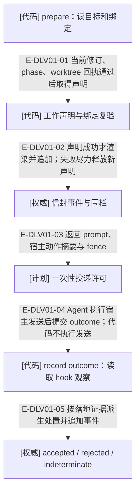

# 投递：许可、宿主效果与落地证据

> 2026-10-03 当前工作树语义复核；含未提交实现。HEAD 只定位已提交基线，来源指纹覆盖本页实际引用的文件。图谱不拥有业务状态。本页的测试锚点表示已核对的覆盖入口，运行结果见本轮总台账。

```mermaid
flowchart TB
  accTitle: 准备投递到记录宿主结局
  accDescr: 准备投递到记录宿主结局；每条关系由当前实现的调用或条件支持，错误停止与恢复保持显式。
  A["[代码] prepare：读目标和绑定"]
  B["[代码] 工作声明与绑定复验"]
  C["[权威] 信封事件与围栏"]
  D["[计划] 一次性投递许可"]
  F["[代码] record outcome：读取 hook 观察"]
  H["[权威] accepted / rejected / indeterminate"]
  A -->|"E-DLV01-01 当前修订、phase、worktree 回执通过后取得声明"| B
  B -->|"E-DLV01-02 声明成功才渲染并追加；失败尽力释放新声明"| C
  C -->|"E-DLV01-03 返回 prompt、宿主动作摘要与 fence"| D
  D -->|"E-DLV01-04 Agent 执行宿主发送后提交 outcome；代码不执行发送"| F
  F -->|"E-DLV01-05 按落地证据派生处置并追加事件"| H
```

### 本图术语说明

| 术语 | 本图含义 |
| --- | --- |
| [代码] | 确定性服务、守卫或纯决定；失败会拒绝转换。 |
| [权威] | 持久事实；只能由指定写入者改变。 |
| [视图] | 由权威派生的可重建数据，不授权写入。 |
| permit | 一次性外部动作许可；返回许可不证明动作发生。 |
| fence | claimId 与 claimDigest 绑定窗口工作声明和投递代际。 |
| accepted | 此处仅表示宿主效果已落地；业务 acceptance 属于评审。 |

### 本图边级证据

| 编号 | 代码证据 | 测试证据 | 关系与边界 |
| --- | --- | --- | --- |
| E-DLV01-01 | `src/capabilities/delivery/service.ts#executePrepare` | 间接覆盖：`tests/capabilities/delivery/service.test.ts#prepareFixtureDelivery`（经公共切片入口执行此内部关系） | 当前修订、phase、worktree 回执通过后取得声明 |
| E-DLV01-02 | `src/capabilities/delivery/service.ts#takeClaim` | 间接覆盖：`tests/capabilities/delivery/service.test.ts#prepareFixtureDelivery`（经公共切片入口执行此内部关系） | 声明成功才渲染并追加；失败尽力释放新声明 |
| E-DLV01-03 | `src/capabilities/delivery/service.ts#permitBody` | 间接覆盖：`tests/capabilities/delivery/service.test.ts#prepareFixtureDelivery`（经公共切片入口执行此内部关系） | 返回 prompt、宿主动作摘要与 fence |
| E-DLV01-04 | `src/capabilities/delivery/contract.ts#PREPARE_DELIVERY_TOOL_REGISTRATION` | 间接覆盖：`tests/capabilities/delivery/service.test.ts#recordFixtureDeliveryOutcome`（测试模拟宿主结局，未执行真实会话发送） | Agent 执行宿主发送后提交 outcome；代码不执行发送 |
| E-DLV01-05 | `src/capabilities/delivery/service.ts#executeOutcome` | 间接覆盖：`tests/capabilities/delivery/service.test.ts#recordFixtureDeliveryOutcome`（经公共切片入口执行此内部关系） | 按落地证据派生处置并追加事件 |

## 三个时间点不能合并

准备信封 ≠ 宿主已发送 ≠ Controller 已接受目标结果。prepare 读取不可变任务包，保证窗口属于正确拓扑且 worktree 回执与当前 bindingId 同代；取得声明后再次读绑定摘要，消除检查与占用之间的重绑定裂缝。

Prompt 按任务包、需求文档、工作区规则、仓库规则、状态根安排阅读；实施目标必需 target skill，测试目标另需 test skill。仅列前四个验收锚点时明确提示剩余数量。返工和产品缺陷修复分别从真实决定/授权历史生成必改项。测试 prompt 明示本次 attempt、环境指令、预算和子集重跑范围。

当前工作树保护：hook 查询不完整或存在 skipped 记录时，禁止用缺失观察判定未落地；但 observedOutcomeDecision 允许独立 project-thread 成功发送回执，或 Controller 对 indeterminate 明确解决为 rejected-before-send。显式 accepted 仍需实际 hook 记录，读取中止及其他错误不走此回退。raw handle 只在内存中用于读取会话观察，对外仅返回摘要。

## 聊天入口与执行目录

Codex 的 project-thread 在配置工作区根创建项目聊天；任务执行目录来自窗口配置或已绑定 worktree 回执。`renderPrompt` 输出相对工作区的 `executionRootFromWorkspace`，随后所有阅读路径均从该执行目录解析，命令显式使用该 workdir。聊天初始 cwd 不能代替执行目录。

| 路径/身份 | 真实来源 | 消费位置 |
| --- | --- | --- |
| 执行目录 | worktreePath 优先，否则 workspace + configuredPlacement | `src/capabilities/delivery/service.ts#renderPrompt` |
| 回到工作区的相对路径 | 执行目录至 workspace 的 relative | `src/capabilities/delivery/service.ts#workspaceRootFromWindow` |
| 需求文档与指令路径 | 上述相对路径、Ledger 配置及冻结成员引用 | `src/capabilities/delivery/prompt.ts#readingLines` |
| 落地观察 | 当前绑定 session 与 preparedAt 后的 user-prompt-submit | `src/capabilities/delivery/service.ts#sessionRecords` |

`tests/capabilities/delivery/prompt.test.ts#renderDeliveryPortablePrompt` 直接断言普通目录与 worktree 的执行根提示以及“聊天初始 cwd 可能不同”。该测试不证明真实项目聊天创建或 shell 自动切目录。Hook 中的 artifactManifestDigest 只识别观察器制品来源；投递读取 session/event/prompt/time，不据此证明目标会话加载了同一 MCP 运行版本，运行身份见[宿主接缝](../09-public-mcp-host-seams/README.md)。

## 继续阅读

[本专题总览](./README.md) · [文件导入](./file-dependencies.md) · [实际调用](./runtime-call-flow.md) · [逐文件审阅记录](../../plans/review-2026-10-03/demand-delivery.md) · [图谱入口](../README.md)
