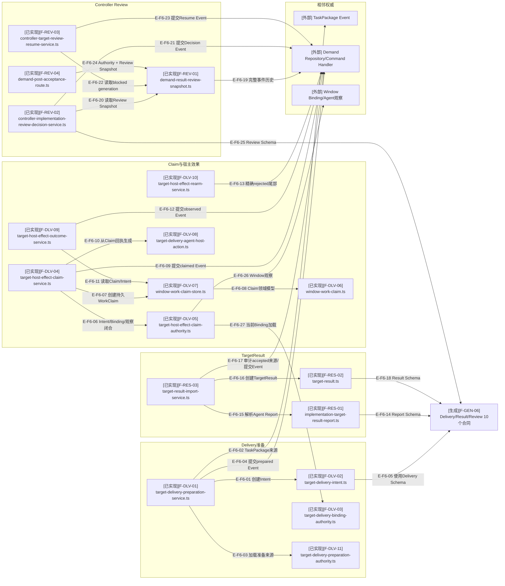

# 实现投递与审阅：关键文件依赖

## F6：Delivery、Result与Review骨干依赖

### 本图术语说明

| 图中术语 | 解释 |
| --- | --- |
| Binding闭合 | Intent目标窗口与当前私有Binding、Host Profile和期望逻辑根一致 |
| Claim authority | 创建WorkClaim和claimed Event前对Intent、观察、Binding、窗口占用与generation的闭合事实 |
| Implementation Report | Agent生成的实现结果输入；Wakeflow必须补齐并复验权威来源后才成为Implementation TargetResult |
| accepted来源 | 同一Intent/action/claim的host-effect-observed accepted事件 |
| blocked generation | Controller决定需要外部条件后暂停的精确Review轮次 |

## 文件与职责映射

| 文件编号 | 代表符号 | 职责 |
| --- | --- | --- |
| `F-DLV-01` | `TargetDeliveryPreparationService` | preview/apply准备Intent并提交prepared Event |
| `F-DLV-02` | `createTargetDeliveryIntent` | TaskPackage、返工投影和prompt核心的不可变Intent |
| `F-DLV-03` | `loadCurrentDeliveryWindowBinding` | Claim、Rearm与Test复用的当前私有Binding窄加载器 |
| `F-DLV-11` | Preparation Authority | 为implementation准备加载TaskPackage、Config拓扑、私有Binding与可选返工来源 |
| `F-DLV-04/05` | `TargetHostEffectClaimService`与Claim Authority | 新鲜观察、WorkClaim、claimed Event和Agent Action |
| `F-DLV-06/07` | WindowWorkClaim模型与Store | 0600当前窗口占用、exclusive create和exact release |
| `F-DLV-08` | `createTargetDeliveryAgentHostAction` | 从首次Claim Event回执生成一次性宿主动作 |
| `F-DLV-09/10` | Outcome/Rearm Services | 记录效果观察或显式重开rejected generation |
| `F-RES-01/02/03` | Report、TargetResult、Import Service | accepted来源闭合、不可变Result和Event提交 |
| `F-REV-01` | `readDemandResultReviewSnapshot` | 从Repository一次完整审计重建Review读模型 |
| `F-REV-02/03` | Implementation Decision / shared Resume Services | 提交实现审阅决定；Resume按workType恢复implementation或test blocked Event |
| `F-REV-04` | `readDemandPostAcceptanceRoute` | 从Authority和同修订Snapshot确定下一业务owner |

## F6边级证据

| 边编号 | 静态关系范围 | 核验结论 |
| --- | --- | --- |
| `E-F6-01`–`E-F6-05` | Preparation Service、Authority、Intent、TaskPackage/Repository/Schema | Preparation经专用Authority加载来源，不直接导入共享Binding loader |
| `E-F6-06`–`E-F6-13`、`E-F6-26`、`E-F6-27` | Claim/Outcome/Rearm、WorkClaim、Action与Binding | Claim Service导入并生成Action；Claim Authority复用当前Binding loader |
| `E-F6-14`–`E-F6-18` | Report、Result与Import Service | Shared Import按workType导入来源专用Report并提交统一Result Event |
| `E-F6-19`–`E-F6-25` | Snapshot、Decision/Resume、Route与Repository | 读模型可重建；Decision/Resume Event才改变权威状态 |

## 原始依赖快照

| 直接生产模块 | 当前全仓受检模块 | 当前全仓依赖 | 违规 |
| ---: | ---: | ---: | ---: |
| 69 | 723 | 5059 | 0 |

## 停止边界

- 本范围已进入`d17602e`；字段或依赖变化后必须重新核验。
- Agent Host Action是瞬时执行指令，不进入MCP公开结果或第二个持久状态机。
- Review读模型可重建；Decision/Resume Event才改变Demand事实。
