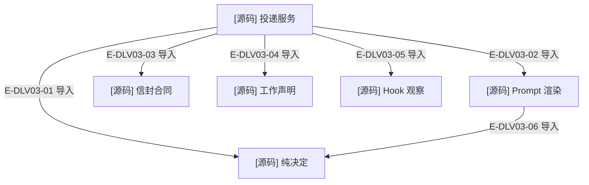

# 投递：决定、内容和观察的静态接缝

> 2026-10-03 当前工作树语义复核；含未提交实现。HEAD 只定位已提交基线，来源指纹覆盖本页实际引用的文件。图谱不拥有业务状态。本页仅声明静态导入，由 AST 核验；不把导入存在作为运行分支已覆盖的证明。

```mermaid
flowchart TB
  accTitle: 投递切片的精选直接导入
  accDescr: 图中连线仅表示当前 TypeScript 直接导入，不表示调用顺序或持久状态；完整路径与符号在表中定位。
  S["[源码] 投递服务"]
  D["[源码] 纯决定"]
  P["[源码] Prompt 渲染"]
  E["[源码] 信封合同"]
  W["[源码] 工作声明"]
  O["[源码] Hook 观察"]
  S -->|"E-DLV03-01 导入"| D
  S -->|"E-DLV03-02 导入"| P
  S -->|"E-DLV03-03 导入"| E
  S -->|"E-DLV03-04 导入"| W
  S -->|"E-DLV03-05 导入"| O
  P -->|"E-DLV03-06 导入"| D
```

### 本图术语说明

| 术语 | 本图含义 |
| --- | --- |
| [代码] | 确定性服务、守卫或纯决定；失败会拒绝转换。 |
| [权威] | 持久事实；只能由指定写入者改变。 |
| [视图] | 由权威派生的可重建数据，不授权写入。 |

### 本图边级证据

| 编号 | 代码证据 | 测试证据 | 关系与边界 |
| --- | --- | --- | --- |
| E-DLV03-01 | `src/capabilities/delivery/service.ts` | 未覆盖：此边仅声明静态 import，由 AST 核验；运行分支覆盖见相邻调用页。 | 导入 |
| E-DLV03-02 | `src/capabilities/delivery/service.ts` | 未覆盖：此边仅声明静态 import，由 AST 核验；运行分支覆盖见相邻调用页。 | 导入 |
| E-DLV03-03 | `src/capabilities/delivery/service.ts` | 未覆盖：此边仅声明静态 import，由 AST 核验；运行分支覆盖见相邻调用页。 | 导入 |
| E-DLV03-04 | `src/capabilities/delivery/service.ts` | 未覆盖：此边仅声明静态 import，由 AST 核验；运行分支覆盖见相邻调用页。 | 导入 |
| E-DLV03-05 | `src/capabilities/delivery/service.ts` | 未覆盖：此边仅声明静态 import，由 AST 核验；运行分支覆盖见相邻调用页。 | 导入 |
| E-DLV03-06 | `src/capabilities/delivery/prompt.ts` | 未覆盖：此边仅声明静态 import，由 AST 核验；运行分支覆盖见相邻调用页。 | 导入 |

| 节点 | 完整路径 | 主要符号 |
| --- | --- | --- |
| S | `src/capabilities/delivery/service.ts` | `executePrepareDeliveryRequest` |
| D | `src/capabilities/delivery/decide.ts` | `deriveDeliveryDisposition` |
| P | `src/capabilities/delivery/prompt.ts` | `renderDeliveryPortablePrompt` |
| E | `src/governance/delivery/delivery-envelope.ts` | `createDeliveryEnvelope` |
| W | `src/kernel/work-claims.ts` | `takeWorkClaim` |
| O | `src/kernel/hook-observations.ts` | `readHostHookObservations` |

折叠：窗口绑定、worktree 回执、事件仓储、返工/修复上下文、测试 attempt 合同。共享投递服务只取得 Profile 与绑定，未导入具体 Codex/Claude host 实现。

## 继续阅读

[本专题总览](./README.md) · [文件导入](./file-dependencies.md) · [实际调用](./runtime-call-flow.md) · [逐文件审阅记录](../../plans/review-2026-10-03/demand-delivery.md) · [图谱入口](../README.md)
