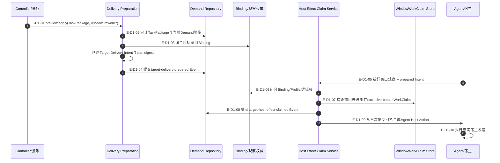
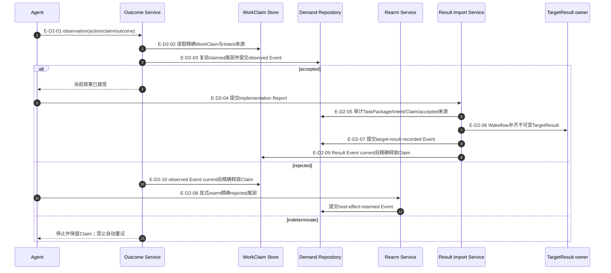
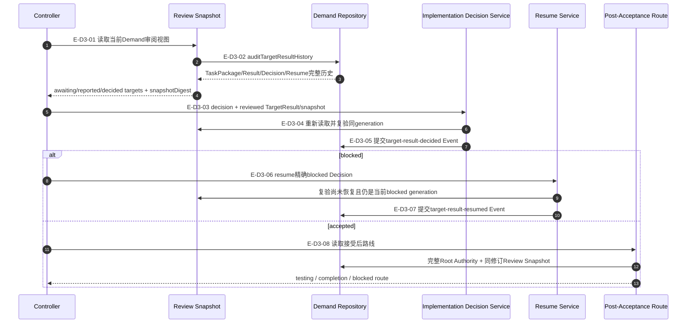

# 实现投递与审阅：准备、Claim、Result和Review调用流

## D1：Delivery准备与一次性宿主动作

### 本图术语说明

| 图中术语 | 解释 |
| --- | --- |
| prepared Intent | 尚未执行宿主效果、已绑定TaskPackage和目标窗口的不可变Delivery事实 |
| 新鲜观察 | 记录时间不超过固定5分钟且与当前Binding/逻辑根一致的Agent窗口观察 |
| exclusive-create | 目标窗口不存在当前Claim时才创建；不同Claim不能覆盖 |
| 一次性动作 | 只由首次committed Claim Event生成；idempotent重放不重复签发 |

### D1边级证据

| 边编号 | 代码位置 | 核验结论 |
| --- | --- | --- |
| `E-D1-01`–`E-D1-04` | Preparation Service/Authority、Intent与Demand Handler | preview/apply闭合TaskPackage和Binding后只追加prepared Event |
| `E-D1-05`、`E-D1-06` | Claim Input/Authority | 候选handle只用于当前观察准入，不进入Action或事件 |
| `E-D1-07`、`E-D1-08` | WorkClaim Store、Claim Service | Claim文件先于Event；中断后以Claim预分配ID前向完成 |
| `E-D1-09`、`E-D1-10` | Claim Service、Agent Host Action | 仅首次committed回执签发Action；Agent才执行宿主效果 |

## D2：宿主效果观察与TargetResult导入

### 本图术语说明

| 图中术语 | 解释 |
| --- | --- |
| accepted | 宿主效果已被安全证明发生，可继续导入Result |
| rejected | 宿主明确拒绝且未产生目标效果，可由显式命令打开新generation |
| indeterminate | 结果未知，自动重试可能产生重复效果，因此失败关闭 |
| Wakeflow补齐 | 从事件权威加入IDs、摘要、TaskPackage/Intent/Claim/Effect来源，而非信任Report自报 |

### D2边级证据

| 边编号 | 代码位置 | 核验结论 |
| --- | --- | --- |
| `E-D2-01`–`E-D2-03` | Outcome Input/Authority/Service | observed Event先于后续Claim处置；不重新验证已漂移Binding |
| `E-D2-04`–`E-D2-07` | Implementation Report、Result Import与TargetResult | 仅accepted来源可首次创建Result Event |
| `E-D2-09` | Result Import、Claim release settlement | Result Event current后才释放accepted路径Claim |
| `E-D2-08`、`E-D2-10` | Outcome/Rearm Service | rejected observed Event后释放Claim，再由显式rearm打开新generation；indeterminate不释放 |

## D3：Controller Implementation Review决定、blocked恢复与接受后路由

### 本图术语说明

| 图中术语 | 解释 |
| --- | --- |
| snapshotDigest | 当前完整Review Snapshot的语义摘要；决定必须引用同一读取代际 |
| rework | 保持同一TaskPackage边界，对同一目标要求实现返工 |
| redesign | 当前TaskPackage边界不足，需要回到设计/规划owner |
| blocked | 缺少外部条件而暂停；不是拒绝、接受或自动完成 |
| post-acceptance route | 零写读模型，根据Authority testing mode和全体目标状态选择下一owner |

### D3边级证据

| 边编号 | 代码位置 | 核验结论 |
| --- | --- | --- |
| `E-D3-01`–`E-D3-05` | Review Snapshot与Implementation Decision Service | 决定前重新审计并绑定同一Result、generation和snapshot digest |
| `E-D3-06`、`E-D3-07` | Target Review Resume Service | 只有当前未恢复blocked generation可追加Resume Event |
| `E-D3-08` | Demand Post-Acceptance Route | accepted后只读选择下一owner，不执行Testing或Completion |

## 停止边界

- Delivery、Result与Review模块已提交；Product Remediation完整调用流在07/08文档包下钻。
- Agent宿主动作、Result Report与Controller决定分别由执行者输入，但只有对应Demand Event改变权威状态。
- 当前公共MCP分别暴露这些owner；跨阶段箭头仍是Event前置条件，不是Server自动串联调用。
- 本文未覆盖Demand完成终态和真实测试纵切，分别由后续07/08文档包下钻。
