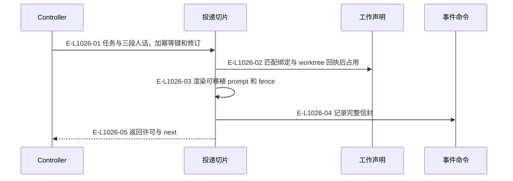
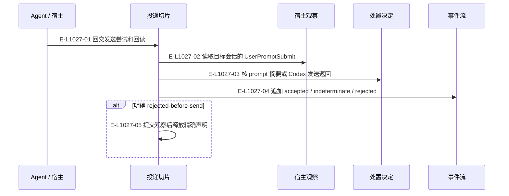
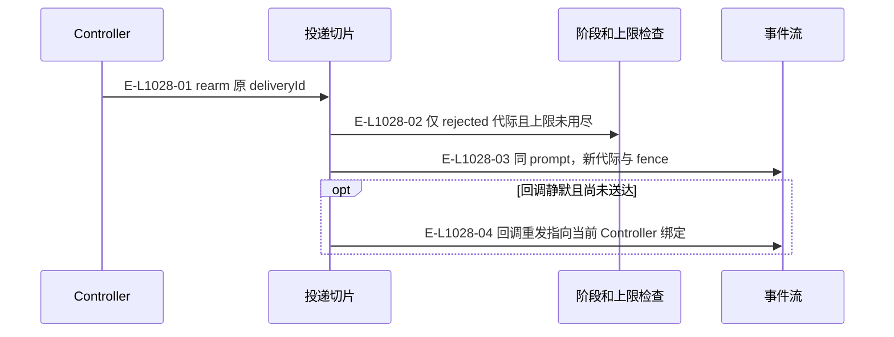

# 投递：准备、落地与重发恢复

当前三个追加工具为 prepare_delivery、record_delivery_outcome、rearm_delivery。

> 核验基线：`1480271`（L1 observation 第十片已落地，20 个公共工具、18 个一次性场景）。工作树另有并行未提交改动（宿主 hook 通道等），本图不描绘；来源指纹按当前工作树计算。本文说明实现事实，未宣称双宿主真实会话已经验证。

## 准备信封与许可

### 本图术语说明

| 术语 | 本图含义 |
| --- | --- |
| permit | 供 Agent 使用的投递内容与围栏；重放不是新一次发送授权。 |
| fence | claimId、claimDigest 与流修订构成的准入令牌。 |
| claim | 端点注意力及产品检出的工作声明，释放必须匹配当前令牌。 |
| next | 根据当前事实派生的下一责任与建议工具。 |

### 节点与实现定位

| 节点 | 文件 / 符号 | 责任 |
| --- | --- | --- |
| controller | Agent / 用户 / 外部效果或条件视图 | Controller |
| slice | `src/capabilities/delivery/service.ts` | 投递切片 |
| claim | `src/kernel/work-claims.ts` | 工作声明 |
| event | `src/governance/demand/event-sourcing/demand-event-sourcing-command-handler.ts` | 事件命令 |

### 本图边级证据

| 编号 | 代码定位 | 测试 / 核验 | 关系依据 |
| --- | --- | --- | --- |
| E-L1026-01 | `src/capabilities/delivery/service.ts#executePrepareDeliveryRequest` | `tests/capabilities/delivery/service.test.ts` | 任务与三段人话，加幂等键和修订 |
| E-L1026-02 | `src/capabilities/delivery/service.ts#takeClaim` | `tests/capabilities/delivery/service.test.ts` | 匹配绑定与 worktree 回执后占用 |
| E-L1026-03 | `src/capabilities/delivery/service.ts#renderPrompt` | `tests/capabilities/delivery/service.test.ts` | 渲染可移植 prompt 和 fence |
| E-L1026-04 | `src/capabilities/delivery/service.ts#executePrepare` | `tests/capabilities/delivery/service.test.ts` | 记录完整信封 |
| E-L1026-05 | `src/capabilities/delivery/service.ts#prepareResult` | `tests/capabilities/delivery/service.test.ts` | 返回许可与 next |

## 落地证据与不确定结果

### 本图术语说明

| 术语 | 本图含义 |
| --- | --- |
| hook | 宿主回交的会话/提示提交/完成观察记录，保存在宿主本地根。 |
| claim | 端点注意力及产品检出的工作声明，释放必须匹配当前令牌。 |
| commit | 一次不可变事件提交批；文件槽位以预期修订防止并发覆盖。 |

### 节点与实现定位

| 节点 | 文件 / 符号 | 责任 |
| --- | --- | --- |
| agent | Agent / 用户 / 外部效果或条件视图 | Agent / 宿主 |
| slice | `src/capabilities/delivery/service.ts` | 投递切片 |
| hook | `src/kernel/hook-observations.ts` | 宿主观察 |
| decide | `src/capabilities/delivery/decide.ts` | 处置决定 |
| event | `src/governance/demand/event-sourcing/demand-event-sourcing-command-handler.ts` | 事件流 |

### 本图边级证据

| 编号 | 代码定位 | 测试 / 核验 | 关系依据 |
| --- | --- | --- | --- |
| E-L1027-01 | `src/capabilities/delivery/service.ts#executeRecordDeliveryOutcomeRequest` | `tests/capabilities/delivery/service.test.ts` | 回交发送尝试和回读 |
| E-L1027-02 | `src/capabilities/delivery/service.ts#sessionRecords` | `tests/capabilities/delivery/service.test.ts` | 读取目标会话的 UserPromptSubmit |
| E-L1027-03 | `src/capabilities/delivery/decide.ts#deriveDeliveryDisposition` | `tests/capabilities/delivery/service.test.ts` | 核 prompt 摘要或 Codex 发送返回 |
| E-L1027-04 | `src/capabilities/delivery/service.ts#executeOutcome` | `tests/capabilities/delivery/service.test.ts` | 追加 accepted / indeterminate / rejected |
| E-L1027-05 | `src/capabilities/delivery/service.ts#releaseClaimFor` | `tests/capabilities/delivery/service.test.ts` | 提交观察后释放精确声明 |

## 原信封的 rearm 与回调重发

### 本图术语说明

| 术语 | 本图含义 |
| --- | --- |
| permit | 供 Agent 使用的投递内容与围栏；重放不是新一次发送授权。 |
| fence | claimId、claimDigest 与流修订构成的准入令牌。 |
| 回调 | 结果导入返回的 wake-controller 传输内容；送达不等于接受结果。 |

### 节点与实现定位

| 节点 | 文件 / 符号 | 责任 |
| --- | --- | --- |
| controller | Agent / 用户 / 外部效果或条件视图 | Controller |
| slice | `src/capabilities/delivery/service.ts` | 投递切片 |
| decide | `src/capabilities/delivery/decide.ts` | 阶段和上限检查 |
| event | `src/governance/demand/event-sourcing/demand-event-sourcing-command-handler.ts` | 事件流 |

### 本图边级证据

| 编号 | 代码定位 | 测试 / 核验 | 关系依据 |
| --- | --- | --- | --- |
| E-L1028-01 | `src/capabilities/delivery/service.ts#executeRearmDeliveryRequest` | `tests/capabilities/delivery/service.test.ts` | rearm 原 deliveryId |
| E-L1028-02 | `src/capabilities/delivery/decide.ts#deriveRearmBlockers` | `tests/capabilities/delivery/service.test.ts` | 仅 rejected 代际且上限未用尽 |
| E-L1028-03 | `src/capabilities/delivery/service.ts#executeRearm` | `tests/capabilities/delivery/service.test.ts` | 同 prompt，新代际与 fence |
| E-L1028-04 | `src/capabilities/delivery/service.ts#executeCallbackReissue` | `tests/capabilities/result-review/service.test.ts` | 回调重发指向当前 Controller 绑定 |

## 守卫、恢复与验证范围

原信封最多三次 rearm，用尽后 prepare 新信封。回调重发另受落地、静默阈值及上限约束，不占用产品工作声明。

涉及的测试与核验入口：

- `tests/capabilities/delivery/service.test.ts`。
- `tests/capabilities/result-review/service.test.ts`。

## 下钻与相关视图

- [本专题总览](./README.md)
- [图谱总索引](../README.md)
- [核验与剩余范围](../01-diagram-review-ledger.md)
