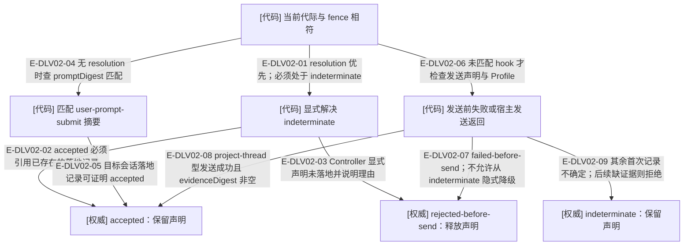

# 投递结局：自动证据、显式解决与重武装

> 2026-10-03 当前工作树语义复核；含未提交实现。HEAD 只定位已提交基线，来源指纹覆盖本页实际引用的文件。图谱不拥有业务状态。本页的测试锚点表示已核对的覆盖入口，运行结果见本轮总台账。

```mermaid
flowchart TB
  accTitle: 记录投递结局的优先级
  accDescr: 记录投递结局的优先级；每条关系由当前实现的调用或条件支持，错误停止与恢复保持显式。
  A["[代码] 当前代际与 fence 相符"]
  B["[代码] 显式解决 indeterminate"]
  C["[代码] 匹配 user-prompt-submit 摘要"]
  D["[代码] 发送前失败或宿主发送返回"]
  F["[权威] accepted：保留声明"]
  H["[权威] rejected-before-send：释放声明"]
  I["[权威] indeterminate：保留声明"]
  A -->|"E-DLV02-01 resolution 优先；必须处于 indeterminate"| B
  B -->|"E-DLV02-02 accepted 必须引用已存在的落地记录"| F
  B -->|"E-DLV02-03 Controller 显式声明未落地并说明理由"| H
  A -->|"E-DLV02-04 无 resolution 时查 promptDigest 匹配"| C
  C -->|"E-DLV02-05 目标会话落地记录可证明 accepted"| F
  A -->|"E-DLV02-06 未匹配 hook 才检查发送声明与 Profile"| D
  D -->|"E-DLV02-07 failed-before-send；不允许从 indeterminate 隐式降级"| H
  D -->|"E-DLV02-08 project-thread 型发送成功且 evidenceDigest 非空"| F
  D -->|"E-DLV02-09 其余首次记录不确定；后续缺证据则拒绝"| I
```

### 本图术语说明

| 术语 | 本图含义 |
| --- | --- |
| [代码] | 确定性服务、守卫或纯决定；失败会拒绝转换。 |
| [权威] | 持久事实；只能由指定写入者改变。 |
| [视图] | 由权威派生的可重建数据，不授权写入。 |
| resolution | Controller 对不确定结局的显式判断；仍受 phase/证据门约束。 |
| Profile | 宿主适配注入的行为事实；共享代码不按 hostId 猜测。 |

### 本图边级证据

| 编号 | 代码证据 | 测试证据 | 关系与边界 |
| --- | --- | --- | --- |
| E-DLV02-01 | `src/capabilities/delivery/decide.ts#deriveDeliveryDisposition` | 间接覆盖：`tests/capabilities/delivery/service.test.ts#recordFixtureDeliveryOutcome`（经公共切片入口执行此内部关系） | resolution 优先；必须处于 indeterminate |
| E-DLV02-02 | `src/capabilities/delivery/decide.ts#resolutionDecision` | 间接覆盖：`tests/capabilities/delivery/service.test.ts#recordFixtureDeliveryOutcome`（经公共切片入口执行此内部关系） | accepted 必须引用已存在的落地记录 |
| E-DLV02-03 | `src/capabilities/delivery/decide.ts#resolutionDecision` | 间接覆盖：`tests/capabilities/delivery/service.test.ts#recordFixtureDeliveryOutcome`（经公共切片入口执行此内部关系） | Controller 显式声明未落地并说明理由 |
| E-DLV02-04 | `src/capabilities/delivery/decide.ts#deriveDeliveryDisposition` | 间接覆盖：`tests/capabilities/delivery/service.test.ts#recordFixtureDeliveryOutcome`（经公共切片入口执行此内部关系） | 无 resolution 时查 promptDigest 匹配 |
| E-DLV02-05 | `src/capabilities/delivery/decide.ts#deriveDeliveryDisposition` | 间接覆盖：`tests/capabilities/delivery/service.test.ts#landFixturePrompt`（经公共切片入口执行此内部关系） | 目标会话落地记录可证明 accepted |
| E-DLV02-06 | `src/capabilities/delivery/decide.ts#deriveDeliveryDisposition` | 间接覆盖：`tests/capabilities/delivery/service.test.ts#recordFixtureDeliveryOutcome`（经公共切片入口执行此内部关系） | 未匹配 hook 才检查发送声明与 Profile |
| E-DLV02-07 | `src/capabilities/delivery/decide.ts#deriveDeliveryDisposition` | 间接覆盖：`tests/capabilities/delivery/service.test.ts#recordFixtureDeliveryOutcome`（经公共切片入口执行此内部关系） | failed-before-send；不允许从 indeterminate 隐式降级 |
| E-DLV02-08 | `src/capabilities/delivery/decide.ts#sendReturnProvesLanding` | 间接覆盖：`tests/capabilities/delivery/service.test.ts#recordFixtureDeliveryOutcome`（经公共切片入口执行此内部关系） | project-thread 型发送成功且 evidenceDigest 非空 |
| E-DLV02-09 | `src/capabilities/delivery/decide.ts#deriveDeliveryDisposition` | 间接覆盖：`tests/capabilities/delivery/service.test.ts#recordFixtureDeliveryOutcome`（经公共切片入口执行此内部关系） | 其余首次记录不确定；后续缺证据则拒绝 |

readback 状态与证据摘要被保留为观察，不能单独证明投递落地。静默从当前代际第一条 indeterminate 事件记录时间起算；超阈值增加 blocker，不自动判失败或自动重发。已提交 rejected 但声明释放失败时，同幂等键回放补释放，仅释放仍匹配该 fence 的声明。

## 外层观察读取的独立证据分支

`src/capabilities/delivery/service.ts#observedOutcomeDecision` 包围上图纯决定：完整查询走通常优先级；只在 observation-query-incomplete / observation-query-unavailable 时用空 records 重算。重算结果必须 accepted=true 且 evidenceKind 为 host-send-return 或 controller-resolution 才继续。

| hook 读取异常时的输入 | 当前结果 | 覆盖边界 |
| --- | --- | --- |
| project-thread、sent、evidenceDigest 非空 | 独立发送回执仍可记录 accepted | 间接覆盖：`tests/capabilities/delivery/service.test.ts#recordFixtureDeliveryOutcome` 的 unavailable 通道回执用例 |
| 当前 indeterminate，Controller 明确解决为 rejected-before-send | 记录拒发并释放声明 | 间接覆盖：`tests/capabilities/delivery/service.test.ts#recordFixtureDeliveryOutcome` 的坏 hook 通道显式解决用例 |
| 仅 failed-before-send 声明、unknown 或无独立依据 | 保留原查询错误，不追加结局 | 间接覆盖：`tests/capabilities/delivery/service.test.ts#recordFixtureDeliveryOutcome` 的截断和不可用停止用例 |
| resolution=accepted | 空 records 无法证明 hookRecordId，不能回退接受 | 未覆盖：本轮未确认专门的异常查询加 accepted resolution 服务负例；纯决定仍强制证据存在 |
| aborted 或其他 I/O 错误 | 原样上抛，不使用回退 | 未覆盖：这张图未声明取消/其他错误的逐分支服务回归 |

现有独立证据回退回归直接覆盖 unavailable，incomplete 只验证无独立证据时停止；两者共享同一生产分支，但不能据此把全部交叉组合标成已跑测试。

prepare、record-outcome 和 rearm 都通过共享工作区作用域进入；读取目标观察仍必须完整。工作区协议/维护保留错误在开业务上下文之前拒绝，不能误归类为“宿主拒绝发送”。request signal 现在参与准入等待。

## 继续阅读

[本专题总览](./README.md) · [文件导入](./file-dependencies.md) · [实际调用](./runtime-call-flow.md) · [逐文件审阅记录](../../plans/review-2026-10-03/demand-delivery.md) · [图谱入口](../README.md)
