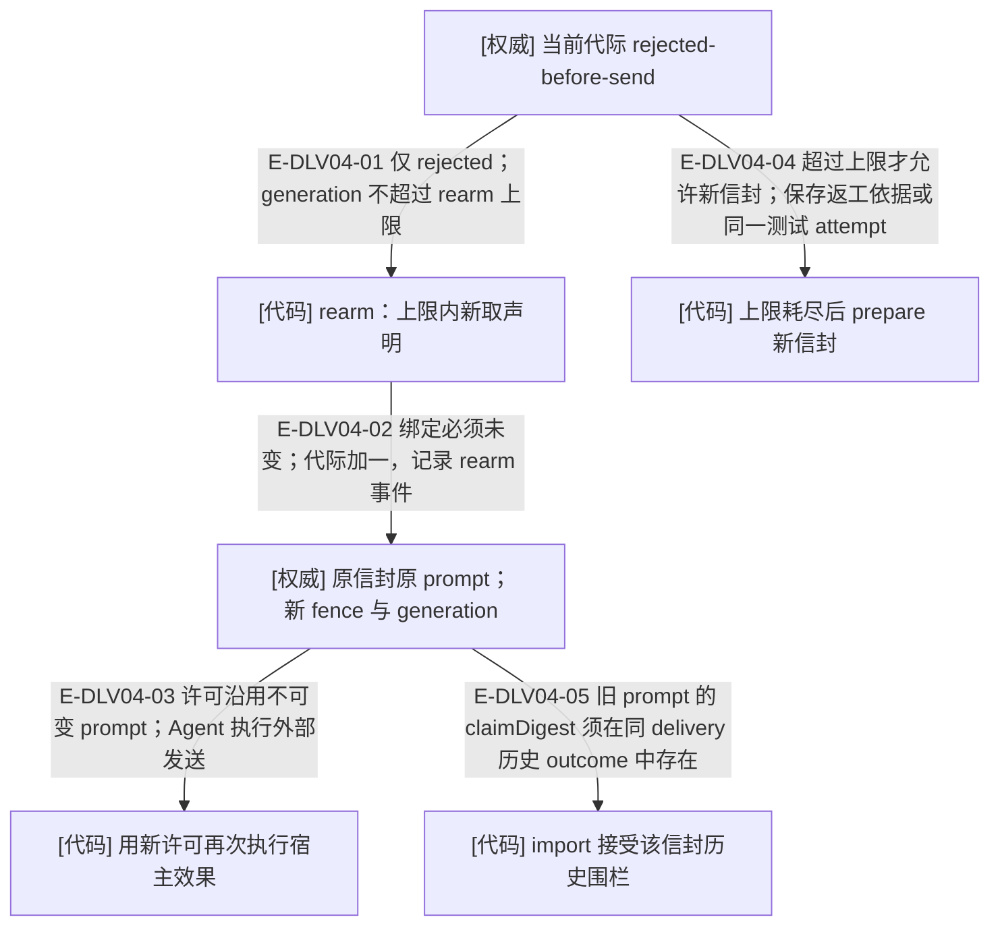

# 投递恢复：同信封换代与回调重发

> 2026-10-03 当前工作树语义复核；含未提交实现。HEAD 只定位已提交基线，来源指纹覆盖本页实际引用的文件。图谱不拥有业务状态。本页的测试锚点表示已核对的覆盖入口，运行结果见本轮总台账。

### 本图术语说明

| 术语 | 本图含义 |
| --- | --- |
| [代码] | 确定性服务、守卫或纯决定；失败会拒绝转换。 |
| [权威] | 持久事实；只能由指定写入者改变。 |
| [视图] | 由权威派生的可重建数据，不授权写入。 |
| rearm | 同信封的发送代际重试；不是重新执行一次测试。 |
| 历史围栏 | 只在同一 deliveryId 历史 outcome 中查证；结果仍绑定当前围栏。 |

### 本图边级证据

| 编号 | 代码证据 | 测试证据 | 关系与边界 |
| --- | --- | --- | --- |
| E-DLV04-01 | `src/capabilities/delivery/decide.ts#deriveRearmBlockers` | 间接覆盖：`tests/capabilities/delivery/service.test.ts#executeRearmDeliveryRequest`（经公共切片入口执行此内部关系） | 仅 rejected；generation 不超过 rearm 上限 |
| E-DLV04-02 | `src/capabilities/delivery/service.ts#executeRearm` | 间接覆盖：`tests/capabilities/delivery/service.test.ts#executeRearmDeliveryRequest`（经公共切片入口执行此内部关系） | 绑定必须未变；代际加一，记录 rearm 事件 |
| E-DLV04-03 | `src/capabilities/delivery/service.ts#permitBody` | 间接覆盖：`tests/capabilities/delivery/service.test.ts#executeRearmDeliveryRequest`（只校验返回许可，未运行真实发送） | 许可沿用不可变 prompt；Agent 执行外部发送 |
| E-DLV04-04 | `src/capabilities/delivery/service.ts#implementationBasis` | 间接覆盖：`tests/capabilities/result-review/service.test.ts#prepareFixtureDelivery`（经公共切片入口执行此内部关系） | 超过上限才允许新信封；保存返工依据或同一测试 attempt |
| E-DLV04-05 | `src/capabilities/result-review/service.ts#assertEarlierGenerationFence` | 间接覆盖：`tests/capabilities/result-review/service.test.ts#importFixtureImplementationResult`（经公共切片入口执行此内部关系） | 旧 prompt 的 claimDigest 须在同 delivery 历史 outcome 中存在 |

## 回调重发是另一条有界路径

`executeRearm` 先按 callbackId 匹配 result-reported / test-result-reported 目标，命中则进入 `executeCallbackReissue`。只有距本代 issuedAt **严格超过十分钟**且无落地时可重发；重算当前 Controller 绑定，沿用结果事件的 prompt 和摘要；不取工作声明、fence=null。初次签发 generation=1，最多重发到 4。目标已评审后不再匹配该回调分支，包括 blocked 与 escalated。

| 事实 | 工作投递 rearm | 结果 callback 重发 |
| --- | --- | --- |
| 进入条件 | 当前代际 rejected-before-send，且未耗尽代际 | 当前目标仍 result-reported / test-result-reported、当前 Controller 会话无落地、严格超过静默阈值 |
| 工作声明 | 新取得 claim 与 fence；绑定必须未变 | 不取 claim，fence=null；可采用当前新的 Controller 绑定 |
| prompt | 原信封字节与 promptDigest 不变，文本仍带原代围栏 | 原结果事件字节与 promptDigest 不变，文本仍带首次导入 streamRevision |
| 业务结果 | 还需执行宿主效果并 record-outcome | 只追加 callback-reissued；不接受结果，也不要求目标再导入 |
| 读侧观察 | 目标当前绑定会话的投递记录 | Controller 当前绑定会话的回调记录，按本代 issuedAt 过滤 |

回调重发的完整查询失败会停止，不继承 record-outcome 的独立宿主发送回执回退。同键回放 callback-reissued 不再重复追加，但仍要求目标保持未评审阶段；其返回许可不是一次新的发送事实。回调状态与 accepted 不能混用，见[回调信任与只读评审](../07-review-rework-completion/callback-trust-and-review.md)。

prepare/rearm 同键回放返回历史许可和当前路由读取；回放不是自动再发送。Agent 必须遵守一次性许可。新信封不等于新任务包；测试拒绝发送后换信封仍使用原逻辑 attempt，避免消耗测试次数。

恢复会重新读取当前绑定和受管历史。新项目聊天的 cwd 变化没有改变不可变信封：rearm 仍沿用该信封的执行目录提示和阅读基准；需要新的 prompt 只能在合法 prepare 分支创建新信封。共享作用域并不授权无证据重发。

## 继续阅读

[本专题总览](./README.md) · [文件导入](./file-dependencies.md) · [实际调用](./runtime-call-flow.md) · [逐文件审阅记录](../../plans/review-2026-10-03/demand-delivery.md) · [图谱入口](../README.md)
