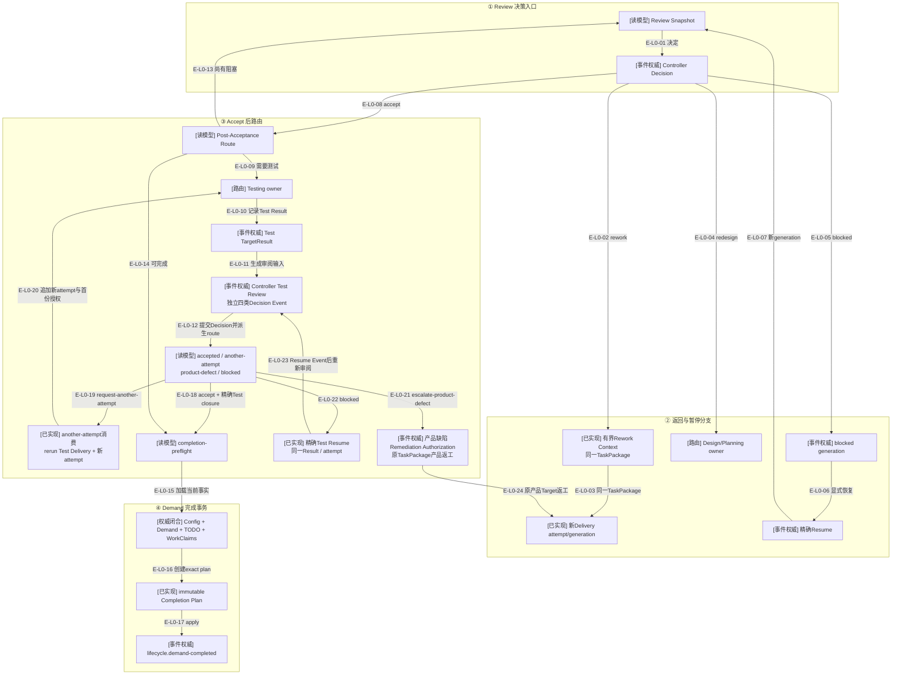

# Review返工、blocked恢复与Demand完成

> Completion、Review、Product Defect Remediation及相邻Delivery/Testing consumer均已进入`d17602e`。

## 当前结论

Controller决定`rework`时不创建新TaskPackage，而是把完整Review文本压缩为有界rework context，后续
Delivery Intent仍引用同一不可变TaskPackage并开启新attempt/generation。`redesign`返回设计/规划owner；
`blocked`不允许直接提交下一决定，必须先用精确blocked Decision提交Resume Event。

只有post-acceptance route判定所有必要产品目标已接受、测试策略满足、TODO仍精确claimed且不存在参与窗口
WindowWorkClaim时，Completion Service才可preview/apply`lifecycle.demand-completed`事件。当前代码已实现：
Test Review `accept`形成带精确Test closure的`completion-preflight`；`request-another-attempt`由Test Delivery
Preparation消费并追加新attempt；real-environment Completion保留TestCard和完整attempt lineage。产品缺陷
Decision由Remediation Service绑定失败检查与原TaskPackage baseline，追加Authorization Event并把精确产品Target
推进到`product-defect-rework-requested`；修复接受后进入新TestCard代际。Test blocked由共享Resume Service精确
恢复，不消耗attempt或创建Delivery。

## L0：Review后续与成功终态

### 本图术语说明

| 图中术语 | 解释 |
| --- | --- |
| 同一TaskPackage返工 | 保持原目标边界与Acceptance Anchors，只增加Review要求和新Delivery generation |
| redesign | 当前TaskPackage边界本身需要改变，因此回到设计/Planning而非直接投递 |
| blocked generation | 缺外部条件的精确Review轮次；Resume只能引用这次Decision |
| completion-preflight | route确认测试策略、所有目标状态和Demand Authority允许进入成功终态 |
| Controller Test Review | 使用`satisfied / defect-observed / inconclusive`结论与四类Test Decision Event，不复用implementation rework语义 |
| Test closure | TestCard、Test target/TaskPackage、最终attempt、TargetResult、Decision和Test窗口的精确只读来源元组 |
| rerun attempt | 同一TestCard/TaskPackage下的新`TestExecutionAttempt`，引用直接前驱Result与Review Decision |
| `currentTestCard` | Aggregate当前可规划/执行的Test合同槽位；product-defect历史Target保留自身Card tuple但退出当前槽位 |
| Remediation Authorization | 绑定Test Decision、Route digest、失败检查和既有产品TaskPackage baseline的不可变Event事实 |
| exact claimed TODO | TODO项仍以相同demandId/lineage处于claimed状态，未被并发改变 |
| 当前WorkClaim | 任一窗口仍持有当前业务占用时，Demand不能完成 |

## 成功完成前置条件

- Demand仍为`active`，并且当前stream revision与plan一致。
- Post-Acceptance Route为`completion-preflight`，不是testing或blocked。
- Demand Authority、Controller window和Config摘要仍与preview一致。
- TODO仍精确claimed到该Demand。
- 所有accepted Target满足testing mode；不存在未处理result/review。
- real-environment模式下`currentTestCard`必须精确匹配唯一`test-accepted`当前Target，route携带其Test closure；
  可同时保留零个或多个历史`test-product-defect` Target。Completion保留全部Card/attempt lineage，不新增第二套Card关闭状态。
- 所有相关WindowWorkClaim已精确释放。

## L0边级证据

| 边编号 | 实际关系 | 当前结论 |
| --- | --- | --- |
| `E-L0-01`–`E-L0-08` | Implementation Decision/Resume Event与Delivery rework source | rework保持TaskPackage，blocked必须精确resume |
| `E-L0-09`–`E-L0-12` | real-environment Test纵切与独立Test Review Event | 内部Service/Event已实现，尚无公共编排入口 |
| `E-L0-18` | Test accept route | 现在真实产生带Test closure的`completion-preflight` |
| `E-L0-19`、`E-L0-20` | another-attempt route与Test Delivery Preparation | 真实追加rerun attempt和首份Delivery authorization |
| `E-L0-21`、`E-L0-24` | product defect route与Remediation | 旧Card/Target保留；Authorization Event重开原产品Target，修复accept后进入新Card代际 |
| `E-L0-22`、`E-L0-23` | Test blocked route | 共享Resume Service精确复验workType/Decision/Result并回到新Test Review generation |
| `E-L0-13`–`E-L0-17` | Completion Authority/Plan/Service | controller-only与real-environment均可完成；TODO与相关Claims必须闭合 |

## 核验快照

| 项目 | 读取值 |
| --- | --- |
| Lifecycle源码 | 4个模块，已提交 |
| 当前架构门 | 823模块、5817依赖、10个显式生产根、0违规；最近完整门1023项 |
| Schema | 全仓114份、215 refs；Review 4份、Lifecycle 1份 |
| Lifecycle测试 | 2个正式测试、1个fixture |
| 来源指纹 | `d0ab87bef6d03e8d6b65b636ef6637a180352e236c3344b42e8c6cae256e667a` |

## 下钻入口

- [Review/Completion关键文件依赖](./file-dependencies.md)
- [返工、Resume与Completion调用流](./runtime-call-flow.md)
