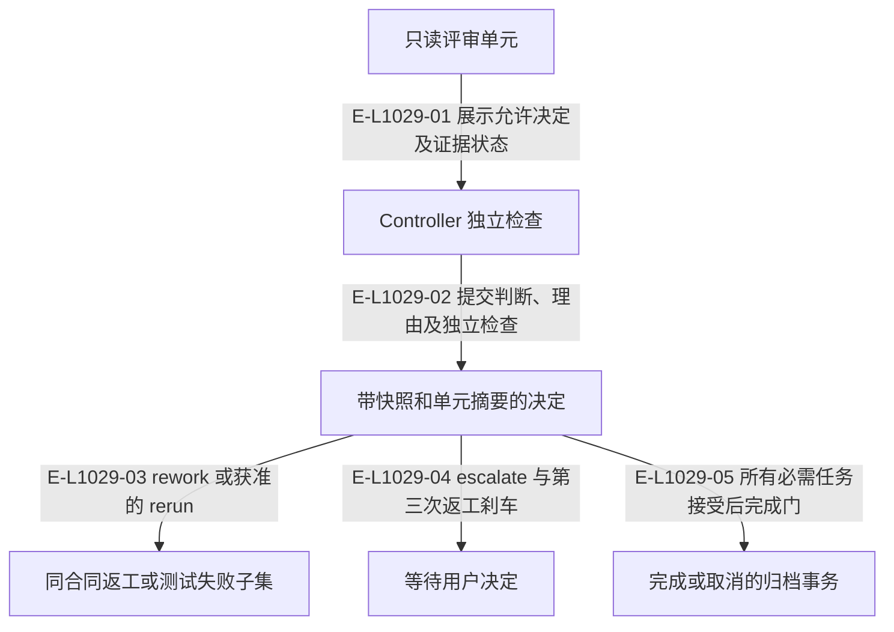

# 评审、升级与完成即归档

Controller 根据独立检查作决定。实现决定为 accept、rework、blocked、escalate；旧独立 Resume 和缺陷授权入口已合入决定流程。

> 核验基线：`7ba1f38`；核验时实现代码均已提交，本轮图谱更新另列。开发阶段为 L1 九片已落地，observation 尚未开始。本文说明实现事实，未宣称双宿主真实会话已经验证。

## 评审决定与下一责任

### 本图术语说明

| 术语 | 本图含义 |
| --- | --- |
| Demand | 一个需求的不可变身份和事件流；当前执行环境由 podId 指定。 |
| CAS | 比较已观察的摘要/修订后提交；来源已改变则拒绝。 |
| verdict | 从逐步 expected/observed/evidence 记录派生的测试结论。 |

### 节点与实现定位

| 节点 | 文件 / 符号 | 责任 |
| --- | --- | --- |
| inspect | `src/capabilities/result-review/service.ts` | 只读评审单元 |
| checks | Agent / 用户 / 外部效果或条件视图 | Controller 独立检查 |
| decision | `src/capabilities/result-review/service.ts` | 带快照和单元摘要的决定 |
| rework | `src/governance/demand/model/demand-aggregate-state.ts` | 同合同返工或测试失败子集 |
| escalate | `src/governance/demand/model/demand-aggregate-state.ts` | 等待用户决定 |
| archive | `src/capabilities/demand/lifecycle.ts` | 完成或取消的归档事务 |

### 本图边级证据

| 编号 | 代码定位 | 测试 / 核验 | 关系依据 |
| --- | --- | --- | --- |
| E-L1029-01 | `src/capabilities/result-review/service.ts#inspectReview` | `tests/capabilities/result-review/service.test.ts` | 展示允许决定及证据状态 |
| E-L1029-02 | `src/capabilities/result-review/service.ts#executeImplementationDecision` | `tests/capabilities/result-review/service.test.ts` | 提交判断、理由及独立检查 |
| E-L1029-03 | `src/governance/demand/model/demand-aggregate-state.ts#decideTargetResultReviewInDemandAggregateState` | `tests/capabilities/result-review/service.test.ts` | rework 或获准的 rerun |
| E-L1029-04 | `src/governance/demand/event-sourcing/demand-event-sourcing-decider.ts#decideDemandEventSourcingCommand` | `tests/capabilities/demand/service.test.ts` | escalate 与第三次返工刹车 |
| E-L1029-05 | `src/capabilities/demand/lifecycle.ts#planTerminal` | `tests/capabilities/demand/service.test.ts` | 所有必需任务接受后完成门 |

## 守卫、恢复与验证范围

blocked 后的新决定须携 resumption；escalated 还需升级已回答。回调 acknowledged 从已记录决定派生，inspect 不写事件。research 零目标完成等剩余限制以实际 Route 为准。

涉及的测试与核验入口：

- `tests/capabilities/demand/service.test.ts`。
- `tests/capabilities/result-review/service.test.ts`。

## 下钻与相关视图

- [文件直接导入](./file-dependencies.md)
- [运行调用与恢复](./runtime-call-flow.md)
- [图谱总索引](../README.md)
- [核验与剩余范围](../01-diagram-review-ledger.md)
