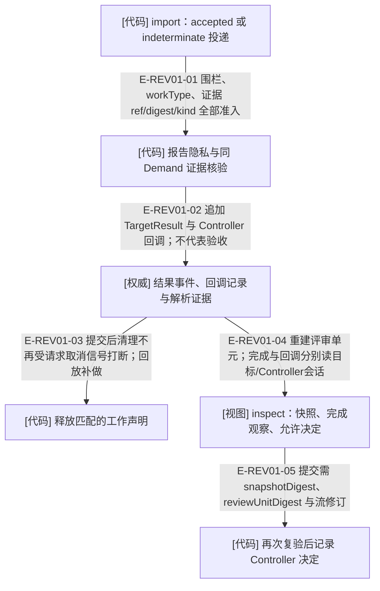

# 结果评审：导入、完成观察与 Controller 判断

> 2026-10-03 当前工作树语义复核；含未提交实现。HEAD 只定位已提交基线，来源指纹覆盖本页实际引用的文件。图谱不拥有业务状态。本页的测试锚点表示已核对的覆盖入口，运行结果见本轮总台账。

```mermaid
flowchart TB
  accTitle: 结果成为评审输入的真实边界
  accDescr: 结果成为评审输入的真实边界；每条关系由当前实现的调用或条件支持，错误停止与恢复保持显式。
  A["[代码] import：accepted 或 indeterminate 投递"]
  B["[代码] 报告隐私与同 Demand 证据核验"]
  C["[权威] 结果事件、回调记录与解析证据"]
  D["[代码] 释放匹配的工作声明"]
  F["[视图] inspect：快照、完成观察、允许决定"]
  H["[代码] 再次复验后记录 Controller 决定"]
  A -->|"E-REV01-01 围栏、workType、证据 ref/digest/kind 全部准入"| B
  B -->|"E-REV01-02 追加 TargetResult 与 Controller 回调；不代表验收"| C
  C -->|"E-REV01-03 提交后清理不再受请求取消信号打断；回放补做"| D
  C -->|"E-REV01-04 重建评审单元；完成与回调分别读目标/Controller会话"| F
  F -->|"E-REV01-05 提交需 snapshotDigest、reviewUnitDigest 与流修订"| H
```

### 本图术语说明

| 术语 | 本图含义 |
| --- | --- |
| [代码] | 确定性服务、守卫或纯决定；失败会拒绝转换。 |
| [权威] | 持久事实；只能由指定写入者改变。 |
| [视图] | 由权威派生的可重建数据，不授权写入。 |
| 完成观察 | 目标窗口当前绑定会话中 recordedAt 不早于报告 reportedAt 的第一条 stop / turn-complete。 |
| 回调落地 | Controller 窗口当前绑定会话中匹配摘要且不早于 issuedAt 的 user-prompt-submit；传输事实。 |
| 评审单元 | 冻结任务、结果与先前决定历史的摘要绑定。 |

### 本图边级证据

| 编号 | 代码证据 | 测试证据 | 关系与边界 |
| --- | --- | --- | --- |
| E-REV01-01 | `src/capabilities/result-review/service.ts#executeImport` | 间接覆盖：`tests/capabilities/result-review/service.test.ts#importFixtureImplementationResult`（经公共切片入口执行此内部关系） | 围栏、workType、证据 ref/digest/kind 全部准入 |
| E-REV01-02 | `src/capabilities/result-review/service.ts#executeImport` | 间接覆盖：`tests/capabilities/result-review/service.test.ts#importFixtureImplementationResult`（经公共切片入口执行此内部关系） | 追加 TargetResult 与 Controller 回调；不代表验收 |
| E-REV01-03 | `src/capabilities/result-review/service.ts#releaseFence` | 间接覆盖：`tests/capabilities/result-review/service.test.ts#importFixtureImplementationResult`（经公共切片入口执行此内部关系） | 提交后清理不再受请求取消信号打断；回放补做 |
| E-REV01-04 | `src/capabilities/result-review/service.ts#loadReviewEvidence` | 间接覆盖：`tests/capabilities/result-review/service.test.ts#inspectFixtureReview`（经公共切片入口执行此内部关系） | 重建评审单元；完成与回调分别读目标/Controller会话 |
| E-REV01-05 | `src/capabilities/result-review/service.ts#loadDecisionSources` | 间接覆盖：`tests/capabilities/result-review/service.test.ts#executeImplementationReviewDecisionRequest`（经公共切片入口执行此内部关系） | 提交需 snapshotDigest、reviewUnitDigest 与流修订 |

## 机器守卫与 Agent 判断

| 内容 | 代码保证 | Controller 仍需判断 |
| --- | --- | --- |
| 报告证据 | 仅同 Demand 受管证据，逐引用核摘要、成员、种类 | 证据是否充分支持需求 |
| 实现 accept | completed 或有完整 anchorEvidence 的 needs-review；完成观察 confirmed | 独立检查与质量评价是否可信 |
| rework | 至少一个 independentCheck=failed；生成可投递必改项 | 如何修正、是否值得返工 |
| blocked | 保存决定；下一次必须引用前决定与 condition-cleared | 条件是否真实解除 |
| escalate | 同提交记录升级；用户回答前禁止再决定 | 议题、选项、建议与用户决定 |

回调未落地不阻止读取已入库结果，也不是 accept 的必需条件。允许决定集合只是机器准入结果，不执行独立检查。工作树新增 hook 不完整读取拒绝与提交后释放围栏的取消边界。

inspect 也不会记录 callback acknowledged：只读视图根据当前决定是否已存在派生这个状态。blocked / escalated 后的 acknowledged 可以没有 landedRecordId；accepted、rework-requested、test-another-attempt-requested 等阶段不再构成可 inspect 的评审单元。发送、落地、回合结束和验收的证据分别记录，详见[回调信任与只读评审](./callback-trust-and-review.md)。

needs-review 的允许集合推导只检查同 Demand 受管证据是否存在；真正提交 accept 时才逐一要求 anchorEvidence 覆盖所有锚点且引用本 Demand 已登记证据。rework 出现在候选集合，也不代表可以提交“独立检查全部通过”的返工决定。候选动作是导航，决定合同仍会复验具体请求。

inspect 显式选择 read，直接读取历史与 hook；import 和两个 review-decision 入口选择共享工作区写入作用域。`releaseFence` 只在结果事件已提交或幂等回放后去掉请求 signal，保证该清理不因原请求取消而跳过；其他 next/观察步骤仍可能失败，不能泛称“提交后全部不受取消影响”。

## 继续阅读

[本专题总览](./README.md) · [文件导入](./file-dependencies.md) · [实际调用](./runtime-call-flow.md) · [逐文件审阅记录](../../plans/review-2026-10-03/demand-delivery.md) · [图谱入口](../README.md)
