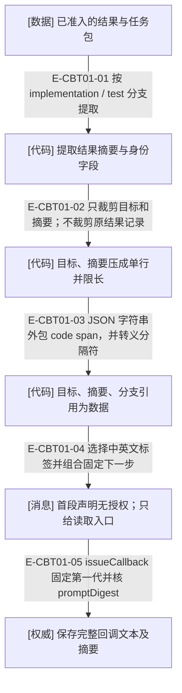
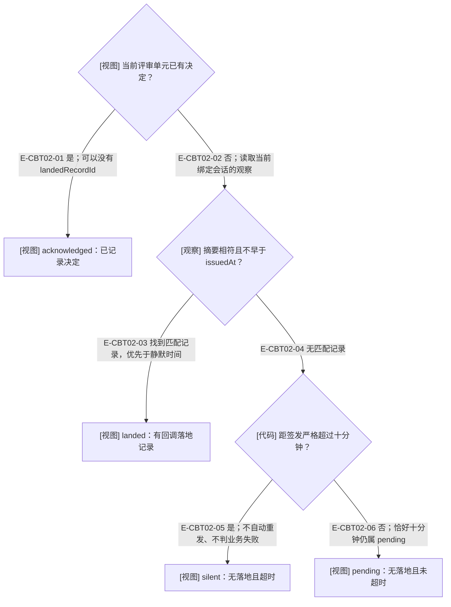
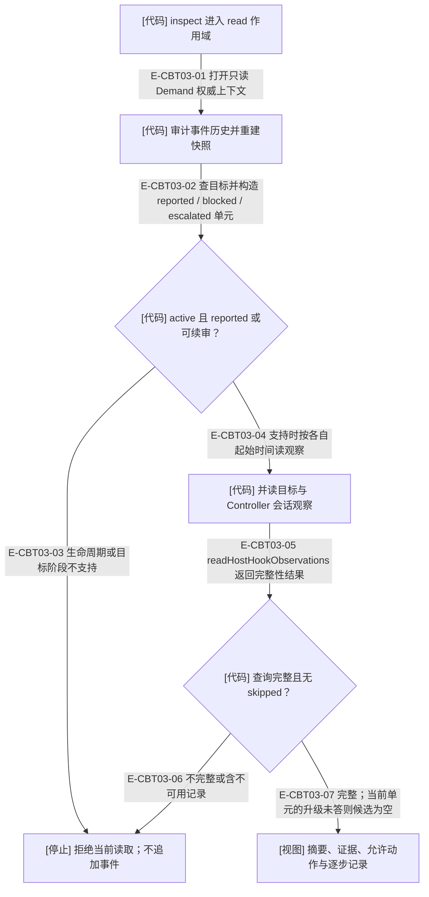

# 回调信任边界：消息、观察与评审决定

2026-10-03 工作树深审，起始基线为 1.1.0-rc.4，最终核验来源已更新至 **1.1.0-rc.5 候选**。回调是读取已存结果的导航消息。目标的摘要即使被宿主显示为 user 消息，也仍是目标报告数据；它既不授权新的操作，也不能代表 Controller 已接受工作。

## 报告文本怎样进入回调

### 本图术语说明

| 术语 | 本图含义 |
| --- | --- |
| 已准入 | ID、枚举、报告形状等已由上游合同检查；不代表摘要内容属实。 |
| 引用为数据 | JSON.stringify 后放在 Markdown 行内代码内；反引号、HTML 边界、表格分隔符和双向控制字符转义。 |
| 限长 | 目标与摘要各不超过 600 个 Unicode code points；整体回调超过 20,000 个 JavaScript 字符则拒绝。 |
| promptDigest | 去除完整回调首尾空白后计算的摘要；不是报告内容正确性的证明。 |
| [权威] | 结果事件保存签发事实；回调本身没有接受或授权能力。 |

### 本图边级证据

| 编号 | 代码证据 | 测试证据 | 关系与边界 |
| --- | --- | --- | --- |
| E-CBT01-01 | `src/capabilities/result-review/decide.ts#summarizeResultForCallback` | `tests/capabilities/result-review/prompt.test.ts#summarizeResultForCallback`（晚变新增真实准入后的 sha1/sha256 非空提交，接着验证两种语言的 callback 文本） | test 不展示分支和提交；implementation 的提交按 algorithm:value 表示。 |
| E-CBT01-02 | `src/capabilities/result-review/prompt.ts#clip` | 间接覆盖：`tests/capabilities/result-review/prompt.test.ts#renderWakeControllerPrompt`（换行与伪造 Next 被压成同一行；该测试不覆盖 600 字截断边界） | 先 trim 和压缩空白，再按 code points 截短。 |
| E-CBT01-03 | `src/foundation/text/markdown-json-string-literal.ts#renderMarkdownJsonStringLiteral` | `tests/foundation/text/markdown-json-string-literal.test.ts#renderMarkdownJsonStringLiteral`；间接覆盖：`tests/capabilities/result-review/prompt.test.ts#renderWakeControllerPrompt`（中英文摘要均验证 Markdown/HTML/方向控制字符无法形成结构） | 渲染器要求输入是完整 NFC 字符串，不充当通用 Markdown 清洗器。 |
| E-CBT01-04 | `src/capabilities/result-review/prompt.ts#renderWakeControllerPrompt` | `tests/capabilities/result-review/prompt.test.ts#renderWakeControllerPrompt` | 无授权声明位于任何目标报告字段之前；工具名来自固定公共合同。 |
| E-CBT01-05 | `src/capabilities/result-review/service.ts#issueCallback`、`src/governance/result/target-result-callback.ts#parseTargetResultCallbackRecord` | 间接覆盖：`tests/capabilities/result-review/service.test.ts#importFixtureImplementationResult`（真实导入切片返回第一代回调及绑定窗口） | 写入结果前生成 callback；事件提交失败不会成为已签发结果。 |

rc.4 修改的是展示包裹和执行指引，不更改 Report、TargetResult、决定 Schema 或事件版本。`assets/agent-text/skills/wakeflow-controller/SKILL.md` 第 10 步与 `references/delivery-and-review.md` 明确：inspect 只读；宿主 user 角色不提升 callback 字段的信任级别；Controller 应独立检查实际差异和证据后，再记录决定。

三个自由文本字段经过引用处理；durable ID、枚举和修订来自已经准入的合同，Pod 名来自受限配置名称。回调不携带原始会话句柄。渲染器没有建立新的身份认证机制：`assertControllerAuthority` 核对配置、Demand 与任务包的 programId，不能被表述成“验证了消息发送者就是人类或 Controller 宿主会话”。

## 回调状态是读侧推导

### 本图术语说明

| 术语 | 本图含义 |
| --- | --- |
| acknowledged | 已有 review decision 的读侧状态，不是 inspect 写入的“已读”回执，也不等于 accept。 |
| landed | Controller 会话中匹配 promptDigest 的 user-prompt-submit 观察；发送返回本身不写 callback 落地记录。 |
| silent / pending | 是否有观察与时间阈值的组合，不是目标执行成功或失败。 |
| 当前绑定 | 查询 windowId 现时绑定的会话；没有绑定或宿主不匹配时按无记录处理，不回查旧会话。 |

### 本图边级证据

| 编号 | 代码证据 | 测试证据 | 关系与边界 |
| --- | --- | --- | --- |
| E-CBT02-01 | `src/capabilities/result-review/service.ts#inspectReview`、`src/governance/result/target-result-callback.ts#deriveTargetResultCallbackStatus` | `tests/capabilities/result-review/decide.test.ts#deriveTargetResultCallbackStatus`；间接覆盖：`tests/capabilities/result-review/service.test.ts#inspectFixtureReview`（blocked 后为 acknowledged） | currentDecision 非空优先，不要求有落地记录。 |
| E-CBT02-02 | `src/capabilities/result-review/service.ts#loadReviewEvidence`、`src/capabilities/result-review/service.ts#windowRecords` | 间接覆盖：`tests/capabilities/result-review/service.test.ts#inspectFixtureReview`（已登记 Controller 会话路径）；未覆盖：此处缺绑定或换绑后的组合未有专门服务断言。 | 以现时绑定读取，issuedAt 是当前回调代际的签发时间。 |
| E-CBT02-03 | `src/governance/result/target-result-callback.ts#deriveTargetResultCallbackStatus` | `tests/capabilities/result-review/decide.test.ts#deriveTargetResultCallbackStatus` | 命中 landed 优先于 silent；宿主观察生产者只对 user-prompt-submit 写 promptDigest。 |
| E-CBT02-04 | `src/governance/result/target-result-callback.ts#deriveTargetResultCallbackStatus` | `tests/capabilities/result-review/decide.test.ts#deriveTargetResultCallbackStatus` | 无匹配进入阈值判断，不把 absence 变成记录。 |
| E-CBT02-05 | `src/governance/result/target-result-callback.ts#deriveTargetResultCallbackStatus` | `tests/capabilities/result-review/decide.test.ts#deriveTargetResultCallbackStatus` | 只派生 silent；重发由独立写入口申请。 |
| E-CBT02-06 | `src/governance/result/target-result-callback.ts#deriveTargetResultCallbackStatus` | `tests/capabilities/result-review/decide.test.ts#deriveTargetResultCallbackStatus`（阈值内断言）；未覆盖：现有测试未单独断言恰好十分钟，本轮纯函数探针已验证。 | 比较式为大于，不能写成达到十分钟立即 silent。 |

回调与工作投递的 generation 不是同一计数。`wakeflow_rearm_delivery` 用 callbackId 命中当前 result-reported / test-result-reported 时，才进入回调重发：读取当前 Controller 绑定，在无落地且严格超过静默阈值、generation 小于 4 时追加 result.callback-reissued。新代际保留原 prompt 和 promptDigest，更新签发时间与绑定；不取得 work claim，许可的 fence 为 null。已记录决定的目标不再进入回调重发分支，包括 blocked 与 escalated。

提示文本不重渲染，因此其中 streamRevision 仍是最初导入修订。重发后的实际修订在工具回执中，记录评审前应重读 inspect 的当前摘要；不能从旧消息中的修订推断当前基线。重发是有界显式操作，状态变成 silent 不会自行发送。

## inspect 读取什么，在哪些地方停止

### 本图术语说明

| 术语 | 本图含义 |
| --- | --- |
| 可续审 | review-blocked / test-review-blocked / escalated / test-escalated，引用当前决定继续评审。 |
| 目标完成 | 目标窗口当前会话中 recordedAt 不早于 report.reportedAt 的第一条 stop 或 turn-complete；不是 callback 落地。 |
| skipped | 观察读取中存在不可准入记录；服务返回 observation-query-unavailable，不当作零条记录。 |
| allowedDecisions | 从状态与报告分类推导的候选动作；不代替独立检查、请求字段准入或最终 CAS。 |

### 本图边级证据

| 编号 | 代码证据 | 测试证据 | 关系与边界 |
| --- | --- | --- | --- |
| E-CBT03-01 | `src/capabilities/result-review/service.ts#executeTargetResultReviewInspectionRequest`、`src/capabilities/result-review/service.ts#openContext` | 间接覆盖：`tests/entrypoints/wakeflow-public-mcp-lifecycle.test.ts#client.callTool`（公共 inspect 返回无 decision 的视图） | scope=read、openDemandReadAuthorityContext，不调用 appendCommand。 |
| E-CBT03-02 | `src/capabilities/result-review/service.ts#reviewUnitOf` | 间接覆盖：`tests/capabilities/result-review/service.test.ts#inspectFixtureReview`（reported、blocked、升级待答与回答后续审） | 可续审单元摘要把当前决定追加进 priorReviewHistory。 |
| E-CBT03-03 | `src/capabilities/result-review/service.ts#inspectReview`、`src/capabilities/result-review/service.ts#reviewUnitOf` | 未覆盖：本页未找到对 accepted / rework-requested 等各个不支持 phase 的 inspect 公共入口穷举断言；结论来自显式枚举与拒绝分支。 | inspect 不是跨所有历史阶段的通用浏览器。 |
| E-CBT03-04 | `src/capabilities/result-review/service.ts#loadReviewEvidence`、`src/capabilities/result-review/decide.ts#deriveTargetCompletion`、`src/capabilities/result-review/decide.ts#deriveCallbackLanding` | `tests/capabilities/result-review/decide.test.ts#deriveTargetCompletion`、`tests/capabilities/result-review/decide.test.ts#deriveCallbackLanding` | 目标从 reportedAt 读完成；Controller 从 issuedAt 读回调；分别匹配事件与时间。 |
| E-CBT03-05 | `src/capabilities/result-review/service.ts#sessionRecords` | 间接覆盖：`tests/capabilities/result-review/service.test.ts#inspectFixtureReview`（完整正常观察路径） | readHostHookObservations 的 complete 与 skipped 均核验。 |
| E-CBT03-06 | `src/capabilities/result-review/service.ts#sessionRecords` | 未覆盖：没有找到 result-review 服务专门注入不完整或不可用 hook 查询的聚焦负例；不能借 delivery 分支测试声称此路径已覆盖。 | 不使用 delivery 的独立发送回执回退；一组查询失败即读取失败。 |
| E-CBT03-07 | `src/capabilities/result-review/service.ts#allowedDecisionsFor`、`src/capabilities/result-review/service.ts#inspectReview` | 间接覆盖：`tests/capabilities/result-review/service.test.ts#inspectFixtureReview`（升级未回答集合为空；回答后恢复候选动作） | 没有执行独立测试，也不记录 acknowledged 或 accept。 |

决定工具会再次审计并核 expectedStreamRevision、snapshotDigest、reviewUnitDigest 和 resumption，然后重新读取回调/完成观察。已有同键同请求提交优先幂等回放；新请求不能用旧快照越过已前进状态。决定记录保存当次观察到的 callbackLanding 与 targetCompletion；只有这里才把这些观察引用写进 review 决定。即使回调未落地也可形成决定；accept 仍受目标完成证据和相应报告/判断合同约束。

## 导入、回放与现有覆盖边界

| 情况 | 当前行为 | 核验依据 |
| --- | --- | --- |
| 首次导入 | 只接 accepted / indeterminate 投递；同 Demand 证据引用逐一核 ref、digest、成员与 kind，然后追加结果与第一代 callback。 | `src/capabilities/result-review/service.ts#executeImport`；间接覆盖：`tests/capabilities/result-review/service.test.ts#importFixtureImplementationResult`。 |
| 同键同请求再导入 | 先查原提交，返回原结果与回调，补做围栏释放；不重复结果事件。Controller bindingId 变化则拒绝回放。 | `src/capabilities/result-review/service.ts#replayImport`；间接覆盖：`tests/capabilities/result-review/service.test.ts#importFixtureImplementationResult`（同键回放）；未覆盖：该测试未覆盖换绑拒绝组合。 |
| 已回报目标换新键再导入 | target-phase 拒绝；修订相符也不会覆盖原结果。 | `tests/capabilities/result-review/service.test.ts#importFixtureImplementationResult` 的已回报二次导入断言。 |
| 信封重武装后仍持旧 prompt | 输入 claimDigest 可来自同 delivery 历史 outcome；存入结果的是当前 generation 与 fence，陌生 digest 拒绝。 | `src/capabilities/result-review/service.ts#assertEarlierGenerationFence`；间接覆盖：`tests/capabilities/result-review/service.test.ts#importFixtureImplementationResult`（旧围栏与陌生摘要）。 |
| 已接受或转入返工后读原结果 | 同键决定可回放；新的 inspect 不再接纳此 phase，新的决定需当前合法单元。 | `src/capabilities/result-review/service.ts#reviewUnitOf`、`src/capabilities/result-review/service.ts#replayDecision`；间接覆盖：`tests/capabilities/result-review/service.test.ts#executeImplementationReviewDecisionRequest`（接受后回放原决定与拒绝旧快照新键）。 |

以上测试锚点表示已核对真实断言，不表示本页新增或运行了全部公共组合测试。精确阈值和信任包裹的额外探针见[本轮只读探针](../../plans/review-2026-10-03-rc4/callback-probes.json)；它们不访问工作区、事件存储或宿主会话。

## 本轮发现并核对修复：回调提交列表

本轮起始实现对已经准入的 `{ algorithm, value }` GitObjectId 使用 `map(String)`，非空提交列表显示成 `[object Object]`；原 Report/TargetResult 一直保存正确身份。发现后由另一开发线程改为显式的 algorithm:value，并新增真实准入结果 → 摘要 → 中英文回调的 sha1/sha256 回归。图谱线程重新阅读了整个消费者文件，并用同一组纯记录输入确认新文本保留两种提交身份、原报告不变。

[修复前证据](../../plans/review-2026-10-03-rc4/callback-probes-before-fix.json)与[修复后探针](../../plans/review-2026-10-03-rc4/callback-probes-after-fix.json)分别保存，不改写历史。正式测试执行归本轮统一验证记录；此页的独立探针只验证纯函数和记录构造，不声称完成公共 import 或真实宿主回调发送。Controller 仍应读取原结果并核对实际差异。

[评审总览](./README.md) · [评审分支](./runtime-call-flow.md) · [投递与回调恢复](../06-implementation-delivery-review/state-and-recovery.md) · [本轮深审记录](../../plans/review-2026-10-03-rc4/callback-review.md)。
