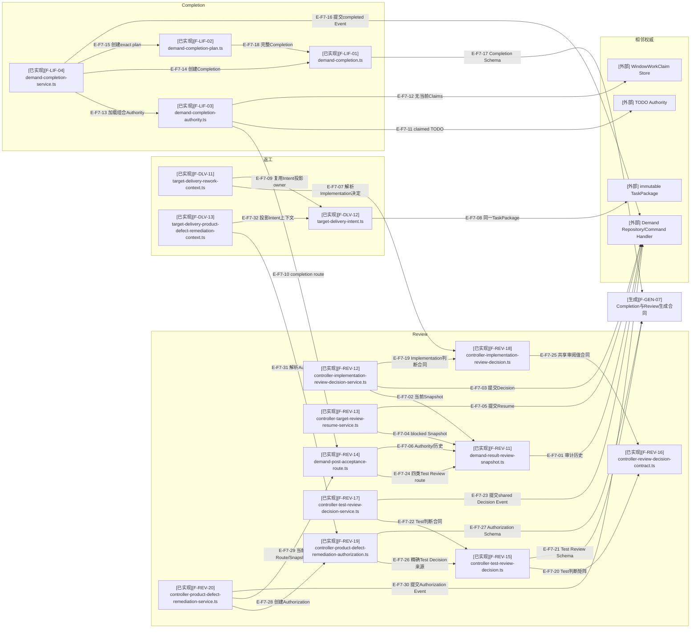

# Review返工与Completion：关键文件依赖

## F7：Review路由与Completion骨干

### 本图术语说明

| 术语 | 解释 |
| --- | --- |
| Rework Context | 从完整Review文字确定性压缩的有界投递输入，不复制Decision权威 |
| completion route | Post-Acceptance Route明确允许进入成功终态的来源投影 |
| Completion Plan | 绑定Authority、Completion、expected revision、commitId和eventId的preview产物 |
| 无当前Claims | 与Demand相关的窗口不存在未释放WorkClaim |

## 文件职责

| 范围 | 关键职责 |
| --- | --- |
| Review Snapshot/Decision/Resume | implementation/test完整历史读模型、来源专用决定Event与共享精确blocked恢复Event |
| Test Review | Test conclusion、Evidence充分性、shared Decision Event和四类route；四类均有明确consumer或终态 |
| Remediation Authorization/Service | 精确绑定Test Decision、失败检查和产品baseline，提交Event并重开原产品Target |
| Remediation Delivery Context | 从Authorization投影原TaskPackage边界内的修复目标和required corrections |
| Post-Acceptance Route | testing/completion/blocked的确定性下一owner选择 |
| Rework Context/Intent | 同一TaskPackage的新投递generation |
| Completion Authority | Route、Controller、TODO和Claims组合准入 |
| Completion Service | preview/apply、幂等Commit和eventAuthority |

## F7直接导入核验

- `controller-implementation-review-decision-service.ts`直接导入来源专用Decision模型；共享值合同由
  `controller-implementation-review-decision.ts`和`controller-test-review-decision.ts`分别导入。
- `target-delivery-rework-context.ts`直接导入Implementation Decision、TargetResult及
  `target-delivery-intent.ts`中的投影函数；它不导入Review Snapshot，完整历史由Preparation Authority先加载。
- Completion只从Route投影`testingMode`进入Lifecycle；完整real-environment Test closure继续由Review拥有，
  避免Lifecycle反向取得Review内部类型并形成循环。
- Repository/Route以`currentTestCard`选择当前Test Target，历史`test-product-defect` Target继续保留原Card tuple。
- `controller-product-defect-remediation-service.ts`从当前Route/Snapshot/History创建Authorization并提交Event；
  `target-delivery-product-defect-remediation-context.ts`再把授权投影为同一TaskPackage的Delivery输入。

## F7边级证据

| 边编号 | 静态关系范围 | 核验结论 |
| --- | --- | --- |
| `E-F7-01`–`E-F7-09` | Implementation Snapshot/Decision/Resume、Rework Context与Intent | Rework Context导入Decision/Result和Intent投影owner，不导入Snapshot |
| `E-F7-10`–`E-F7-18` | Completion Authority/Service/Plan/合同 | Route、TODO与Claim准入后只提交一个completed Event |
| `E-F7-19`–`E-F7-27` | 来源Decision、共享合同、Test Service/Route与Remediation Authorization | 来源专用判断和授权合同闭合 |
| `E-F7-28`–`E-F7-32` | Remediation Service、Repository与Delivery Context | Authorization Event重开原Target并进入同Package返工Intent |

## 停止边界

Review/Lifecycle/Remediation已提交。当前停止边界是Research Completion、Implementation Redesign以及
Demand完成后的Evidence/Archive owner。
