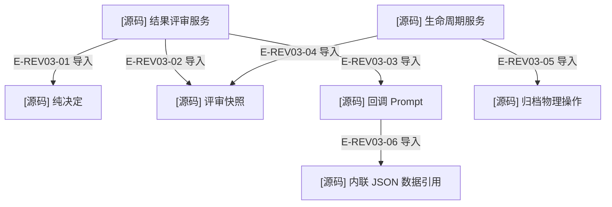

# 评审和完成：不同 owner 的文件边界

> 2026-10-03 当前工作树语义复核；含未提交实现。HEAD 只定位已提交基线，来源指纹覆盖本页实际引用的文件。图谱不拥有业务状态。本页仅声明静态导入，由 AST 核验；不把导入存在作为运行分支已覆盖的证明。

```mermaid
flowchart TB
  accTitle: 评审与归档的精选直接导入
  accDescr: 图中连线仅表示当前 TypeScript 直接导入，不表示调用顺序或持久状态；完整路径与符号在表中定位。
  S["[源码] 结果评审服务"]
  D["[源码] 纯决定"]
  R["[源码] 评审快照"]
  P["[源码] 回调 Prompt"]
  Q["[源码] 内联 JSON 数据引用"]
  L["[源码] 生命周期服务"]
  A["[源码] 归档物理操作"]
  S -->|"E-REV03-01 导入"| D
  S -->|"E-REV03-02 导入"| R
  S -->|"E-REV03-03 导入"| P
  L -->|"E-REV03-04 导入"| R
  L -->|"E-REV03-05 导入"| A
  P -->|"E-REV03-06 导入"| Q
```

### 本图术语说明

| 术语 | 本图含义 |
| --- | --- |
| [源码] | 手写 TypeScript 文件；节点并非业务状态。 |
| 导入 | 当前文件的直接静态依赖，不证明调用次序或测试通过。 |
| 数据引用 | JSON 字符串外包 Markdown code span，处理展示结构，不授予报告执行权。 |

### 本图边级证据

| 编号 | 代码证据 | 测试证据 | 关系与边界 |
| --- | --- | --- | --- |
| E-REV03-01 | `src/capabilities/result-review/service.ts` | 未覆盖：此边仅声明静态 import，由 AST 核验；运行分支覆盖见相邻调用页。 | 导入 |
| E-REV03-02 | `src/capabilities/result-review/service.ts` | 未覆盖：此边仅声明静态 import，由 AST 核验；运行分支覆盖见相邻调用页。 | 导入 |
| E-REV03-03 | `src/capabilities/result-review/service.ts` | 未覆盖：此边仅声明静态 import，由 AST 核验；运行分支覆盖见相邻调用页。 | 导入 |
| E-REV03-04 | `src/capabilities/demand/lifecycle.ts` | 未覆盖：此边仅声明静态 import，由 AST 核验；运行分支覆盖见相邻调用页。 | 导入 |
| E-REV03-05 | `src/capabilities/demand/lifecycle.ts` | 未覆盖：此边仅声明静态 import，由 AST 核验；运行分支覆盖见相邻调用页。 | 导入 |
| E-REV03-06 | `src/capabilities/result-review/prompt.ts` | 未覆盖：此边仅声明静态 import，由 AST 核验；渲染行为覆盖见回调信任页。 | 导入 |

| 节点 | 完整路径 | 主要符号 |
| --- | --- | --- |
| S | `src/capabilities/result-review/service.ts` | `executeTargetResultImportRequest` |
| D | `src/capabilities/result-review/decide.ts` | `deriveResumptionBlockers` |
| R | `src/governance/review/demand-result-review-snapshot.ts` | `readDemandResultReviewSnapshot` |
| P | `src/capabilities/result-review/prompt.ts` | `renderWakeControllerPrompt` |
| Q | `src/foundation/text/markdown-json-string-literal.ts` | `renderMarkdownJsonStringLiteral` |
| L | `src/capabilities/demand/lifecycle.ts` | `executeDemandCompletionRequest` |
| A | `src/capabilities/demand/archive.ts` | `sealDemandArchive` |

折叠：结果/决定编解码器、事件流、受管证据读取器、观察存储与工作声明。评审服务不导入 archive；Demand生命周期拥有完成即归档事务。

rc.4 的新增直接依赖是 Prompt → Markdown JSON 字面量渲染器。它保护目标、摘要和分支的展示边界；实际调用与不覆盖的授权问题见[回调信任与只读评审](./callback-trust-and-review.md)。

## 继续阅读

[本专题总览](./README.md) · [文件导入](./file-dependencies.md) · [实际调用](./runtime-call-flow.md) · [逐文件审阅记录](../../plans/review-2026-10-03/demand-delivery.md) · [图谱入口](../README.md)
