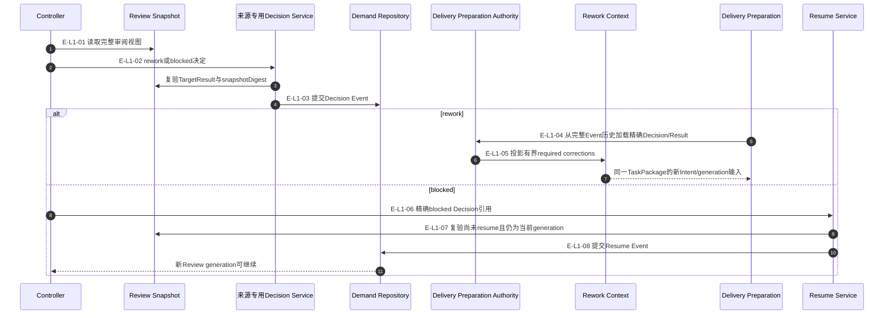
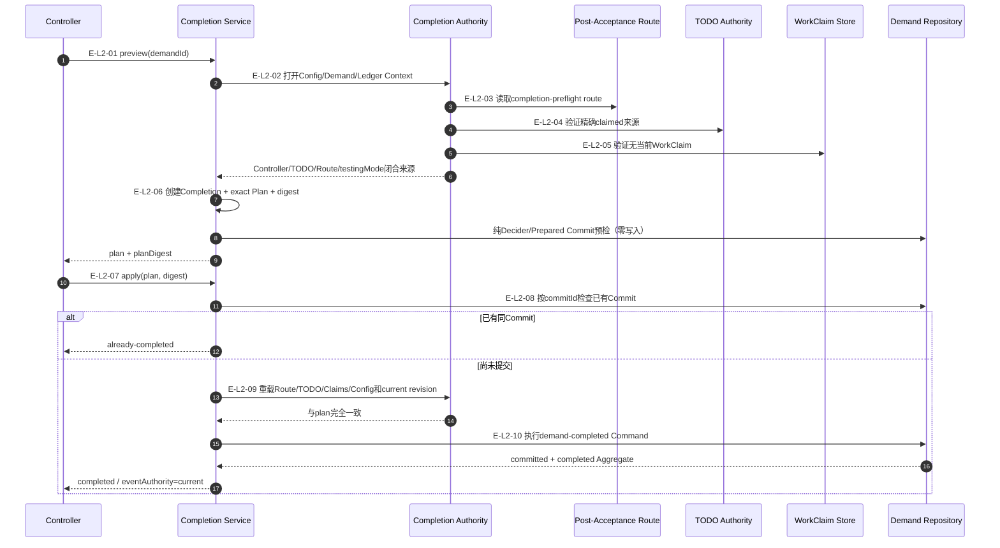
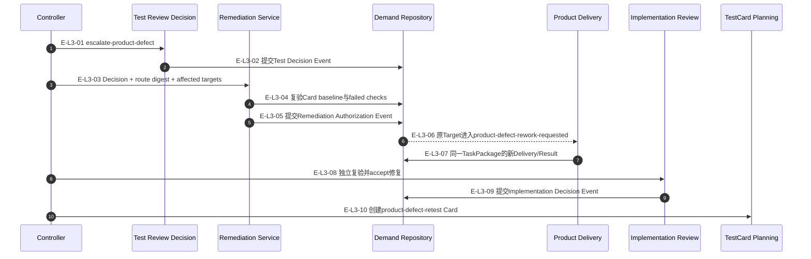

# Review返工、Resume与Completion调用流

## L1：rework与implementation/test blocked generation恢复

### 本图术语说明

| 术语 | 解释 |
| --- | --- |
| required corrections | 从Review决定提取、进入下一Delivery Intent的有界执行修正 |
| 同一TaskPackage | 返工不改变目标边界、acceptance anchors或权威引用 |
| blocked Decision引用 | decisionId、TargetResult和snapshot generation的精确组合 |
| workType闭合 | Resume要求Target phase、TaskPackage/Result workType与Implementation/Test Decision kind一致 |

### L1边级证据

| 边编号 | 代码位置 | 核验结论 |
| --- | --- | --- |
| `E-L1-01`–`E-L1-03` | Review Snapshot、Implementation Decision Service | 决定绑定当前Result与snapshot generation并提交Event |
| `E-L1-04`、`E-L1-05` | Target Delivery Preparation Authority、Rework Context | 后续Preparation从完整历史加载Decision/Result后才压缩返工输入；不是Controller直接调用Rework模块 |
| `E-L1-06`–`E-L1-08` | 共享Resume Service与Review Snapshot | 当前implementation/test blocked Decision尚未恢复时才允许追加Resume Event |

## L2：Demand Completion preview与apply

### 本图术语说明

| 术语 | 解释 |
| --- | --- |
| Demand操作Context | 当前Config、Demand Root Authority、Ledger根与Aggregate的组合 |
| completion-preflight | 路由读模型证明测试策略和全部目标已满足成功完成条件；real-environment携带已接受Test的精确closure |
| `already-completed` | 同一Completion Commit已存在的幂等apply结果 |
| eventAuthority | Completion Event是否`unchanged/current/unknown`的显式结果/错误状态 |

### L2边级证据

| 边编号 | 代码位置 | 核验结论 |
| --- | --- | --- |
| `E-L2-01`–`E-L2-05` | Completion Service/Authority、Post-Acceptance Route | controller-only检查产品窗口；real-environment额外检查Test窗口和Test closure |
| `E-L2-06` | Demand Completion/Plan、纯Decider | Completion只复制`testingMode`与Route/Review摘要，不复制完整Review closure |
| `E-L2-07`–`E-L2-10` | Completion Service与Demand Command Handler | apply重验、同Commit幂等和唯一completed Event |

## L3：产品缺陷授权、产品返工与新Test代际

### 本图术语说明

| 术语 | 解释 |
| --- | --- |
| affected targets | 旧TestCard implementation baselines中由失败检查精确定位的既有产品Target |
| Authorization Event | 绑定Test Decision、Route/Stream fence、原TaskPackage baseline和修复目标的不可变事实 |
| product-defect rework | 不创建新产品TaskPackage；在原边界内产生新的Delivery generation |
| product-defect-retest | 修复accepted后创建的新TestCard，显式引用旧Card、Test Decision与Authorization |

### L3边级证据

| 边编号 | 代码位置 | 核验结论 |
| --- | --- | --- |
| `E-L3-01`、`E-L3-02` | Controller Test Review Decision Service/Event | 只有充分且独立复验的产品缺陷Decision可进入授权 |
| `E-L3-03`–`E-L3-05` | Product Defect Remediation Service/Authorization | 精确route/stream CAS、failed-check映射、幂等Event提交 |
| `E-L3-06`、`E-L3-07` | Aggregate与Product Defect Delivery Context | 原Target重开，同一TaskPackage生成新Delivery |
| `E-L3-08`–`E-L3-10` | Implementation Review与TestCard Planning | 修复需重新accept，之后新Card冻结retest lineage |

## 停止边界

Completion只表示成功终态；取消路径不属于本文。real-environment完成保留TestCard、attempt、Result与Decision
摘要，不新增Card closed事件。TODO归档、BusinessArchive和宿主窗口关闭仍属于后续owner；Lifecycle文件已提交。
