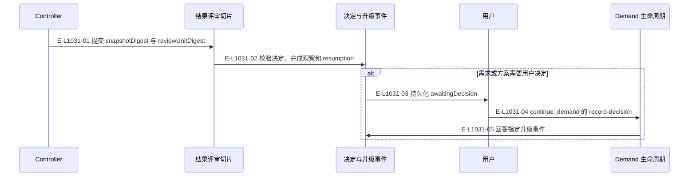
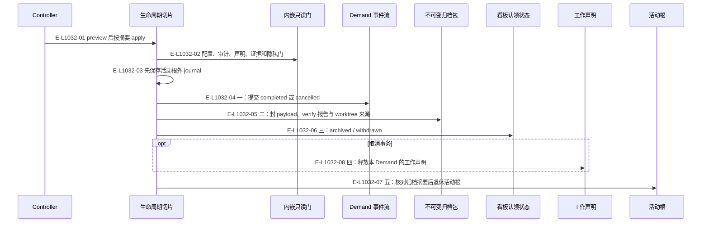
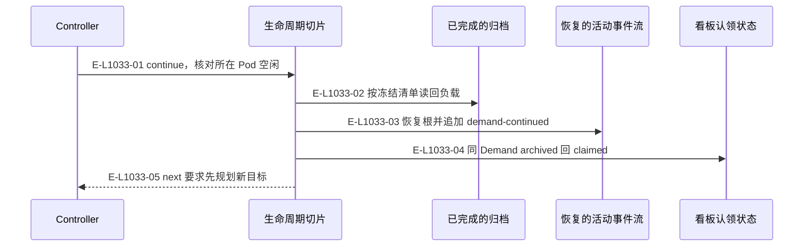

# 评审和生命周期：决定、归档与继续

调用图将外部判断、事件变更和物理归档分开。

> 核验基线：`7ba1f38`；核验时实现代码均已提交，本轮图谱更新另列。开发阶段为 L1 九片已落地，observation 尚未开始。本文说明实现事实，未宣称双宿主真实会话已经验证。

## 决定和升级后的返回

### 本图术语说明

| 术语 | 本图含义 |
| --- | --- |
| Demand | 一个需求的不可变身份和事件流；当前执行环境由 podId 指定。 |
| hook | 宿主回交的会话/提示提交/完成观察记录，保存在宿主本地根。 |
| CAS | 比较已观察的摘要/修订后提交；来源已改变则拒绝。 |

### 节点与实现定位

| 节点 | 文件 / 符号 | 责任 |
| --- | --- | --- |
| controller | Agent / 用户 / 外部效果或条件视图 | Controller |
| slice | `src/capabilities/result-review/service.ts` | 结果评审切片 |
| event | `src/governance/demand/event-sourcing/demand-event-sourcing-decider.ts` | 决定与升级事件 |
| user | Agent / 用户 / 外部效果或条件视图 | 用户 |
| life | `src/capabilities/demand/lifecycle.ts` | Demand 生命周期 |

### 本图边级证据

| 编号 | 代码定位 | 测试 / 核验 | 关系依据 |
| --- | --- | --- | --- |
| E-L1031-01 | `src/capabilities/result-review/service.ts#executeImplementationDecision` | `tests/capabilities/result-review/service.test.ts` | 提交 snapshotDigest 与 reviewUnitDigest |
| E-L1031-02 | `src/capabilities/result-review/service.ts#executeImplementationDecision` | `tests/capabilities/result-review/service.test.ts` | 校验决定、完成观察和 resumption |
| E-L1031-03 | `src/governance/demand/model/demand-aggregate-state.ts#escalateDemandAggregateState` | `tests/capabilities/demand/service.test.ts` | 持久化 awaitingDecision |
| E-L1031-04 | `src/capabilities/demand/lifecycle.ts#applyDecision` | `tests/capabilities/demand/service.test.ts` | continue_demand 的 record-decision |
| E-L1031-05 | `src/governance/demand/model/demand-aggregate-state.ts#recordDecisionInDemandAggregateState` | `tests/capabilities/demand/service.test.ts` | 回答指定升级事件 |

## 完成和取消的五步归档事务

### 本图术语说明

| 术语 | 本图含义 |
| --- | --- |
| ledger | 长期不可变需求包与归档的存储根。 |
| commit | 一次不可变事件提交批；文件槽位以预期修订防止并发覆盖。 |
| CAS | 比较已观察的摘要/修订后提交；来源已改变则拒绝。 |
| claim | 端点注意力及产品检出的工作声明，释放必须匹配当前令牌。 |

### 节点与实现定位

| 节点 | 文件 / 符号 | 责任 |
| --- | --- | --- |
| controller | Agent / 用户 / 外部效果或条件视图 | Controller |
| slice | `src/capabilities/demand/lifecycle.ts` | 生命周期切片 |
| verify | `src/capabilities/demand/verify.ts` | 内嵌只读门 |
| event | `src/governance/demand/event-sourcing/demand-event-sourcing-command-handler.ts` | Demand 事件流 |
| archive | `src/capabilities/demand/archive.ts` | 不可变归档包 |
| board | `src/kernel/requirement-board.ts` | 看板认领状态 |
| claim | `src/kernel/work-claims.ts` | 工作声明 |
| activeRoot | `src/capabilities/demand/archive.ts#retireDemandRoot` | 活动根 |

### 本图边级证据

| 编号 | 代码定位 | 测试 / 核验 | 关系依据 |
| --- | --- | --- | --- |
| E-L1032-01 | `src/capabilities/demand/lifecycle.ts#executeDemandCompletionRequest` | `tests/capabilities/demand/service.test.ts` | preview 后按摘要 apply |
| E-L1032-02 | `src/capabilities/demand/verify.ts#evaluateVerifyGates` | `tests/capabilities/demand/service.test.ts` | 配置、审计、声明、证据和隐私门 |
| E-L1032-03 | `src/capabilities/demand/lifecycle.ts#applyTerminal` | `tests/capabilities/demand/service.test.ts` | 先保存活动根外 journal |
| E-L1032-04 | `src/capabilities/demand/lifecycle.ts#terminalEvent` | `tests/capabilities/demand/service.test.ts` | 一：提交 completed 或 cancelled |
| E-L1032-05 | `src/capabilities/demand/lifecycle.ts#sealArchive` | `tests/capabilities/demand/service.test.ts` | 二：封 payload、verify 报告与 worktree 来源 |
| E-L1032-06 | `src/capabilities/demand/lifecycle.ts#settlePackage` | `tests/capabilities/demand/service.test.ts` | 三：archived / withdrawn |
| E-L1032-08 | `src/capabilities/demand/lifecycle.ts#releaseClaims` | `tests/capabilities/demand/service.test.ts` | 四：取消时释放本 Demand 的工作声明 |
| E-L1032-07 | `src/capabilities/demand/archive.ts#retireDemandRoot` | `tests/capabilities/demand/service.test.ts` | 五：核对归档摘要后退休活动根 |

## 从归档继续同一 Demand

### 本图术语说明

| 术语 | 本图含义 |
| --- | --- |
| Demand | 一个需求的不可变身份和事件流；当前执行环境由 podId 指定。 |
| Pod | 完整窗口组与每仓执行位置；main 是 primary Pod。 |
| snapshot | 可重建的事件聚合检查点；损坏时回退重放。 |

### 节点与实现定位

| 节点 | 文件 / 符号 | 责任 |
| --- | --- | --- |
| controller | Agent / 用户 / 外部效果或条件视图 | Controller |
| slice | `src/capabilities/demand/lifecycle.ts` | 生命周期切片 |
| archive | `src/capabilities/demand/archive.ts` | 已完成的归档 |
| event | `src/governance/demand/event-sourcing/demand-event-sourcing-command-handler.ts` | 恢复的活动事件流 |
| board | `src/kernel/requirement-board.ts` | 看板认领状态 |

### 本图边级证据

| 编号 | 代码定位 | 测试 / 核验 | 关系依据 |
| --- | --- | --- | --- |
| E-L1033-01 | `src/capabilities/demand/lifecycle.ts#planContinue` | `tests/capabilities/demand/service.test.ts` | continue，核对所在 Pod 空闲 |
| E-L1033-02 | `src/capabilities/demand/archive.ts#readArchivePayload` | `tests/capabilities/demand/service.test.ts` | 按冻结清单读回负载 |
| E-L1033-03 | `src/capabilities/demand/lifecycle.ts#applyContinue` | `tests/capabilities/demand/service.test.ts` | 恢复根并追加 demand-continued |
| E-L1033-04 | `src/kernel/requirement-board.ts#reclaimRequirementPackage` | `tests/capabilities/demand/service.test.ts` | 同 Demand archived 回 claimed |
| E-L1033-05 | `src/capabilities/demand/lifecycle.ts#applyContinue` | `tests/capabilities/demand/service.test.ts` | next 要求先规划新目标 |

## 守卫、恢复与验证范围

取消的 Demand 不能 continue。日志只为当前事务恢复提供依据；恢复不是重新规划。归档包含已有事件历史而不包含可重建 snapshots/index/append-candidates。

涉及的测试与核验入口：

- `tests/capabilities/demand/service.test.ts`。
- `tests/capabilities/result-review/service.test.ts`。

## 下钻与相关视图

- [本专题总览](./README.md)
- [图谱总索引](../README.md)
- [核验与剩余范围](../01-diagram-review-ledger.md)
