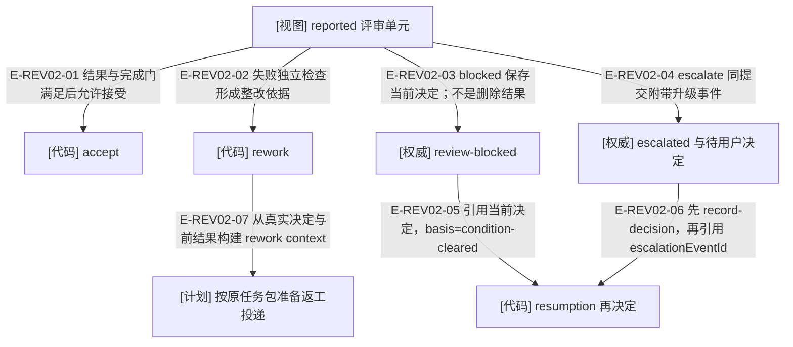

# 评审分支：返工、条件恢复与升级回答

> 2026-10-03 当前工作树语义复核；含未提交实现。HEAD 只定位已提交基线，来源指纹覆盖本页实际引用的文件。图谱不拥有业务状态。本页的测试锚点表示已核对的覆盖入口，运行结果见本轮总台账。

```mermaid
flowchart TB
  accTitle: 同一结果的评审与恢复路径
  accDescr: 同一结果的评审与恢复路径；每条关系由当前实现的调用或条件支持，错误停止与恢复保持显式。
  A["[视图] reported 评审单元"]
  B["[代码] accept"]
  C["[代码] rework"]
  D["[权威] review-blocked"]
  F["[权威] escalated 与待用户决定"]
  H["[代码] resumption 再决定"]
  I["[计划] 按原任务包准备返工投递"]
  A -->|"E-REV02-01 结果与完成门满足后允许接受"| B
  A -->|"E-REV02-02 失败独立检查形成整改依据"| C
  A -->|"E-REV02-03 blocked 保存当前决定；不是删除结果"| D
  A -->|"E-REV02-04 escalate 同提交附带升级事件"| F
  D -->|"E-REV02-05 引用当前决定，basis=condition-cleared"| H
  F -->|"E-REV02-06 先 record-decision，再引用 escalationEventId"| H
  C -->|"E-REV02-07 从真实决定与前结果构建 rework context"| I
```

### 本图术语说明

| 术语 | 本图含义 |
| --- | --- |
| [代码] | 确定性服务、守卫或纯决定；失败会拒绝转换。 |
| [权威] | 持久事实；只能由指定写入者改变。 |
| [视图] | 由权威派生的可重建数据，不授权写入。 |
| resumption | 对同一个结果继续评审的来源指针；必须引用当前决定。 |
| rework | 保留原 TaskPackage 的返工；再次导入产生新评审单元并保留旧历史。 |

### 本图边级证据

| 编号 | 代码证据 | 测试证据 | 关系与边界 |
| --- | --- | --- | --- |
| E-REV02-01 | `src/capabilities/result-review/decide.ts#deriveImplementationDecisionBlockers` | 间接覆盖：`tests/capabilities/result-review/service.test.ts#executeImplementationReviewDecisionRequest`（经公共切片入口执行此内部关系） | 结果与完成门满足后允许接受 |
| E-REV02-02 | `src/capabilities/result-review/decide.ts#deriveImplementationDecisionBlockers` | 间接覆盖：`tests/capabilities/result-review/service.test.ts#decideFixtureImplementation`（经公共切片入口执行此内部关系） | 失败独立检查形成整改依据 |
| E-REV02-03 | `src/capabilities/result-review/service.ts#executeImplementationDecision` | 间接覆盖：`tests/capabilities/result-review/service.test.ts#executeImplementationReviewDecisionRequest`（经公共切片入口执行此内部关系） | blocked 保存当前决定；不是删除结果 |
| E-REV02-04 | `src/capabilities/result-review/service.ts#executeImplementationDecision` | 间接覆盖：`tests/capabilities/result-review/service.test.ts#executeImplementationReviewDecisionRequest`（经公共切片入口执行此内部关系） | escalate 同提交附带升级事件 |
| E-REV02-05 | `src/capabilities/result-review/decide.ts#deriveResumptionBlockers` | 间接覆盖：`tests/capabilities/result-review/service.test.ts#executeImplementationReviewDecisionRequest`（经公共切片入口执行此内部关系） | 引用当前决定，basis=condition-cleared |
| E-REV02-06 | `src/capabilities/result-review/decide.ts#deriveResumptionBlockers` | 间接覆盖：`tests/capabilities/result-review/service.test.ts#executeDemandContinuationRequest`（经公共切片入口执行此内部关系） | 先 record-decision，再引用 escalationEventId |
| E-REV02-07 | `src/capabilities/delivery/service.ts#loadReworkSource` | 间接覆盖：`tests/capabilities/result-review/service.test.ts#prepareFixtureDelivery`（经公共切片入口执行此内部关系） | 从真实决定与前结果构建 rework context |

## 双摘要防止对旧输入作决定

`loadDecisionSources` 完整审计历史，先核 snapshotDigest，再定位结果并核 reviewUnitDigest，最后检查 resumption 和本次重新读取的 hook 观察。旧快照或旧单元分别返回 snapshot-stale / review-unit-stale。已绑定幂等键优先回放，避免刚提交的决定因当前 phase 已前进而被拒。

两份摘要不包含本次 hook 集合；工具写决定时再次读取目标完成和回调落地，并把当次采用的引用放进决定记录。snapshotDigest / reviewUnitDigest 防止对旧业务单元判断，不能当成“已冻结全部环境观察”的证明。accept 的可选性与实际判断准入也不同：Controller 仍需提交符合决定合同的 assessment、independentChecks、rationale 与必要的 anchorEvidence。

blocked 解除不自动产生新结果；escalated 回答由 Demand 的 continue 工具 action=record-decision 追加，随后仍需 Controller 明确提交 resumption 决定。产品缺陷走测试专题的修复授权分支。

待答升级还有取消分支：取消结束 `awaitingDecision` 并按原事务归档，不记录一个虚构的用户回答。若用户选择继续，仍须先 record-decision 再 resumption。两条路径的事件历史不会互相代写，见[取消与归档](./state-and-recovery.md)。

## 继续阅读

[本专题总览](./README.md) · [文件导入](./file-dependencies.md) · [回调信任与只读评审](./callback-trust-and-review.md) · [逐文件审阅记录](../../plans/review-2026-10-03-rc4/callback-review.md) · [图谱入口](../README.md)
