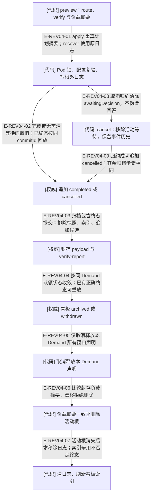

# 完成与取消：五步事务、日志恢复和验收覆盖

> 2026-10-03 当前工作树语义复核；含未提交实现。HEAD 只定位已提交基线，来源指纹覆盖本页实际引用的文件。图谱不拥有业务状态。本页的测试锚点表示已核对的覆盖入口，运行结果见本轮总台账。

### 本图术语说明

| 术语 | 本图含义 |
| --- | --- |
| [代码] | 确定性服务、守卫或纯决定；失败会拒绝转换。 |
| [权威] | 持久事实；只能由指定写入者改变。 |
| [视图] | 由权威派生的可重建数据，不授权写入。 |
| 根外日志 | 活动根删除后仍可恢复的生命周期意图；不是事件权威。 |
| verify | 只读门集合；pass 不会代替完成事件。 |

### 本图边级证据

| 编号 | 代码证据 | 测试证据 | 关系与边界 |
| --- | --- | --- | --- |
| E-REV04-01 | `src/capabilities/demand/lifecycle.ts#applyTerminal` | 间接覆盖：`tests/capabilities/demand/service.test.ts#executeDemandCompletionRequest`（经公共切片入口执行此内部关系） | apply 重算计划摘要；recover 使用原日志 |
| E-REV04-02 | `src/capabilities/demand/lifecycle.ts#terminalEvent` | 间接覆盖：`tests/capabilities/demand/service.test.ts#executeDemandCompletionRequest`（经公共切片入口执行此内部关系） | 完成或无需清等待的取消；已终态按同 commitId 回放 |
| E-REV04-03 | `src/capabilities/demand/lifecycle.ts#sealArchive` | 间接覆盖：`tests/capabilities/demand/service.test.ts#executeDemandCompletionRequest`（经公共切片入口执行此内部关系） | 归档包含终态提交；排除快照、索引、追加候选 |
| E-REV04-04 | `src/capabilities/demand/lifecycle.ts#settlePackage` | 间接覆盖：`tests/capabilities/demand/service.test.ts#executeDemandCancellationRequest`（经公共切片入口执行此内部关系） | 按同 Demand 认领状态收敛；已有正确终态可重放 |
| E-REV04-05 | `src/capabilities/demand/lifecycle.ts#releaseClaims` | 间接覆盖：`tests/capabilities/demand/service.test.ts#executeDemandCancellationRequest`（经公共切片入口执行此内部关系） | 仅取消释放本 Demand 所有窗口声明 |
| E-REV04-06 | `src/capabilities/demand/archive.ts#retireDemandRoot` | 间接覆盖：`tests/capabilities/demand/service.test.ts#executeDemandCompletionRequest`（经公共切片入口执行此内部关系） | 比较封存负载摘要，漂移拒绝删除 |
| E-REV04-07 | `src/capabilities/demand/lifecycle.ts#applyTerminalLocked` | 间接覆盖：`tests/capabilities/demand/service.test.ts#executeDemandCompletionRequest`（经公共切片入口执行此内部关系） | 活动根消失后才移除日志；索引争用不否定终态 |
| E-REV04-08 | `src/governance/demand/model/demand-aggregate-state.ts#cancelDemandAggregateState` | `tests/governance/demand/demand-aggregate-state.test.ts#cancelDemandAggregateState`；间接覆盖：`tests/capabilities/demand/service.test.ts#executeDemandCancellationRequest`（核取消后的等待字段与历史） | DD-F03 已修复；活动等待清除，旧升级事件保留，不追加回答事件。 |
| E-REV04-09 | `src/capabilities/demand/lifecycle.ts#terminalEvent` | 间接覆盖：`tests/capabilities/demand/service.test.ts#executeDemandCancellationRequest`（追加前与终态后中断恢复） | 从原日志恢复同一取消，不重写旧提交。 |

## 完成与取消的门不同

完成要求 active、无 awaitingDecision、route=completion-preflight、所有 verify 门通过。一般 Demand 的 requirement-coverage 逐条核对原始验收标准：controller-only 需要 accepted 实现锚点覆盖；real-environment 需要当前代际 test-accepted 步骤覆盖。空标准也失败。research 走 document 受管证据门，不规划实现任务。

取消无需 completion-preflight，但有待评审结果时阻塞。取消忽略 work-claims-released、requirement-coverage 与 research-evidence 三个失败门，随后自己释放声明；其余门仍阻塞。因此取消归档的 verify 报告可以保留这些失败门，不能把归档存在解释为全门通过。

| 场景 | 恢复行为 / 证据 |
| --- | --- |
| 日志后中断 | 原 action 的 recover 按同计划向前重放；`tests/capabilities/demand/service.test.ts#executeDemandCompletionRequest` |
| 终态根仍在 | 用 commitId 取已提交回执，不追加第二个终态事件 |
| 活动根已删 | 从最近归档取回执并结算看板；无日志已归档则回收据 |
| 不足验收覆盖 | preview blocked，取消仍 ready；`tests/capabilities/demand/acceptance-coverage.test.ts#executeDemandCancellationRequest` |
| 全标准覆盖 | complete apply 成功；`tests/capabilities/demand/acceptance-coverage.test.ts#executeDemandCompletionRequest` |

物理归档先以候选目录整树发布；同目标已存在仅在 payloadTreeDigest 相同才 current，异摘要 archive-conflict。恢复活动根把归档字节放回并补空缓存目录。验证边界：本页没有宣称所有五个边界均做过进程级崩溃测试；现有生命周期用例主要是日志之后中断与幂等重放。

## 两个取消问题已在当前实现闭合

DD-F02：`src/capabilities/demand/decide.ts#gateBlockers` 对 cancel 显式豁免 research-evidence。无 document 时 complete 仍 blocked，cancel 的 verify 仍记录 fail，但可 ready → cancelled → withdrawn → 删除活动根；再次 recover 返回相同归档摘要。证据为 `tests/governance/demand/demand-research-completion.test.ts#executeDemandCancellationRequest` 的新增完整切片用例。

DD-F03：`src/governance/demand/model/demand-aggregate-state.ts#cancelDemandAggregateState` 先移除活动等待，再验证 cancelled 状态。`tests/capabilities/demand/service.test.ts#executeDemandCancellationRequest` 分别在追加前和终态已追加、归档未完成时制造中断；recover 按原日志完成，旧提交字节不变、升级仍在、decisionRecords 为空。它们是临时工作区里的受控 I/O 故障，不是所有归档步骤的进程崩溃证明。

创建、终态和续接在 shared 工作区作用域内继续使用 Pod 短锁与配置复验。日志只记录收尾意图，不成为新的业务权威。详细闭环见[本轮修复复核](../../plans/review-2026-10-03/demand-delivery.md)。

## 继续阅读

[本专题总览](./README.md) · [文件导入](./file-dependencies.md) · [实际调用](./runtime-call-flow.md) · [逐文件审阅记录](../../plans/review-2026-10-03/demand-delivery.md) · [图谱入口](../README.md)
