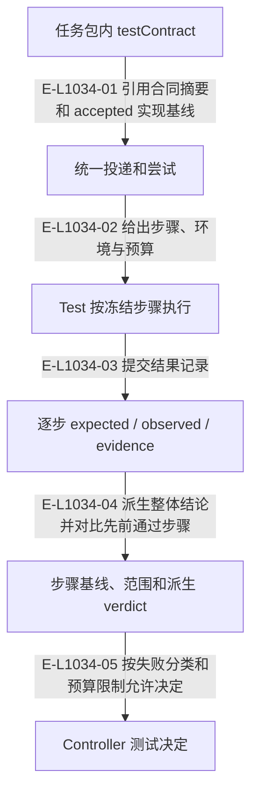

# 测试：任务合同、逐步记录与基线对比

testContract 已替代独立 TestCard。Test 执行冻结步骤并记录观察，Controller 决定接受、重跑、阻塞或升级；真实宿主实跑仍未纳入本轮声明。

> 核验基线：`1480271`（L1 observation 第十片已落地，20 个公共工具、18 个一次性场景）。工作树另有并行未提交改动（宿主 hook 通道等），本图不描绘；来源指纹按当前工作树计算。本文说明实现事实，未宣称双宿主真实会话已经验证。

## 测试合同到 Controller 决定

### 本图术语说明

| 术语 | 本图含义 |
| --- | --- |
| testContract | 测试任务包内冻结的步骤、环境、技能、预算与停止条件。 |
| verdict | 从逐步 expected/observed/evidence 记录派生的测试结论。 |
| TaskPackage | 目标任务的不可变合同，内容来自已发布需求包。 |

### 节点与实现定位

| 节点 | 文件 / 符号 | 责任 |
| --- | --- | --- |
| contract | `src/governance/tasking/task-package.ts` | 任务包内 testContract |
| delivery | `src/capabilities/delivery/service.ts` | 统一投递和尝试 |
| test | Agent / 用户 / 外部效果或条件视图 | Test 按冻结步骤执行 |
| report | `src/governance/result/test-target-result-report.ts` | 逐步 expected / observed / evidence |
| view | `src/capabilities/result-review/decide.ts` | 步骤基线、范围和派生 verdict |
| decision | `src/capabilities/result-review/service.ts` | Controller 测试决定 |

### 本图边级证据

| 编号 | 代码定位 | 测试 / 核验 | 关系依据 |
| --- | --- | --- | --- |
| E-L1034-01 | `src/capabilities/delivery/service.ts#testAttemptFor` | `tests/capabilities/delivery/service.test.ts` | 引用合同摘要和 accepted 实现基线 |
| E-L1034-02 | `src/capabilities/delivery/service.ts#testContractSection` | `tests/capabilities/delivery/service.test.ts` | 给出步骤、环境与预算 |
| E-L1034-03 | `src/capabilities/result-review/service.ts#executeImport` | `tests/capabilities/result-review/service.test.ts` | 提交结果记录 |
| E-L1034-04 | `src/capabilities/result-review/decide.ts#deriveStepViews` | `tests/capabilities/result-review/service.test.ts` | 派生整体结论并对比先前通过步骤 |
| E-L1034-05 | `src/capabilities/result-review/service.ts#executeTestDecision` | `tests/capabilities/result-review/service.test.ts` | 按失败分类和预算限制允许决定 |

## 守卫、恢复与验证范围

environment 失败进入 blocked；harness-defect、flaky、missing-evidence 可在预算内跑失败子集；product-defect 的升级在同一提交附带产品返工授权；needs-decision 交用户。

涉及的测试与核验入口：

- `tests/capabilities/delivery/service.test.ts`。
- `tests/capabilities/result-review/service.test.ts`。
- `tests/capabilities/tasking/service.test.ts`。

## 下钻与相关视图

- [文件直接导入](./file-dependencies.md)
- [运行调用与恢复](./runtime-call-flow.md)
- [图谱总索引](../README.md)
- [核验与剩余范围](../01-diagram-review-ledger.md)
