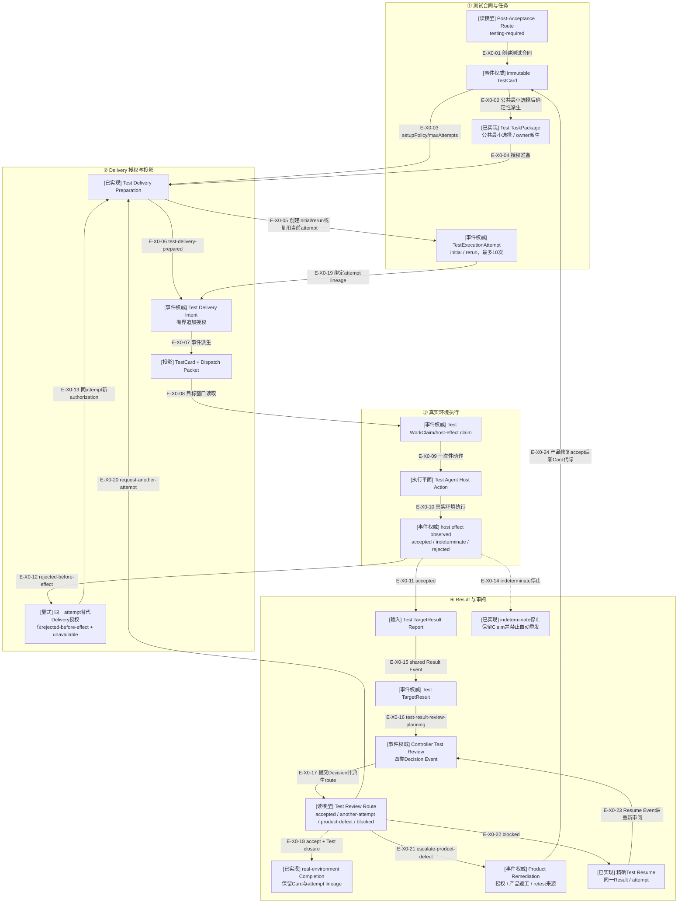

# 真实环境Testing纵切

> Testing 23个生产模块、5个Schema/生成合同及13个测试/fixture已进入`d17602e`。

## 当前结论

Testing从Review接受后路由开始。Controller先冻结TestCard，再由Tasking从TestCard确定性派生test
TaskPackage。Test Delivery Preparation可创建initial attempt、在`request-another-attempt`后创建rerun attempt，
或为明确rejected的当前attempt追加replacement authorization；随后从Event权威物化TestCard与Dispatch Packet投影。

Claim、宿主效果观察和Result导入复用Delivery/Result的权威边界，但Test来源必须额外闭合TestCard、
Test TaskPackage、attempt、授权Intent、Dispatch Packet和环境setup策略。`rejected-before-effect + unavailable`
只允许同一attempt的显式替代Delivery授权；`indeterminate`仍停止。Test Result进入独立Controller Test Review，
不能复用implementation的rework/redesign语义。

当前实现支持1–10条连续attempt lineage；rerun绑定直接前驱Result和`request-another-attempt` Decision。
Test accept进入Completion，blocked由共享Resume精确恢复。product-defect释放`currentTestCard`、保留历史Target，
Remediation Authorization重开原产品Target；修复accept后由TestCard Planning创建绑定旧Card/Decision/Authorization
的新retest代际。

公共MCP通过Route、TestCard Planning、最小Test Task Planning、Test Delivery、Claim/Outcome、Result Import、
Inspection/Test Decision、Remediation与Completion工具暴露该链；Server不会自动串联这些步骤，Agent按Route调用。

## X0：TestCard到真实测试Result

### 本图术语说明

| 术语 | 解释 |
| --- | --- |
| TestCard | Controller冻结的真实环境测试合同，含目标、setup策略、通过条件和Authority来源 |
| logical attempt | 一轮逻辑测试执行；TestCard允许1–10次连续attempt，每次可包含最多32个追加型Delivery授权 |
| setup策略 | `reuse-existing / fresh-once / fresh-per-attempt`；每次attempt派生`reuse`或`prepare-fresh`指令，不是环境回执 |
| rerun | 新attempt，必须引用直接前驱attempt、TargetResult与Controller `request-another-attempt` Decision |
| Dispatch Packet | 由prepared Event、Intent、TaskPackage和TestCard派生的目标窗口读取快照 |
| 追加型授权 | 同一attempt的新授权不能改写之前Intent，只能追加新generation |
| 替代Delivery授权 | 明确rejected-before-effect且宿主不可用后，在同一Test attempt追加新Intent；不是自动重试或新attempt |
| Controller Test Review | 独立判断Evidence结论与充分性，提交accept、another-attempt、product-defect或blocked Decision Event |
| Test Review Route | `test-accepted / test-another-attempt-planning / test-product-defect-escalated / test-review-blocked`四类只读路由；四类均有consumer |
| product-defect retest | Remediation授权并接受产品修复后创建的新TestCard，绑定旧Card/Decision/Authorization |
| `currentTestCard` | 当前可规划/执行Test合同；product-defect后退出槽位，但历史Test Target继续保存原Card tuple |

## X0边级证据

| 边编号 | 实际关系 | 当前结论 |
| --- | --- | --- |
| `E-X0-01`–`E-X0-04` | TestCard与Test TaskPackage | 公共Card/Task工具按Route准入；test Package由owner派生 |
| `E-X0-03`、`E-X0-05`、`E-X0-06`、`E-X0-19` | Test Delivery Preparation三种mode | initial/rerun创建attempt；replacement只追加当前attempt授权 |
| `E-X0-07`–`E-X0-17` | Dispatch、Claim、Outcome、Result与Test Review | 各Service以Event前置条件连接；未由公共orchestrator直接串联 |
| `E-X0-18` | Test accept | 已由Completion Authority消费并保留Test lineage |
| `E-X0-20` | request-another-attempt | 已由Test Delivery Preparation `mode:rerun`消费 |
| `E-X0-21`、`E-X0-24` | product-defect与retest | 释放currentTestCard、保留历史Target，授权产品返工并在修复accept后创建新Card |
| `E-X0-22`、`E-X0-23` | Test blocked | 共享Resume Service复验workType/Decision/Result且不消耗attempt |

## 核验快照

| 项目 | 读取值 |
| --- | --- |
| 生产源码 | 23个Testing模块 |
| 当前全仓架构门 | 710模块、4967依赖、0违规；902项TypeScript测试通过 |
| 测试 | 9个正式测试、4个fixture |
| 合同 | 5个Schema、5个生成合同 |
| 提交状态 | Testing及相邻公共入口已进入`d17602e` |
| 来源指纹 | `7f70498f7256fe4cba57c95d0b89ad1c49297afa71d34cf3a0ed1dedef2f4604` |

## 关键边界

- TestCard Planning只创建Card Event，不创建Test TaskPackage。
- Test TaskPackage必须从已持久化TestCard确定性派生。
- Test Delivery授权绑定同一Card/Package/attempt，超过32条失败关闭。
- TestCard允许最多10次attempt；rerun ordinal连续且必须精确引用直接前驱Result/Decision。
- Dispatch Projection缺失时必须从Event历史重建，不能让目标窗口自造packet。
- 真实宿主效果仍遵循accepted/indeterminate/rejected停止规则。
- Test Result使用`workType: test`、ordered step evidence和精确Card/attempt/packet lineage。
- Test accept、another-attempt、blocked和product-defect均有真实consumer；Remediation后必须重新Test。
- Completion不修改或删除TestCard/attempt，Card保持不可变并由终态Aggregate保留。

## 下钻入口

- [Testing关键文件依赖](./file-dependencies.md)
- [Card、Delivery、Claim与Result调用流](./runtime-call-flow.md)
