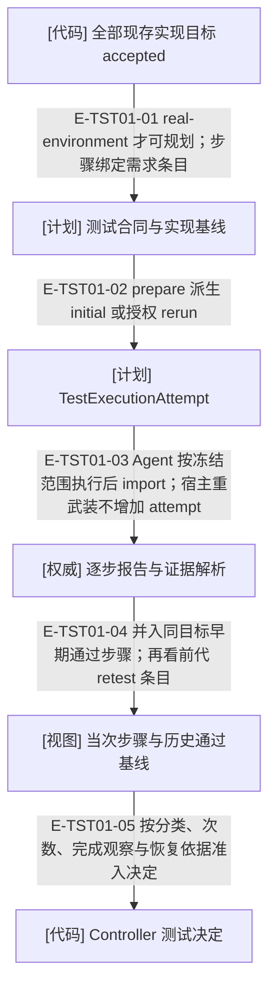

# 真实环境测试：合同、尝试和评审不是一个状态

> 2026-10-03 当前工作树语义复核；含未提交实现。HEAD 只定位已提交基线，来源指纹覆盖本页实际引用的文件。图谱不拥有业务状态。本页的测试锚点表示已核对的覆盖入口，运行结果见本轮总台账。

```mermaid
flowchart TB
  accTitle: 冻结测试合同到独立评审
  accDescr: 冻结测试合同到独立评审；每条关系由当前实现的调用或条件支持，错误停止与恢复保持显式。
  A["[代码] 全部现存实现目标 accepted"]
  B["[计划] 测试合同与实现基线"]
  C["[计划] TestExecutionAttempt"]
  D["[权威] 逐步报告与证据解析"]
  F["[视图] 当次步骤与历史通过基线"]
  H["[代码] Controller 测试决定"]
  A -->|"E-TST01-01 real-environment 才可规划；步骤绑定需求条目"| B
  B -->|"E-TST01-02 prepare 派生 initial 或授权 rerun"| C
  C -->|"E-TST01-03 Agent 按冻结范围执行后 import；宿主重武装不增加 attempt"| D
  D -->|"E-TST01-04 并入同目标早期通过步骤；再看前代 retest 条目"| F
  F -->|"E-TST01-05 按分类、次数、完成观察与恢复依据准入决定"| H
```

### 本图术语说明

| 术语 | 本图含义 |
| --- | --- |
| [代码] | 确定性服务、守卫或纯决定；失败会拒绝转换。 |
| [权威] | 持久事实；只能由指定写入者改变。 |
| [视图] | 由权威派生的可重建数据，不授权写入。 |
| attempt | 一次真实测试执行；与宿主发送 generation 分开计数。 |
| GWT | given / when / then：前置、动作、期待；Controller 冻结其文本。 |
| approved 基线 | 历史 pass 步骤的证据视图；不执行新环境检查。 |

### 本图边级证据

| 编号 | 代码证据 | 测试证据 | 关系与边界 |
| --- | --- | --- | --- |
| E-TST01-01 | `src/capabilities/tasking/service.ts#buildTestPackage` | 间接覆盖：`tests/capabilities/tasking/service.test.ts#planFixtureTestTask`（经公共切片入口执行此内部关系） | real-environment 才可规划；步骤绑定需求条目 |
| E-TST01-02 | `src/capabilities/delivery/service.ts#testAttemptFor` | 间接覆盖：`tests/capabilities/result-review/service.test.ts#prepareFixtureDelivery`（经公共切片入口执行此内部关系） | prepare 派生 initial 或授权 rerun |
| E-TST01-03 | `src/capabilities/result-review/service.ts#buildResult` | 间接覆盖：`tests/capabilities/result-review/service.test.ts#importFixtureTestResult`（经公共切片入口执行此内部关系） | Agent 按冻结范围执行后 import；宿主重武装不增加 attempt |
| E-TST01-04 | `src/capabilities/result-review/decide.ts#deriveStepViews` | 间接覆盖：`tests/capabilities/result-review/service.test.ts#inspectFixtureReview`（经公共切片入口执行此内部关系） | 并入同目标早期通过步骤；再看前代 retest 条目 |
| E-TST01-05 | `src/capabilities/result-review/decide.ts#deriveTestDecisionBlockers` | 间接覆盖：`tests/capabilities/result-review/service.test.ts#executeTestReviewDecisionRequest`（经公共切片入口执行此内部关系） | 按分类、次数、完成观察与恢复依据准入决定 |

## 环境 setup 的精确行为

| setupPolicy | initial | rerun |
| --- | --- | --- |
| fresh-once | prepare-fresh-environment | reuse-confirmed-environment |
| fresh-per-attempt | prepare-fresh-environment | prepare-fresh-environment |
| reuse-existing | reuse-confirmed-environment | reuse-confirmed-environment |

`src/governance/testing/test-execution-attempt.ts#assertTestExecutionAttemptMatchesPackage` 核目标、包身份/摘要、setup 指令与预算，子集 stepIds 必须在合同内；rerun 还必须 ordinal 连续、来源指向前 attempt。实际准备环境属于 Test Agent 的执行责任；字段不是环境准备成功的回执。

任务包规定步骤为 ts-1…ts-n，且同份合同不允许两个步骤引用同一个验收 itemId。测试环境取冻结需求包唯一 landing 角色成员，不读取用户任意传入的环境路径。实现基线记录每个 accepted 实现目标的包、结果与评审摘要。

本轮混合失败修复只改变产品缺陷授权集合，不改变测试接受条件。原报告的其他 fail 继续存在；修复、retest 和 rerun 是不同的合同/尝试关系，不能把“已发修复授权”画成“全部测试通过”。[分类与闭环证据](./runtime-call-flow.md)。

## 继续阅读

[本专题总览](./README.md) · [文件导入](./file-dependencies.md) · [实际调用](./runtime-call-flow.md) · [逐文件审阅记录](../../plans/review-2026-10-03/demand-delivery.md) · [图谱入口](../README.md)
