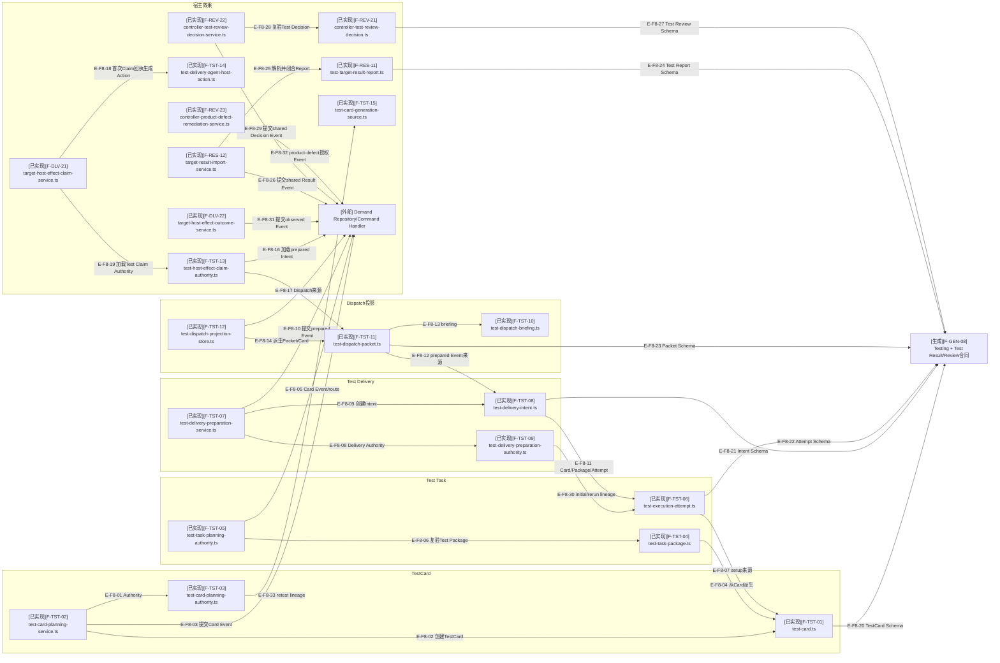

# 真实环境Testing：关键文件依赖

## F8：Testing骨干依赖

### 本图术语说明

| 术语 | 解释 |
| --- | --- |
| Test Delivery Authority | Card、Package、Attempt、Config、窗口和替换授权的组合准入 |
| briefing | 面向目标测试窗口的有界中文/英文执行说明，不替代Card或Packet合同 |
| Card Projection | 从TestCard Event物化的目标读取文件 |
| prepared Intent | 已提交测试授权但尚未产生WorkClaim或宿主效果 |
| Test Review | Test conclusion、Evidence充分性与四类Decision；四类均有明确consumer |
| retest lineage | 新Card对旧Card、Test Decision和Remediation Authorization的精确来源 |
| rerun lineage | 新attempt对直接前驱attempt、Result与request-another-attempt Decision的精确引用链 |

## F8直接导入核验

| 边范围 | 核验结论 |
| --- | --- |
| `E-F8-01`–`E-F8-07` | Card、Test TaskPackage与Attempt的直接imports成立；公共Planning按Route消费test分支 |
| `E-F8-08`–`E-F8-15`、`E-F8-30` | Preparation直接组合Authority/Intent，Authority读取initial/rerun lineage，Projection从Event派生Packet |
| `E-F8-16`–`E-F8-19`、`E-F8-31` | 共享Claim Service导入Test Claim Authority与Action；Outcome Service提交observed Event，方向不是Action调用Service |
| `E-F8-24`–`E-F8-29` | 共享Result Import导入Test Report；Test Review Service导入Test Decision并提交shared Event |
| `E-F8-20`–`E-F8-23` | TestCard、Intent、Attempt与Dispatch Packet分别依赖自己的生成Schema合同 |
| `E-F8-32`、`E-F8-33` | Remediation与TestCard generation source | 产品返工授权后新Card闭合retest lineage |

## 原始依赖快照

| Testing生产模块 | 当前全仓受检模块 | 当前全仓依赖 | 违规 |
| ---: | ---: | ---: | ---: |
| 23 | 710 | 4967 | 0 |

## 停止边界

Testing已进入`d17602e`；rerun、real-environment Completion、blocked Resume和product-defect Remediation/retest
均有真实consumer。真实宿主效果仍由Agent执行，MCP只签发Action并记录观察。
