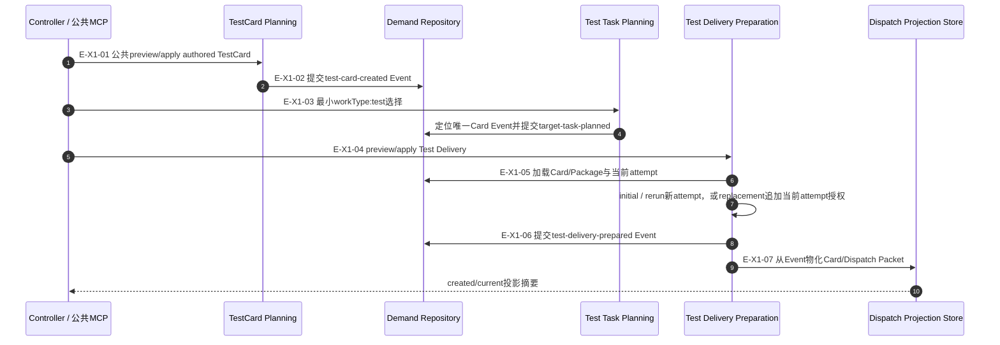
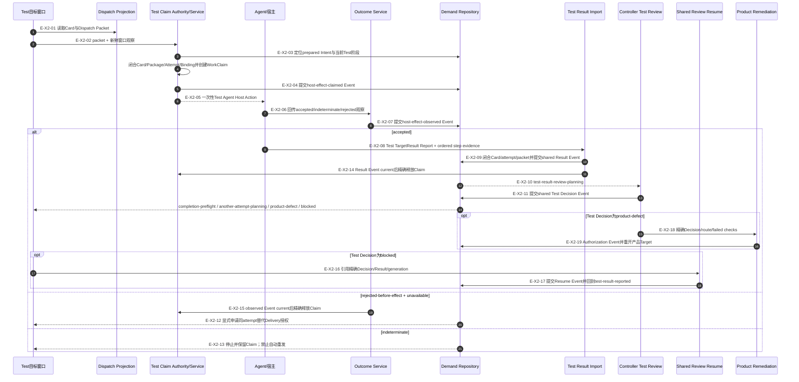

# 真实环境Testing：Card、Delivery与Result调用流

## X1：TestCard、Test TaskPackage与Delivery授权

### 本图术语说明

| 术语 | 解释 |
| --- | --- |
| authored TestCard | Controller提供目标、setup、通过条件等内容；系统分配Card/Event身份 |
| initial attempt | TestCard的首个逻辑执行attempt，ordinal固定为1 |
| rerun attempt | 新attempt，ordinal连续且绑定直接前驱Result和Controller request-another-attempt Decision |
| environment setup | 按`reuse-existing / fresh-once / fresh-per-attempt`与attempt mode唯一派生的执行指令，不是环境已准备回执 |
| authorization generation | 同一attempt中追加的第N份Test Delivery授权，最大32；replacement必须有精确rejected来源 |

### X1边级证据

| 边编号 | 代码位置 | 核验结论 |
| --- | --- | --- |
| `E-X1-01`、`E-X1-02` | TestCard Public Coordinator/Planning Service | Route准入后提交Card Event |
| `E-X1-03` | Target Task Planning Public Coordinator/Test Planning Authority | 最小test选择由owner派生完整Package |
| `E-X1-04`–`E-X1-06` | Test Delivery Preparation Input/Authority/Service | 三种mode严格分离；rerun与replacement不能互换 |
| `E-X1-07` | Dispatch Projection Store | 只从Event历史物化Card和当前Packet |

## X2：Test Claim、真实执行与Result

### 本图术语说明

| 术语 | 解释 |
| --- | --- |
| Test Agent Host Action | 从首次Claim Event生成、要求Agent执行真实测试环境动作的瞬时指令 |
| Test Result Report | 测试Agent输出；只有闭合Event来源后才成为TargetResult |
| 真实环境 | 实际宿主/工作区/依赖条件，不是纯单元测试模拟 |
| ordered step evidence | 与TestCard approved plan逐项同序、索引连续且文字一致的测试执行事实 |
| Test Decision | `accept / request-another-attempt / escalate-product-defect / blocked`；四类均有明确consumer |

### X2边级证据

| 边编号 | 代码位置 | 核验结论 |
| --- | --- | --- |
| `E-X2-01`–`E-X2-05` | Dispatch Projection、Test Claim Authority、共享Claim Service | Claim文件和claimed Event先于首次Action；没有公共dispatch入口 |
| `E-X2-06`、`E-X2-07` | 共享Outcome Service | accepted/indeterminate保留Claim，rejected Event current后授权释放 |
| `E-X2-08`–`E-X2-11`、`E-X2-14` | Test Report、共享Result Import与Test Review | Result Event current后释放Claim并进入独立Test Decision |
| `E-X2-12`、`E-X2-15` | rejected replacement | 释放Claim后只允许同attempt replacement authorization |
| `E-X2-13` | indeterminate | Claim保留且失败关闭 |
| `E-X2-16`、`E-X2-17` | Test blocked Resume | 共享Resume Service复验workType与精确Decision/Result，不消耗attempt或创建Delivery |
| `E-X2-18`、`E-X2-19` | Product Remediation Service | Test缺陷Decision映射到原产品Target并提交Authorization Event |

## 停止边界

Testing与公共入口已提交；本文不声明某次真实宿主测试已经实际执行。Agent仍负责一次性宿主效果，
Wakeflow公共工具负责Card/Task/Delivery/Result/Review/Remediation/Completion的确定性权威与路由。
