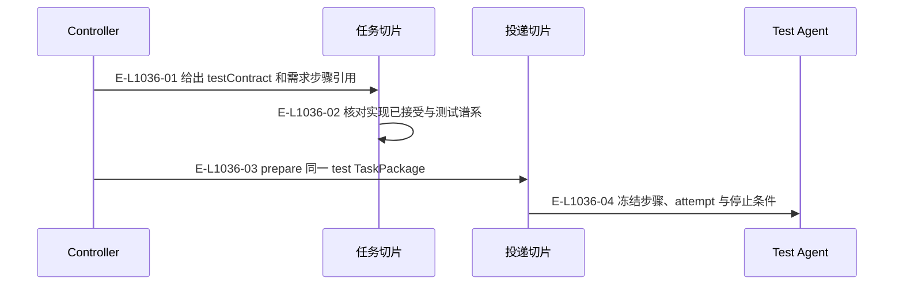
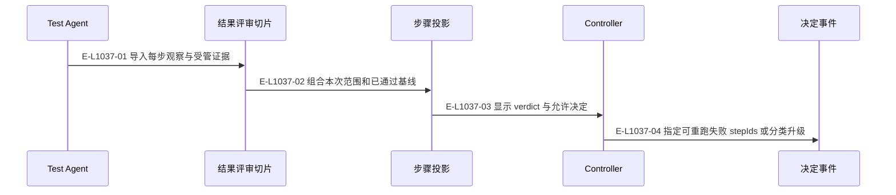

# 测试：规划、尝试与失败子集

测试合同和任务身份保持不可变，尝试与审阅决定保留谱系。

> 核验基线：`7ba1f38`；核验时实现代码均已提交，本轮图谱更新另列。开发阶段为 L1 九片已落地，observation 尚未开始。本文说明实现事实，未宣称双宿主真实会话已经验证。

## 测试规划与统一投递

### 本图术语说明

| 术语 | 本图含义 |
| --- | --- |
| testContract | 测试任务包内冻结的步骤、环境、技能、预算与停止条件。 |
| TaskPackage | 目标任务的不可变合同，内容来自已发布需求包。 |
| permit | 供 Agent 使用的投递内容与围栏；重放不是新一次发送授权。 |

### 节点与实现定位

| 节点 | 文件 / 符号 | 责任 |
| --- | --- | --- |
| controller | Agent / 用户 / 外部效果或条件视图 | Controller |
| tasking | `src/capabilities/tasking/service.ts` | 任务切片 |
| delivery | `src/capabilities/delivery/service.ts` | 投递切片 |
| test | Agent / 用户 / 外部效果或条件视图 | Test Agent |

### 本图边级证据

| 编号 | 代码定位 | 测试 / 核验 | 关系依据 |
| --- | --- | --- | --- |
| E-L1036-01 | `src/capabilities/tasking/service.ts#buildTestPackage` | `tests/capabilities/tasking/service.test.ts` | 给出 testContract 和需求步骤引用 |
| E-L1036-02 | `src/capabilities/tasking/decide.ts#deriveTestPlanningBlockers` | `tests/capabilities/tasking/service.test.ts` | 核对实现已接受与测试谱系 |
| E-L1036-03 | `src/capabilities/delivery/service.ts#executePrepare` | `tests/capabilities/delivery/service.test.ts` | prepare 同一 test TaskPackage |
| E-L1036-04 | `src/capabilities/delivery/service.ts#renderPrompt` | `tests/capabilities/delivery/service.test.ts` | 冻结步骤、attempt 与停止条件 |

## 逐步结果、分类与重跑

### 本图术语说明

| 术语 | 本图含义 |
| --- | --- |
| verdict | 从逐步 expected/observed/evidence 记录派生的测试结论。 |
| testContract | 测试任务包内冻结的步骤、环境、技能、预算与停止条件。 |
| commit | 一次不可变事件提交批；文件槽位以预期修订防止并发覆盖。 |

### 节点与实现定位

| 节点 | 文件 / 符号 | 责任 |
| --- | --- | --- |
| test | Agent / 用户 / 外部效果或条件视图 | Test Agent |
| review | `src/capabilities/result-review/service.ts` | 结果评审切片 |
| view | `src/capabilities/result-review/decide.ts` | 步骤投影 |
| controller | Agent / 用户 / 外部效果或条件视图 | Controller |
| event | `src/governance/demand/event-sourcing/demand-event-sourcing-decider.ts` | 决定事件 |

### 本图边级证据

| 编号 | 代码定位 | 测试 / 核验 | 关系依据 |
| --- | --- | --- | --- |
| E-L1037-01 | `src/capabilities/result-review/service.ts#executeImport` | `tests/capabilities/result-review/service.test.ts` | 导入每步观察与受管证据 |
| E-L1037-02 | `src/capabilities/result-review/service.ts#testUnitView` | `tests/capabilities/result-review/service.test.ts` | 组合本次范围和已通过基线 |
| E-L1037-03 | `src/capabilities/result-review/decide.ts#deriveUnionVerdict` | `tests/capabilities/result-review/service.test.ts` | 显示 verdict 与允许决定 |
| E-L1037-04 | `src/capabilities/result-review/service.ts#executeTestDecision` | `tests/capabilities/result-review/service.test.ts` | 指定可重跑失败 stepIds 或分类升级 |

## 守卫、恢复与验证范围

接受需要 completed 与目标会话的完成记录。步骤通过是证据，不能自动替代 Controller 的验收判断；预算、范围和失效基线均在下一尝试准入中核对。

涉及的测试与核验入口：

- `tests/capabilities/delivery/service.test.ts`。
- `tests/capabilities/result-review/service.test.ts`。
- `tests/capabilities/tasking/service.test.ts`。

## 下钻与相关视图

- [本专题总览](./README.md)
- [图谱总索引](../README.md)
- [核验与剩余范围](../01-diagram-review-ledger.md)
