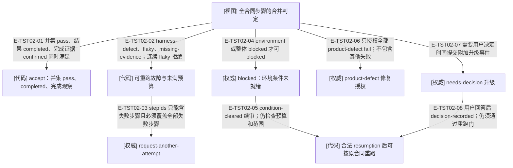

# 测试决定：按失败分类分支与子集重跑

> 2026-10-03 当前工作树语义复核；含未提交实现。HEAD 只定位已提交基线，来源指纹覆盖本页实际引用的文件。图谱不拥有业务状态。本页的测试锚点表示已核对的覆盖入口，运行结果见本轮总台账。

```mermaid
flowchart TB
  accTitle: 失败分类决定允许动作
  accDescr: 失败分类决定允许动作；每条关系由当前实现的调用或条件支持，错误停止与恢复保持显式。
  A["[视图] 全合同步骤的合并判定"]
  B["[代码] accept：并集 pass、completed、完成观察"]
  C["[代码] 可重跑故障与未满预算"]
  D["[权威] request-another-attempt"]
  F["[权威] blocked：环境条件未就绪"]
  H["[代码] 合法 resumption 后可按原合同重跑"]
  I["[权威] product-defect 修复授权"]
  J["[权威] needs-decision 升级"]
  A -->|"E-TST02-01 并集 pass、结果 completed、完成证据 confirmed 同时满足"| B
  A -->|"E-TST02-02 harness-defect、flaky、missing-evidence；连续 flaky 拒绝"| C
  C -->|"E-TST02-03 stepIds 只能含失败步骤且必须覆盖全部失败步骤"| D
  A -->|"E-TST02-04 environment 或整体 blocked 才可 blocked"| F
  F -->|"E-TST02-05 condition-cleared 续审；仍检查预算和范围"| H
  A -->|"E-TST02-06 只授权全部 product-defect fail；不包含其他失败"| I
  A -->|"E-TST02-07 需要用户决定时同提交附加升级事件"| J
  J -->|"E-TST02-08 用户回答后 decision-recorded；仍须通过重跑门"| H
```

### 本图术语说明

| 术语 | 本图含义 |
| --- | --- |
| [代码] | 确定性服务、守卫或纯决定；失败会拒绝转换。 |
| [权威] | 持久事实；只能由指定写入者改变。 |
| [视图] | 由权威派生的可重建数据，不授权写入。 |
| 分类 | 失败性质由报告声明；代码用其约束可选决定，不替 Agent 诊断。 |
| 并集判定 | 本次 fail 优先，再 blocked，缺当前通过且无基线为 cannot-conclude。 |
| 修复授权 | 测试决定同提交附加，绑定受影响实现目标与其冻结接受基线。 |

### 本图边级证据

| 编号 | 代码证据 | 测试证据 | 关系与边界 |
| --- | --- | --- | --- |
| E-TST02-01 | `src/capabilities/result-review/decide.ts#deriveTestDecisionBlockers` | `tests/capabilities/result-review/decide.test.ts#deriveTestAllowedDecisions`、`tests/capabilities/result-review/decide.test.ts#deriveTestDecisionBlockers`（三项满足时允许集合含 accept；完成 pending 和步骤 fail 分别有阻塞断言） | 并集 pass、结果 completed、完成证据 confirmed 同时满足，accept 分支才无状态阻塞项。 |
| E-TST02-02 | `src/capabilities/result-review/decide.ts#rerunBlockers` | 间接覆盖：`tests/capabilities/result-review/decide.test.ts#deriveTestDecisionBlockers`（纯决定用例直接覆盖分类、预算、连续 flaky、范围及 environment 恢复门；不宣称这些组合均经公共I/O纵切） | harness-defect、flaky、missing-evidence；连续 flaky 拒绝 |
| E-TST02-03 | `src/capabilities/result-review/decide.ts#rerunScopeBlockers` | 间接覆盖：`tests/capabilities/result-review/decide.test.ts#deriveTestDecisionBlockers`（纯决定用例直接覆盖分类、预算、连续 flaky、范围及 environment 恢复门；不宣称这些组合均经公共I/O纵切） | stepIds 只能含失败步骤且必须覆盖全部失败步骤 |
| E-TST02-04 | `src/capabilities/result-review/decide.ts#deriveTestDecisionBlockers` | 间接覆盖：`tests/capabilities/result-review/decide.test.ts#deriveTestDecisionBlockers`（纯决定用例直接覆盖分类、预算、连续 flaky、范围及 environment 恢复门；不宣称这些组合均经公共I/O纵切） | environment 或整体 blocked 才可 blocked |
| E-TST02-05 | `src/capabilities/result-review/decide.ts#rerunBlockers` | 间接覆盖：`tests/capabilities/result-review/decide.test.ts#deriveTestDecisionBlockers`（纯决定用例覆盖 environment 在 resumed 后可重跑；公共服务先核 condition-cleared） | blocked 之后必须带 condition-cleared，仍检查预算和范围。 |
| E-TST02-06 | `src/capabilities/result-review/decide.ts#escalateBlockers`、`src/capabilities/result-review/service.ts#remediationAuthorization` | 间接覆盖：`tests/capabilities/result-review/mixed-failure-remediation.test.ts#executeTestReviewDecisionRequest`（4种混合分类；flaky另走完整修复/复测/重跑） | 映射集合恰为产品缺陷 fail；其他失败保留在原报告。 |
| E-TST02-07 | `src/capabilities/result-review/service.ts#executeTestDecision` | 间接覆盖：`tests/capabilities/result-review/service.test.ts#executeTestReviewDecisionRequest`（经公共切片入口执行此内部关系） | 需要用户决定时同提交附加升级事件 |
| E-TST02-08 | `src/capabilities/result-review/service.ts#testUnitView`、`src/capabilities/result-review/decide.ts#deriveResumptionBlockers` | `tests/capabilities/result-review/decide.test.ts#deriveResumptionBlockers`、`tests/capabilities/result-review/decide.test.ts#deriveTestDecisionBlockers`（分别覆盖已答升级恢复和 environment 的 resumed 准入；不声称二者组合已有公共 I/O 纵切回归） | 升级回答后以 decision-recorded 续审，不冒充 blocked 的 condition-cleared。 |

E-TST02-01 表示允许 accept 的正向状态条件，三项缺一不可。若某合同步骤缺少本次通过记录且没有历史通过基线，`src/capabilities/result-review/decide.ts#deriveUnionVerdict` 返回 cannot-conclude；随后 accept 守卫产生 verdict:cannot-conclude 阻塞，不能沿该边进入 accept。允许集合仍不代替 Controller 的独立检查与决定合同准入。

## 重跑与复测的区别

request-another-attempt 沿用同一 TaskPackage，建立紧邻的逻辑 attempt；范围外步骤沿用此前 pass 的观察与证据。其来源先按同目标 stepId，再按 retest 前目标引用的相同 requirement itemId 匹配。不能只重跑失败集合的一部分。

product-defect 不是普通 rerun。同提交追加修复授权，把受影响实现目标送回 product-defect-rework-requested；实现修复重新接受后，以 retest 谱系规划新测试任务包并消费 pendingTestRetest。新合同的实现基线必须来自修复后的当前接受状态。测试已接受后进入 completion-preflight，仍须通过独立的全需求覆盖与归档门。

真实会话执行未由这些 fixture 自动证明。此页只确认合同、报告、决定与事件接线；真实宿主/环境的结果需另外留证。

## 混合失败的授权集合与复测闭环

DD-F01 已修复。`escalateBlockers` 要求映射只含 product-defect fail，并覆盖该类全部失败；`remediationAuthorization` 从原报告只取这些产品缺陷步骤。授权 codec 仍严格要求 failedSteps 与受影响目标的映射集合一致，不放宽其 v1 合同。

历史读取也同步修正：`src/governance/demand/event-sourcing/demand-event-sourcing-repository.ts#DemandEventSourcingRepository.auditTargetResultHistoryOfCommits` 以持久决定实际映射的集合筛选原报告 fail，逐项比较 stepId/observed。这样当前窄授权可审计，旧 v1 中已明确映射全失败的合法记录仍按原决定解释；不改写旧字节，也不允许新公共请求绕过分类准入。

| 混合分类 | 当前授权 | 后续保留的约束 |
| --- | --- | --- |
| product-defect + flaky / harness-defect / missing-evidence / environment | 只包括产品缺陷步骤及其实现基线 | 其他 fail 的分类与证据继续保留，不能变为历史 pass 基线。 |
| 产品修复已接受，新建 retest | 新测试包绑定修复后的接受基线，initial 尝试跑全合同 | 旧失败不会自动补齐新合同；仍须实际通过或合法重跑。 |
| retest 仍有 flaky | accept 被 verdict 拒绝，可申请只包含全部当前失败的 rerun | 重跑通过后才能合并先前 pass 并接受；完成仍检查验收覆盖。 |

`tests/capabilities/result-review/mixed-failure-remediation.test.ts#executeTestReviewDecisionRequest` 直接覆盖四类混合报告、同键回放、授权集合及未消失的原失败；其中 flaky 用例继续走实际公共切片的实现修复 → retest → 拒绝提前接受 → 子集 rerun → test-accepted → completion preview ready。它使用临时 fixture，不能作为真实登录宿主或外部产品环境的执行证明。

允许集合也不替代决定合同：`src/governance/review/controller-test-review-decision.ts#assertControllerTestReviewJudgment` 对 accept 还要求 satisfied/sufficient、独立检查全 passed、无阻塞；rerun 要求 inconclusive 或 insufficient、至少一条 failed/inconclusive 检查以及非空范围；产品缺陷要求充分证据、failed 独立检查和 defect-observed。

inspect 推导候选动作时不携带待提交的 stepIds 或 escalation.remediation，因而集合里的 request-another-attempt / escalate 不是任意范围或映射已获准的证明。写入口仍复验全失败集合、产品缺陷映射、双摘要、resumption 和判断合同。test-result-reported、test-review-blocked、test-escalated 可以读评审单元；test-accepted、test-another-attempt-requested 和 test-product-defect 已转入后续流程，不再由此只读入口返回当前单元。回调落地与目标完成的分工见[回调信任与只读评审](../07-review-rework-completion/callback-trust-and-review.md)。

## 继续阅读

[本专题总览](./README.md) · [文件导入](./file-dependencies.md) · [实际调用](./runtime-call-flow.md) · [逐文件审阅记录](../../plans/review-2026-10-03/demand-delivery.md) · [图谱入口](../README.md)
