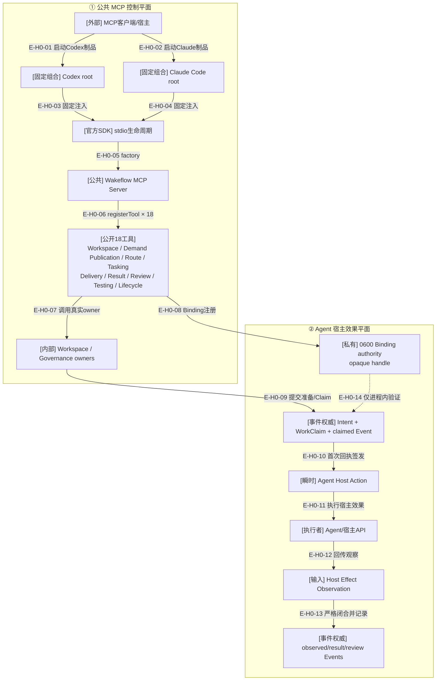

# 公共MCP与宿主接缝

## 当前结论

当前公共MCP注册18个真实工具，覆盖Workspace Maintenance/Binding、Demand Publication/Route、implementation/test
Tasking、Delivery、Host Effect事实、Result、Review/Resume、Testing、Product Remediation和Completion。
Codex和Claude Code各自拥有固定composition root；公共请求不能选择宿主，双宿主工具名称与Schema集合一致。

当前工作树新增Managed Evidence source selection、零写capture Planning、Demand Event/Aggregate selector、final/stage/journal
资源目录及完整record tree plan，但没有Root Inventory集成、资源Application或Public Coordinator，因此公共工具仍严格为
18个；record plan存在不能被描述为`wakeflow_record_evidence`已经恢复。

Agent宿主效果采用“Wakeflow提交Intent/Claim事实 → 签发瞬时Action → Agent执行 → 回传Observation →
Wakeflow记录Event”的握手。MCP不替Agent操作窗口。Window Binding注册请求会接收Agent观察到的
opaque handle，但该值只进入0600私有Binding权威，不进入返回值、投影、业务Event或Host Action。

## H0：双平面宿主接缝

### 本图术语说明

| 术语 | 解释 |
| --- | --- |
| 固定composition root | 在模块装载时绑定宿主Profile与executor，不接受请求级宿主选择 |
| 官方stdio生命周期 | MCP SDK拥有连接、`tools/list`、`tools/call`和Schema协议边界 |
| raw handle | 宿主定位窗口的私有opaque值；只允许出现在注册请求的瞬时输入和0600 Binding authority，不进入输出、投影或业务事件 |
| Agent Host Action | 已提交Claim后签发的一次性、非持久宿主执行指令 |
| Observation | Agent对真实宿主效果的结构化观察，必须与Intent/Claim/Binding闭合 |

## 公共与内部边界

| 能力 | 当前公共MCP | 内部源码 | 宿主效果执行者 |
| --- | --- | --- | --- |
| Workspace Maintenance / Binding | 是 | 静态资源与私有窗口身份 | Agent执行launch intents并提供窗口观察 |
| Demand Publication | 是 | 零写Planning、exact-plan Application、sidecar/根/TODO前向事务 | 无宿主效果；成功后Agent继续调用Route |
| Demand Route / Task Planning | 是 | 22类frontier；implementation/test判别规划 | 无直接宿主效果 |
| Delivery / Host Effect / Result | 是 | Intent、Claim、Observation、TargetResult Event | Agent执行一次性Host Action |
| Review / Resume / Remediation | 是 | Controller独立判断与产品返工授权 | Controller执行检查，Agent执行后续修复 |
| TestCard / Test Delivery / Completion | 是 | 测试代际与Demand终态 | Test窗口执行真实环境动作 |
| Managed Evidence Capture/Event/Record Plan | 否（进行中） | 稳定读取、Event/selector、final/stage/journal及Manifest+payload整树计划 | 无Inventory、资源Application、Public或宿主效果 |

## 安全边界

- 公共结果使用稳定错误信封，不返回异常栈、绝对路径、锁token或raw handle。
- Binding注册输入可携带当前宿主opaque handle；公共Coordinator必须在写入后校验返回结构不包含该私值。
- stdout只承载MCP协议；稳定transport/shutdown摘要写stderr。
- Maintenance返回launch intent但不创建窗口。
- Agent观察不能作为权限本身，必须与当前私有Binding和Config逻辑根闭合。

## H0边级证据

| 边编号 | 代码证据 | 核验结论 |
| --- | --- | --- |
| `E-H0-01`–`E-H0-07` | 两宿主composition root、stdio与Public MCP Server | 18工具同名同Schema；Demand Publication与test Planning都采用最小owner派生请求 |
| `E-H0-08` | Window Binding request/Coordinator/Store | handle从请求进入0600 Binding，结果和registered projection不含原值 |
| `E-H0-09`–`E-H0-14` | Delivery/Testing公共owners与Binding/Observation Authority | Claim/Outcome工具公开；Agent仍执行真实效果，Action/Event不携带原handle |

## 下钻入口

- [公共MCP调用时序](../01-overall-architecture/runtime-call-flow.md)
- [固定组合文件依赖](../01-overall-architecture/file-dependencies.md)
- [Agent宿主效果握手](./host-effect-handshake.md)
