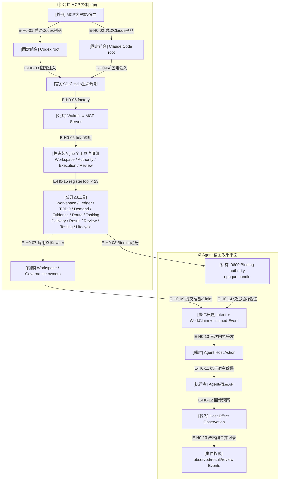

# 公共MCP与宿主接缝

## 当前结论

当前公共MCP注册23个真实工具，覆盖Workspace Maintenance/Binding、Ledger、TODO Inspection/Intake、Demand/Managed Evidence Publication、Route、implementation/test
Tasking、Delivery、Host Effect事实、Result、Review/Resume、Testing、Product Remediation和Completion。
Codex和Claude Code各自拥有固定composition root；公共请求不能选择宿主，双宿主工具名称与Schema集合一致。
Demand Publication及Completion的TODO字段使用共享`todo_<UUIDv4>` typed identity；A2-F1又在内部收紧Ledger-bound Intake，
A2关闭State到Service/Recovery及Intake可达性；A4已公开有界list/item和一致page token，A5已公开exact Intake publication，A6使Demand只读取Intake refs。Auto Claim仍没有执行consumer。
A3已把`wakeflow_publish_requirement`和`wakeflow_publish_confirmation`同时接入Public Server与双宿主组合根；它们发布immutable Ledger Authority及metadata refs，不创建TODO或Demand。

统一技术Review把初始化时发送给模型的server instructions从逐工具手册收敛为五条跨工具关系：closed-world且不执行宿主效果、exact preview/apply、exact recovery、Demand变更后重查Route，以及Inspection/TargetResult不授予权限。各工具的具体输入、效果、恢复和披露边界仍由自己的description与自包含Schema拥有，避免两份说明漂移。

公共入口现按Workspace、Authority、Execution、Review分为四个静态注册组；58行Public Server只负责配置准入、SDK实例和固定调用顺序。共享`registerWakeflowPublicMcpTool`只生成Canonical成功/错误结果，不保存动态registry或选择领域owner。拆分前后23项完整`tools/list`在去除transport产生的undefined字段后逐项一致。

Managed Evidence现已由`wakeflow_record_evidence`公开`preview / apply / recover`，但Apply/Recover只返回typed ID、摘要和Event/Commit/Aggregate
游标。Preview包含供确认的逻辑source ref；内部Reader与payload bytes不公开。工具不执行宿主效果，也不把可见性冒充Controller认证。

Agent宿主效果采用“Wakeflow提交Intent/Claim事实 → 签发瞬时Action → Agent执行 → 回传Observation →
Wakeflow记录Event”的握手。MCP不替Agent操作窗口。Window Binding注册请求会接收Agent观察到的
opaque handle，但该值只进入0600私有Binding权威，不进入返回值、投影、业务Event或Host Action。

## H0：双平面宿主接缝

### 本图术语说明

| 术语 | 解释 |
| --- | --- |
| 固定composition root | 在模块装载时绑定宿主Profile与executor，不接受请求级宿主选择 |
| 官方stdio生命周期 | MCP SDK拥有连接、`tools/list`、`tools/call`和Schema协议边界 |
| 静态注册组 | 四个源码固定模块，分别拥有自己的Schema、description、annotations、executor与错误映射 |
| raw handle | 宿主定位窗口的私有opaque值；只允许出现在注册请求的瞬时输入和0600 Binding authority，不进入输出、投影或业务事件 |
| Agent Host Action | 已提交Claim后签发的一次性、非持久宿主执行指令 |
| Observation | Agent对真实宿主效果的结构化观察，必须与Intent/Claim/Binding闭合 |

## 公共与内部边界

| 能力 | 当前公共MCP | 内部源码 | 宿主效果执行者 |
| --- | --- | --- | --- |
| Workspace Maintenance / Binding | 是 | 静态资源与私有窗口身份 | Agent执行launch intents并提供窗口观察 |
| Requirement / Confirmation Ledger Authority | 是 | Design源稳定读取、exact Plan、immutable record tree及前向恢复 | 无宿主效果；只返回Plan或member-reference metadata |
| TODO Inspection / Intake | 是 | strict JSON Collection、纯Query、existing append/recovery transaction | Inspection只观察；Intake不执行Auto Claim或创建Demand |
| Demand Publication | 是 | typed TODO选择、零写Planning、exact-plan Application、sidecar/根/TODO前向事务 | 无宿主效果；成功后Agent继续调用Route |
| Demand Route / Task Planning | 是 | 22类frontier；implementation/test判别规划 | 无直接宿主效果 |
| Delivery / Host Effect / Result | 是 | Intent、Claim、Observation、TargetResult Event | Agent执行一次性Host Action |
| Review / Resume / Remediation | 是 | Controller独立判断与产品返工授权 | Controller执行检查，Agent执行后续修复 |
| TestCard / Test Delivery / Completion | 是 | 测试代际与Demand终态 | Test窗口执行真实环境动作 |
| Managed Evidence记录 | 是 | preview/apply/recover、可恢复publication与metadata-only receipt | 内部Reader bytes不公开；无宿主效果 |

## 安全边界

- 公共结果使用稳定错误信封，不返回异常栈、绝对路径、锁token或raw handle。
- Binding注册输入可携带当前宿主opaque handle；公共Coordinator必须在写入后校验返回结构不包含该私值。
- stdout只承载MCP协议；稳定transport/shutdown摘要写stderr。
- server instructions只表达跨工具关系，不重复23份工具description；catalog测试限制其UTF-8长度不超过1024字节。
- Maintenance返回launch intent但不创建窗口。
- Agent观察不能作为权限本身，必须与当前私有Binding和Config逻辑根闭合。

## H0边级证据

| 边编号 | 代码证据 | 核验结论 |
| --- | --- | --- |
| `E-H0-01`–`E-H0-07`、`E-H0-15` | 两宿主composition root、stdio、Public Server与四注册组 | 独立catalog矩阵及拆分前后完整协议对比证明23工具同名同Schema/description/annotations |
| `E-H0-08` | Window Binding request/Coordinator/Store | handle从请求进入0600 Binding，结果和registered projection不含原值 |
| `E-H0-09`–`E-H0-14` | Delivery/Testing公共owners与Binding/Observation Authority | Claim/Outcome工具公开；Agent仍执行真实效果，Action/Event不携带原handle |

## 下钻入口

- [公共MCP调用时序](../01-overall-architecture/runtime-call-flow.md)
- [固定组合文件依赖](../01-overall-architecture/file-dependencies.md)
- [Agent宿主效果握手](./host-effect-handshake.md)
