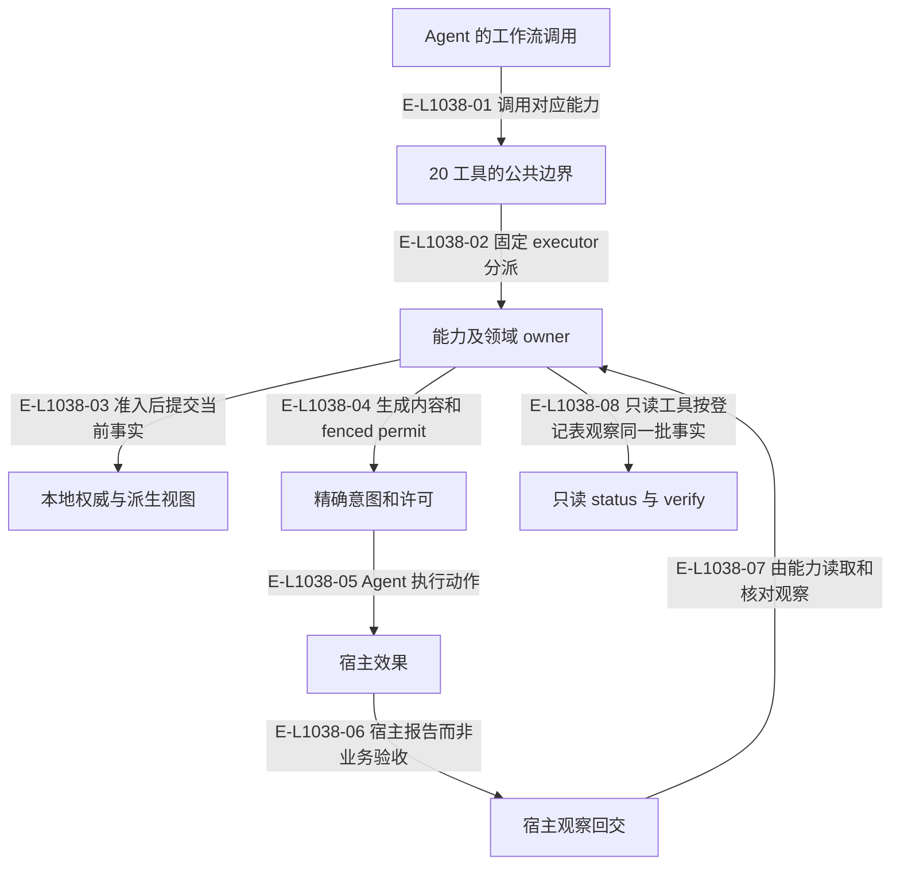

# 公共 MCP 与宿主接缝

当前公开 20 个工具，由一个静态登记表绑定到双宿主组合根。其中 status 与 verify 只读。宿主差异主要是画像、动作内容、观察形状、维护操作与指令；实际创建会话、发送和 worktree 处置由 Agent 执行。

> 核验基线：`1480271`（L1 observation 第十片已落地，20 个公共工具、18 个一次性场景）。工作树另有并行未提交改动（宿主 hook 通道等），本图不描绘；来源指纹按当前工作树计算。本文说明实现事实，未宣称双宿主真实会话已经验证。

## 内容与状态通道的分工

### 本图术语说明

| 术语 | 本图含义 |
| --- | --- |
| host | Codex 或 Claude Code；真实会话动作由 Agent 调用宿主完成。 |
| permit | 供 Agent 使用的投递内容与围栏；重放不是新一次发送授权。 |
| hook | 宿主回交的会话/提示提交/完成观察记录，保存在宿主本地根。 |
| fence | claimId、claimDigest 与流修订构成的准入令牌。 |

### 节点与实现定位

| 节点 | 文件 / 符号 | 责任 |
| --- | --- | --- |
| agent | Agent / 用户 / 外部效果或条件视图 | Agent 的工作流调用 |
| mcp | `src/entrypoints/wakeflow-public-mcp-catalog.ts` | 20 工具的公共边界 |
| caps | `src/entrypoints/wakeflow-public-mcp-shared-executors.ts` | 能力及领域 owner |
| local | `src/governance/demand/event-sourcing/demand-event-sourcing-repository.ts` | 本地权威与派生视图 |
| permit | `src/capabilities/delivery/service.ts` | 精确意图和许可 |
| host | Agent / 用户 / 外部效果或条件视图 | 宿主效果 |
| hook | `src/kernel/hook-observations.ts` | 宿主观察回交 |
| read | `src/capabilities/observation/contract.ts#VERIFY_TOOL_REGISTRATION` | 只读 status 与 verify |

### 本图边级证据

| 编号 | 代码定位 | 测试 / 核验 | 关系依据 |
| --- | --- | --- | --- |
| E-L1038-01 | `src/entrypoints/wakeflow-public-mcp-tool.ts#registerWakeflowPublicMcpCatalog` | `tests/entrypoints/wakeflow-public-mcp-catalog.test.ts` | 调用对应能力 |
| E-L1038-02 | `src/entrypoints/wakeflow-public-mcp-server.ts#createWakeflowPublicMcpServer` | `tests/entrypoints/wakeflow-public-mcp-catalog.test.ts` | 固定 executor 分派 |
| E-L1038-03 | `src/governance/demand/event-sourcing/demand-event-sourcing-command-handler.ts#executeDemandEventSourcingCommand` | `tests/governance/demand/demand-event-sourcing-command-handler.test.ts` | 准入后提交当前事实 |
| E-L1038-04 | `src/capabilities/delivery/service.ts#permitBody` | `tests/capabilities/delivery/service.test.ts` | 生成内容和 fenced permit |
| E-L1038-05 | `src/capabilities/delivery/service.ts#permitBody` | `tests/capabilities/delivery/service.test.ts` | Agent 执行动作 |
| E-L1038-06 | `src/kernel/hook-observations.ts#writeHostHookObservation` | `tests/capabilities/endpoint/service.test.ts` | 宿主报告而非业务验收 |
| E-L1038-07 | `src/capabilities/result-review/service.ts#loadReviewEvidence` | `tests/capabilities/result-review/service.test.ts` | 由能力读取和核对观察 |
| E-L1038-08 | `src/capabilities/observation/service.ts#executeVerifyRequest` | `tests/capabilities/observation/service.test.ts` | 只读工具按登记表观察同一批事实 |

## 宿主专属的维护操作

Claude Code 多出两个状态栏维护操作：`claude-statusline-asset:install` 写入 0600 的状态栏资产，`claude-statusline-settings:install` 只改 `.claude/settings.local.json` 的单个键并保留其它键，设置读不出时该项贡献被阻塞。Codex 侧没有对应资产。两者都由维护事务执行，不属于公共工具目录。

## 守卫、恢复与验证范围

`wakeflow_status` 与 `wakeflow_verify` 已登记，二者只读：不追加事件、不改配置、不创建会话，也不代表 Controller 验收；旧的 `wakeflow_inspect_demand_route` 随 status 带 demandId 的 Route 段删除。候选制品仍 releaseEligible:false；当前工具/场景通过不是最终插件发布。

涉及的测试与核验入口：

- `tests/capabilities/delivery/service.test.ts`。
- `tests/capabilities/endpoint/service.test.ts`。
- `tests/capabilities/result-review/service.test.ts`。
- `tests/capabilities/observation/service.test.ts`。
- `tests/entrypoints/wakeflow-public-mcp-catalog.test.ts`。
- `tests/governance/demand/demand-event-sourcing-command-handler.test.ts`。

## 下钻与相关视图

- [发送与回调时序](./host-effect-handshake.md)
- [执行环境](../15-pod/README.md)
- [只读观察与核验](../16-observation/README.md)
- [图谱总索引](../README.md)
- [核验与剩余范围](../01-diagram-review-ledger.md)
