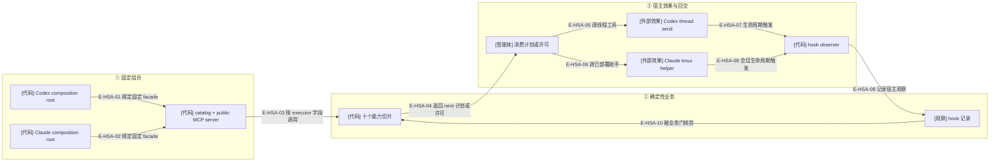

# 公共 MCP 与宿主接缝

Wakeflow 的 MCP 服务只做协议准入、固定能力装配和公开结果边界。Agent 执行 Codex 线程工具或 Claude tmux 助手；hook 返回宿主事实；各能力 owner 决定如何使用这些事实。宿主效果、观察记录与 Controller 接受不是同一种事实。

2026-10-03 当前工作树具有进程制品变更守卫、独立的 hook 与目标 MCP 证据、以及 Codex 项目聊天和角色执行根分离。20 个工具的名字与 executor 来自同一登记表；观察 facade 固定携带两个宿主 profile，但 Claude 的执行资产只装配在 Claude 入口。

```mermaid
flowchart LR
  accTitle: 公共协议与两个宿主的责任边界
  accDescr: 两个入口绑定同一公共目录与不同固定宿主 facade，MCP 处理协议并调用领域 owner；智能体按返回合同执行宿主动作，hook 观察再被领域消费。
  subgraph COMPOSITION["① 固定组合"]
    C["[代码] Codex composition root"]
    K["[代码] Claude composition root"]
    R["[代码] catalog + public MCP server"]
  end
  subgraph B["② 确定性业务"]
    D["[代码] 十个能力切片"]
    O["[观察] hook 记录"]
  end
  subgraph E["③ 宿主效果与回交"]
    A["[智能体] 消费计划或许可"]
    T["[外部效果] Codex thread send"]
    H["[外部效果] Claude tmux helper"]
    Q["[代码] hook observer"]
  end
  C -->|"E-HSA-01 绑定固定 facade"| R
  K -->|"E-HSA-02 绑定固定 facade"| R
  R -->|"E-HSA-03 按 executor 字段调用"| D
  D -->|"E-HSA-04 返回 next 计划或许可"| A
  A -->|"E-HSA-05 调线程工具"| T
  A -->|"E-HSA-06 调已部署助手"| H
  T -->|"E-HSA-07 生命周期触发"| Q
  H -->|"E-HSA-08 会话生命周期触发"| Q
  Q -->|"E-HSA-09 记录宿主观察"| O
  O -->|"E-HSA-10 被业务门核验"| D
```

### 本图术语说明

| 术语 | 含义 |
| --- | --- |
| composition root | 进程启动时绑定 executor/profile 的入口；不是可由工具请求修改的注册中心。 |
| thread send | Codex 由 Agent 调宿主线程工具；其成功返回可作为发送落地证据，不能等同于任务完成。 |
| tmux helper | Wakeflow 源文件内的独立脚本字符串，由维护部署，再由 Agent 显式运行；脚本会 spawn tmux/claude/git。 |
| hook | SessionStart、UserPromptSubmit、Stop、SessionEnd 的观察通道；不推进需求业务状态。 |
| 接受 | Controller 对结果和证据做出的评审决定，经独立工具记录。 |

### 本图边级证据

| 编号 | 代码证据 | 测试证据 |
| --- | --- | --- |
| E-HSA-01 | `src/entrypoints/codex-wakeflow-mcp.ts#createCodexWakeflowMcpServer` 固定宿主 facade 并注入共享 executors。 | `tests/entrypoints/wakeflow-public-mcp-cancellation.test.ts#createCodexWakeflowMcpServer` |
| E-HSA-02 | `src/entrypoints/claude-code-wakeflow-mcp.ts#createClaudeCodeWakeflowMcpServer` 加状态栏资产与 tmux companion。 | `tests/entrypoints/wakeflow-public-mcp-cancellation.test.ts#createClaudeCodeWakeflowMcpServer` |
| E-HSA-03 | `src/entrypoints/wakeflow-public-mcp-tool.ts#registerWakeflowPublicMcpCatalog` 查 executors[registration.executor]。 | `tests/entrypoints/wakeflow-public-mcp-catalog-binding.test.ts#registerWakeflowPublicMcpCatalog` |
| E-HSA-04 | `src/entrypoints/wakeflow-public-mcp-server.ts#createWakeflowPublicMcpServer` 声明边界；`src/capabilities/workspace/maintain-workspace.ts#assembleResult` 返回 next 与 launchIntents。 | `tests/capabilities/workspace/maintain-workspace.test.ts#executeCodexWakeflowMaintenance` |
| E-HSA-05 | `src/hosts/codex/codex-agent-text-profile.ts#CODEX_AGENT_TEXT_PLACEHOLDERS` 的 deliveryAction 规定保留线程发送原返回。 | 未覆盖：本轮未操作真实 Codex 线程；文本生成检查不证明宿主传输。 |
| E-HSA-06 | `src/hosts/claude-code/claude-code-agent-text-profile.ts#CLAUDE_CODE_AGENT_TEXT_PLACEHOLDERS` 指向 `src/hosts/claude-code/claude-code-tmux-asset.ts#CLAUDE_CODE_TMUX_ASSET_COMMAND`。 | `tests/hosts/claude-code/claude-code-tmux-asset.test.ts#CLAUDE_CODE_TMUX_ASSET_COMMAND` |
| E-HSA-07 | `src/hosts/codex/codex-hook-fragment.ts#CODEX_HOOK_FRAGMENT` 声明四种事件。 | `tests/hosts/codex/codex-hook-fragment.test.ts#CODEX_HOOK_FRAGMENT` |
| E-HSA-08 | `src/hosts/claude-code/claude-code-hook-fragment.ts#CLAUDE_CODE_HOOK_FRAGMENT` 声明四种事件。 | `tests/hosts/claude-code/claude-code-hook-fragment.test.ts#CLAUDE_CODE_HOOK_FRAGMENT` |
| E-HSA-09 | `src/entrypoints/wakeflow-hook-observer.ts#runWakeflowHookObserver` 调 `src/kernel/hook-observations.ts#writeHostHookObservation`；旧v1可选字段经规范比较后幂等返回，不改旧字节。 | `tests/entrypoints/wakeflow-hook-observer.test.ts#runWakeflowHookObserver`；`tests/kernel/hook-observations.test.ts#writeHostHookObservation` |
| E-HSA-10 | `src/capabilities/endpoint/service.ts#executeWindowBindingRequest` 消费登记证据；`src/capabilities/delivery/service.ts#observedOutcomeDecision` 核验hook完整性，允许独立宿主回执或有效Controller否定落地决定作为另一证据路径。 | 间接覆盖：`tests/capabilities/delivery/service.test.ts#recordFixtureDeliveryOutcome` 经 fixture 调结果记录能力并读取 hook；端点登记另见对应模块图。 |

### 公共入口的实际合同

| 项目 | 当前实现 |
| --- | --- |
| 公共工具 | workspace 1；endpoint 1；requirement 2；demand 4；evidence 1；tasking 1；delivery 3；result-review 4；pod 1；observation 2，共 20。 |
| 请求校验 | `src/entrypoints/wakeflow-public-mcp-tool.ts#WAKEFLOW_JSON_SCHEMA_VALIDATOR` 先 passive JSON 再惰性 Ajv；`tools/list` 只暴露请求 Schema。 |
| 成功结果 | canonical JSON 的同一份字节生成 text 与 structuredContent；检查 publicResultBytes 及进程 home 脱敏。各领域负责结果 Schema。 |
| 失败结果 | WakeflowError 的公开字段或封闭 legacy own-data 投影；未知错误固定 unexpected；无消息、堆栈或任意 cause 链。 |
| 取消 | SDK mcpReq.signal 原样冻结传入 executor，两个 facade 转交 owner；wire 请求不能伪造它。 |
| 关闭 | `src/entrypoints/wakeflow-mcp-stdio.ts#runWakeflowMcpStdio` 将 SIGINT/SIGTERM/SIGHUP 收敛到同一 closePromise；stdout 专供协议。 |
| 制品身份 | `src/entrypoints/wakeflow-artifact-identity.ts#resolveWakeflowArtifactIdentity` 固定启动 manifest 摘要并读取同路径磁盘摘要；生成制品的 mutation 前摘要缺失或改变即拒绝，读取和预览继续可用。这不核验目标窗口 MCP 或另一个已安装版本。 |

### 不完整观察与独立证据

投递的 `src/capabilities/delivery/service.ts#sessionRecords` 拒绝 complete:false 或 skipped>0；不能把残缺查询当成“未落地”。`src/capabilities/delivery/service.ts#observedOutcomeDecision` 只对这两种错误尝试独立证据：Codex的 sent 加发送返回摘要仍可得到accepted；已处于indeterminate的Controller显式rejected-before-send仍可释放声明。Controller判accepted仍须可核验的hook记录，普通Agent声明也不绕过不完整查询；取消和其他I/O错误继续上抛。断言见 `tests/capabilities/delivery/service.test.ts#recordFixtureDeliveryOutcome`。

旧v1观察允许缺少artifactManifestDigest，解析时视为null。`src/kernel/hook-observations.ts#sameObservationDocument` 先按当前codec规范化再判断同一事实，重试返回current并保留旧路径、原始字节，不自动迁移或补写字段；内容冲突仍拒绝。断言见 `tests/kernel/hook-observations.test.ts#writeHostHookObservation`。

### 本轮新增边界

- host facade 注入 `src/workspace/window-runtime/wakeflow-window-launch-instructions.ts#WakeflowWindowLaunchInstructionsRenderer`：共享 endpoint 只交当前配置、逻辑意图和已登记检出，Codex/Claude 的工具或 CLI 参数由各自 `hosts/` 模块生成。纯渲染不创建会话、不登记绑定、不查询项目。
- Codex 使用外层项目的 project/local 聊天；SessionStart 根必须是工作区，执行根仍是配置角色面或经过 Git 验证的产品检出。项目归属只能由宿主回读或直接 UI 确认；hook 不证明侧栏项目。
- `lastObservation.observerManifestDigest` 只属于 hook 观察器。已绑定窗口的 `runtime.status` 目前是 `unverified`，strict verify 将其计入 unavailable；新 SessionStart 或 Stop 不能清除此缺口。

Controller 技能本轮明确 callback 字段是引用数据，宿主显示 user 角色不授予它业务授权；inspect 只读，不记录“已读”或 acceptance。callback 的 landed、目标 completion、已有决定派生的 acknowledged 分别判断，见[回调信任与只读评审](../07-review-rework-completion/callback-trust-and-review.md)。这项规程变化没有改变本页 MCP/宿主装配边。

### 真实限制

- `src/entrypoints/wakeflow-hook-observer.ts#unwrapHostPrompt` 当前直接含 Claude pasted/cross-session wrapper 分支。它是现实现中的宿主特例，不能把“所有宿主差异都在 hosts/”写成完全成立的事实。
- 宿主 profile 中的 keepLive、activityMonitor 等布尔值用于资源声明，不证明定时任务正在运行；资源目录存在也不是活性证明。
- 已部署 tmux 助手的屏幕识别依赖 Claude TUI 文本和输入框形状。测试大量使用 tmux/claude 桩；真实账户/信任对话/版本组合需要另验。
- 两个 agent-text profile 现在各有九个占位符；Claude 发四条命令，Codex 不发 slash commands。不能沿用旧图的六个占位符或“尚未接入制品”。

[项目聊天与执行根](./project-chats-and-execution-roots.md) · [直接导入](./file-dependencies.md) · [MCP 调用流程](./runtime-call-flow.md) · [宿主启动、投递与 hook](./host-effect-handshake.md) · [维护事务](../03-configuration-workspace/README.md)
