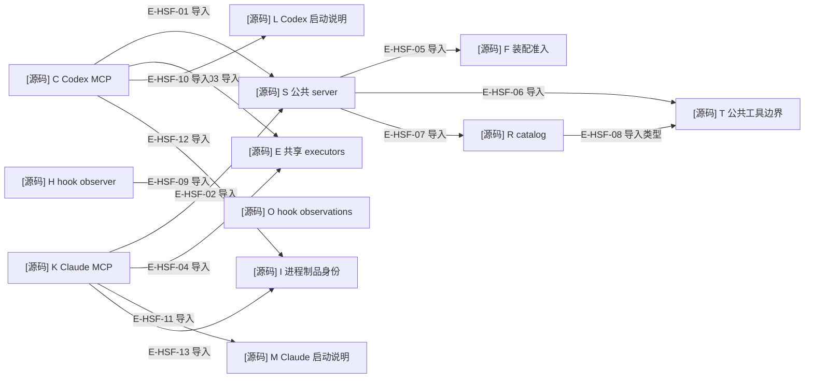

# 公共 MCP 与宿主的直接导入

本图是审阅精选的文件 import。共享 entrypoint 的宿主装配与 hook 观察入口是两条独立闭包；图不把资产字符串中的执行动作冒充 TypeScript import。

### 本图术语说明

| 术语 | 含义 |
| --- | --- |
| 导入类型 | 仅 TypeScript 类型依赖，不表示运行时调用或装载。 |
| 共享 executors | 八个不消费 host profile 的 executor；其余工具由入口绑定固定 facade。 |
| 两条闭包 | MCP 服务与 hook launcher 是不同入口；hook 不初始化全套配置校验与 MCP 服务。 |

### 文件与符号

| 节点 | 文件 / 符号 | 职责 |
| --- | --- | --- |
| C | `src/entrypoints/codex-wakeflow-mcp.ts#createCodexWakeflowMcpServer` | Codex 固定装配。 |
| K | `src/entrypoints/claude-code-wakeflow-mcp.ts#createClaudeCodeWakeflowMcpServer` | Claude 固定装配。 |
| S | `src/entrypoints/wakeflow-public-mcp-server.ts#createWakeflowPublicMcpServer` | 服务器说明、准入、登记。 |
| F | `src/entrypoints/wakeflow-public-mcp-server-configuration.ts#parseCreateWakeflowPublicMcpServerOptions` | 精确 executor 字段集合、非 Proxy function。 |
| T | `src/entrypoints/wakeflow-public-mcp-tool.ts#registerWakeflowPublicMcpCatalog` | Schema、signal、结果与错误边界。 |
| R | `src/entrypoints/wakeflow-public-mcp-catalog.ts#WAKEFLOW_PUBLIC_TOOL_CATALOG` | 20 工具及 executor 字段。 |
| E | `src/entrypoints/wakeflow-public-mcp-shared-executors.ts#WAKEFLOW_SHARED_PUBLIC_EXECUTORS` | 无宿主的 requirement/demand/tasking/evidence 调用绑定。 |
| H | `src/entrypoints/wakeflow-hook-observer.ts#runWakeflowHookObserver` | 有界拓扑定位与记录映射。 |
| O | `src/kernel/hook-observations.ts#writeHostHookObservation` | 内核合同与 append-only 观察发布。 |
| L | `src/hosts/codex/codex-window-launch-instructions.ts#renderCodexWindowLaunchInstructions` | 外层项目/local聊天与独立执行根的纯说明。 |
| M | `src/hosts/claude-code/claude-code-window-launch-instructions.ts#renderClaudeCodeWindowLaunchInstructions` | Claude CLI、tmux与add-dir纯说明。 |
| I | `src/entrypoints/wakeflow-artifact-identity.ts#resolveWakeflowArtifactIdentity` | 当前进程manifest身份与写前复验函数。 |

### 本图边级证据

| 编号 | 直接导入证据 | 测试证据 |
| --- | --- | --- |
| E-HSF-01 | C import createWakeflowPublicMcpServer。 | `tests/entrypoints/wakeflow-public-mcp-cancellation.test.ts#createCodexWakeflowMcpServer` |
| E-HSF-02 | K import createWakeflowPublicMcpServer。 | `tests/entrypoints/wakeflow-public-mcp-cancellation.test.ts#createClaudeCodeWakeflowMcpServer` |
| E-HSF-03 | C import WAKEFLOW_SHARED_PUBLIC_EXECUTORS。 | 间接覆盖：`tests/entrypoints/wakeflow-public-mcp-cancellation.test.ts#createCodexWakeflowMcpServer` 走 requirement executor。 |
| E-HSF-04 | K import WAKEFLOW_SHARED_PUBLIC_EXECUTORS。 | 间接覆盖：`tests/entrypoints/wakeflow-public-mcp-cancellation.test.ts#createClaudeCodeWakeflowMcpServer` 走 requirement executor。 |
| E-HSF-05 | S import parseCreateWakeflowPublicMcpServerOptions。 | 间接覆盖：`tests/entrypoints/wakeflow-public-mcp-catalog.test.ts#createWakeflowPublicMcpServer` 构造服务。 |
| E-HSF-06 | S import registerWakeflowPublicMcpCatalog。 | `tests/entrypoints/wakeflow-public-mcp-catalog-binding.test.ts#registerWakeflowPublicMcpCatalog` |
| E-HSF-07 | S import WAKEFLOW_PUBLIC_TOOL_CATALOG。 | `tests/entrypoints/wakeflow-public-mcp-catalog-binding.test.ts#WAKEFLOW_PUBLIC_TOOL_CATALOG` |
| E-HSF-08 | R import type WakeflowPublicMcpExecutor 来自公共工具边界 T。 | 未覆盖：静态类型关系以源码导入验证。 |
| E-HSF-09 | H import createHostHookObservation / writeHostHookObservation。 | `tests/entrypoints/wakeflow-hook-observer.test.ts#runWakeflowHookObserver` |
| E-HSF-10 | C import renderCodexWindowLaunchInstructions。 | `tests/capabilities/endpoint/service.test.ts#renderCodexWindowLaunchInstructions` |
| E-HSF-11 | K import renderClaudeCodeWindowLaunchInstructions。 | `tests/capabilities/endpoint/service.test.ts#renderClaudeCodeWindowLaunchInstructions` |
| E-HSF-12 | C import resolveWakeflowArtifactIdentity。 | `tests/entrypoints/wakeflow-artifact-mutation-guard.test.ts#resolveWakeflowArtifactIdentity` |
| E-HSF-13 | K import resolveWakeflowArtifactIdentity。 | `tests/entrypoints/wakeflow-artifact-mutation-guard.test.ts#resolveWakeflowArtifactIdentity` |

[返回总览](./README.md) · [运行时调用](./runtime-call-flow.md)
